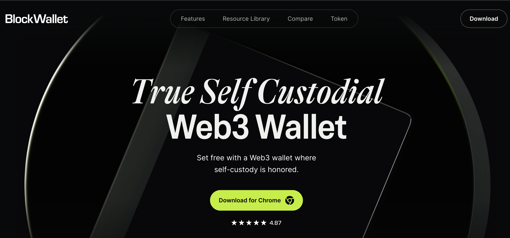
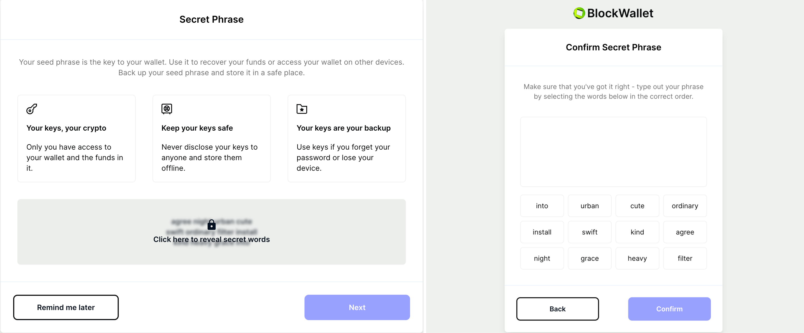
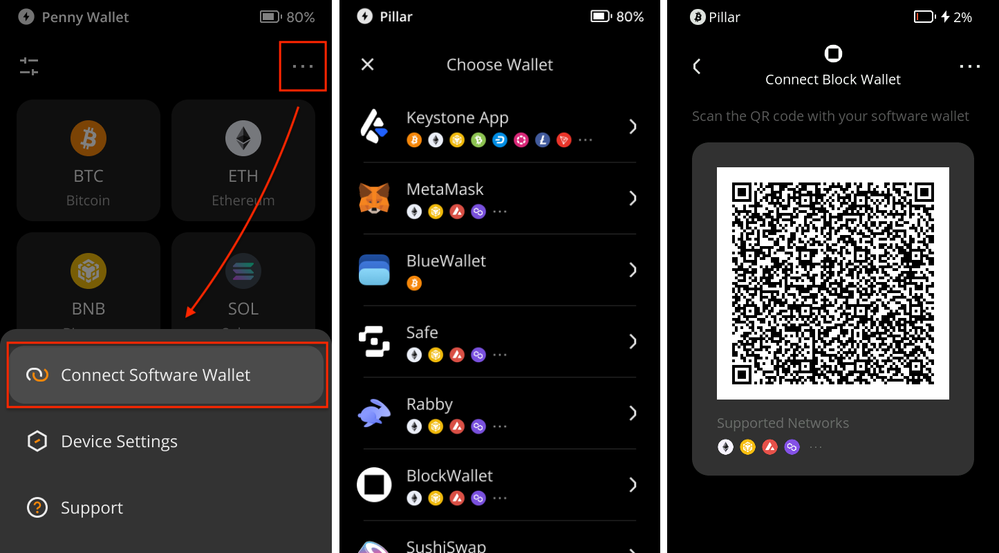
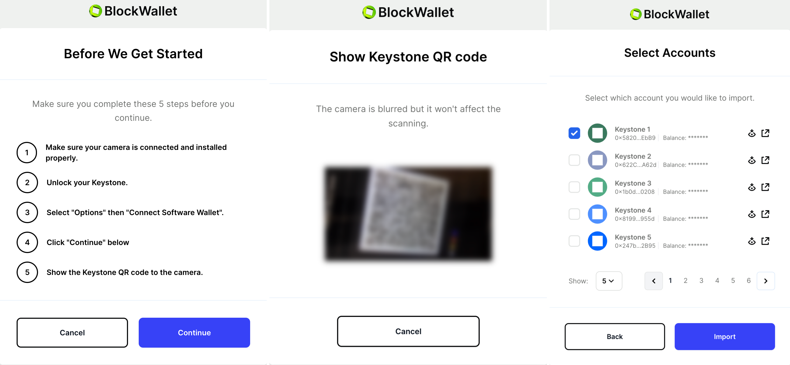

# How to connect with BlockWallet Extension {#f5ab7215e7734b388fe8960e3f7ec7be}

Experience swift, secure, and private management of your digital assets with BlockWallet. Take control of your cryptocurrencies through an intuitive interface that offers low fees, innovative gas prediction, and top-tier encryption for unparalleled security. Embrace the future of digital currency management while ensuring a safe online experience by connecting your Keystone hardware wallet.

**Support**: All EVM Chains

**Features**: Send, Buy, Swap, Bridge

## **Step 1: Preparation** {#e7f606fa4d2e4740a8adec3ae9c7097e}

Before you start, make sure you have the following:

1. [Firmware](https://keyst.one/firmware?locale=en) version 0.9.0 or newer running on Keystone 3 Pro.
1. [BlockWallet browser extension](https://blockwallet.io/) installed.

  

## **Step 2: Binding BlockWallet with Your Keystone Hardware Wallet** {#3acd5d257cde4072b981a183f75c4b76}

### **1. Create a Dummy Wallet on BlockWallet** {#fa4f9a45bf94404ea5235a41d1c5c357}

To access the "Connect Hardware Wallet" button in BlockWallet, you need to create a dummy wallet. Follow these steps:

1. Open the "BlockWallet Extension" in your browser and click [Get Started].

  

1. Choose [Create a new wallet] and set a strong password for your BlockWallet wallet.

  

1. Store your seed phrase in a secure place and confirm it.

  

1. Use the Default Browser Wallet and start using BlockWallet. This completes your successful login.

  

### **2. Connect Keystone with** BlockWallet {#64308ad4deac45e392c2c8f2549652ac}

Now, let's establish the connection between your Keystone hardware wallet and BlockWallet:

1. On your Keystone hardware wallet, select [BlockWallet] in the menu to display a QR code.

  

1. Access the BlockWallet UI. Click the [Settings] button &gt; [Connect Hardware Wallet] &gt; [Keystone] &gt; [Continue].

  

1. Read the tips, click [Continue], and scan the QR code from your Keystone. Choose the account you want to bind with, toggle it, and tap [Import] to successfully complete the binding.

  

Congratulations! Your Keystone hardware wallet is now seamlessly connected to BlockWallet.

## **Sending ETH via** BlockWallet **Connected to Keystone** {#294fa0f0f68f40f18a13d1784f289925}

1. Find the "Send" button on BlockWallet's home page.

  

1. Enter the recipient's address and the the amount of ETH. Confirm the transaction details.

  

1. BlockWallet generates a QR code; scan it with your Keystone.

  

1. Verify and securely sign the transaction with your Keystone password.

  

1. Return to BlockWallet, scan the QR code on your Keystone, and your transaction is pending confirmation on the Ethereum blockchain.

  

And there you have it! You've successfully sent your cryptocurrency to another address.

Once you've connected Keystone with BlockWallet, you can do more than just send currency easily. **You can still access all of BlockWallet's features.** 

Keystone, as a hardware wallet, secures your assets, and all transactions after binding require Keystone's signature. Plus, you can explore and use various online features in BlockWallet to meet your basic needs.

## FAQ: {#507a39dbffb84aad8e3146fd3a8cd2a0}

  
Which Account Should You Connect When Binding Keystone with BlockWallet?

For newcomers, using the 1st account is recommended for unlocking. You can manage various addresses to cater to different asset management needs and personal preferences.

  

