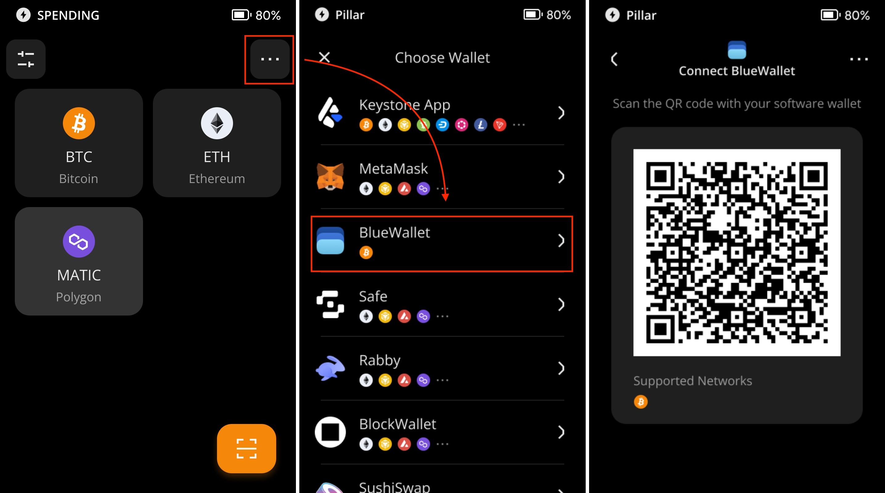
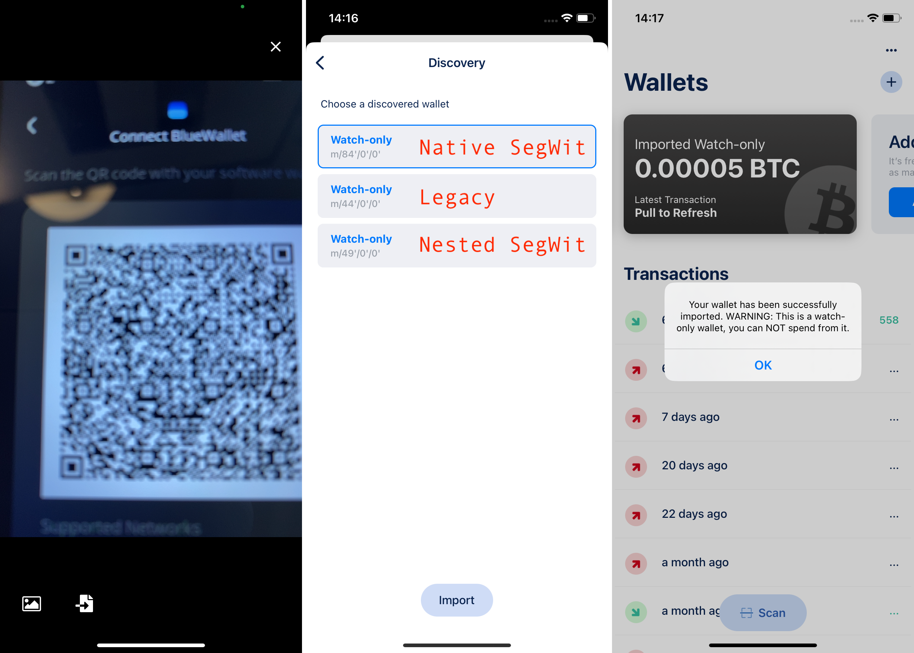
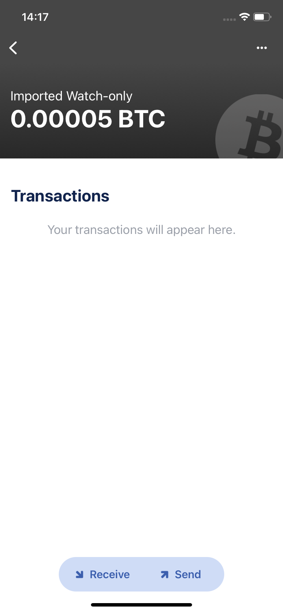
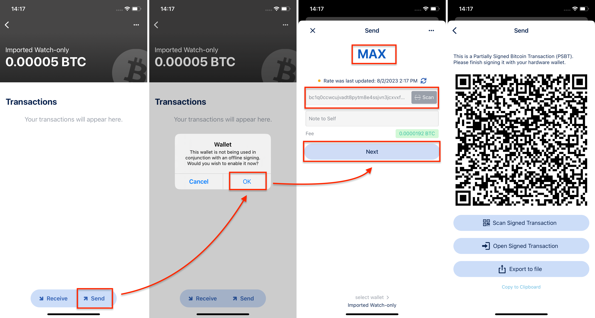
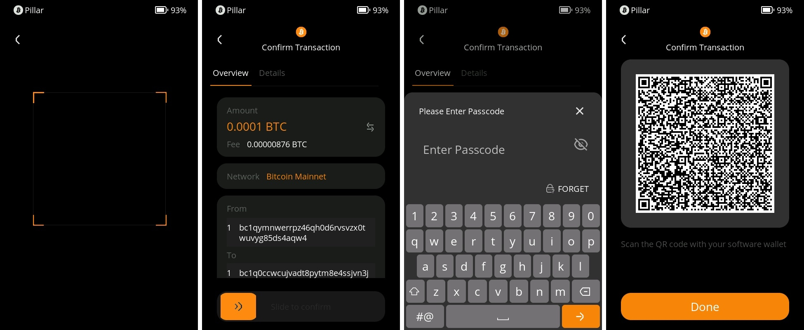

# Using BlueWallet with Keystone {#7fed46cf965746f3b5191a21826fc60b}

By integrating your Keystone Wallet with BlueWallet, you can boost the security of your Bitcoin holdings. Here's a step-by-step guide to get started:

**Support**: BTC with Native SegWit, Nested SegWit, and Legacy

**Feature**: Send, Receive, Coin Control, Tor, etc.

## **1. Preparation** {#fc61a3365f8b435aa0175b2ae3b650f8}

Before you begin, ensure you have the following:

1. [Firmware](https://keyst.one/firmware?locale=en) version 0.9.0 or newer running on Keystone 3 Pro.
1. The BlueWallet app installed on your device. You can download it from the Google Play Store or App Store. If you need more information, visit the [official BlueWallet website](https://bluewallet.io/).

## **2. Binding BlueWallet with Your Keystone Hardware Wallet** {#80007fa2c2ce492da52aa5431708b73d}

**On your Keystone hardware wallet:**

1. Tap the menu icon (usually represented by three dots), and then select "Connect Software Wallet."
1. Choose "BlueWallet." A QR code will be displayed.

  

**On BlueWallet:**

1. Open the BlueWallet app on your device.
1. Tap "Add now," then select "Import wallet," followed by "Scan or import a file."

  

1. Use the BlueWallet app on your phone to scan the QR code shown on your Keystone hardware wallet.
1. Select a path for your Bitcoin address. You have three options: Native Segwit, Segwit, and Legacy. If these terms are new to you, consider using "Native Segwit" for lower fees.

  

That's it! Your BTC addresses are now synchronized with BlueWallet and Keystone. You're ready to explore the app's features and perform secure transactions with your Keystone hardware wallet.

## **3. Sending BTC via BlueWallet with Keystone Connected** {#d8e87d6718e440ca93b8613fff0ebeda}

**On BlueWallet:**

1. Select the "Imported Watch-only" wallet.
1. Tap "Send," and a hint will appear. Tap "OK."
1. Enter the amount and the receiving address, then tap "Next." A QR code will appear, requiring your Keystone's signature.

  

**Back to Keystone Hardware Wallet:**

1. Tap the scan button.
1. Scan the QR code displayed in step 3. The transaction will be decoded into an easy-to-understand format by Keystone, showing the actual transactions on your software wallet.
1. Confirm details and slide to sign. Enter your password and a new QR code will be generated.

  

**Return to the BlueWallet app:**

1. Select "Scan Signed Transaction."
1. Scan the QR code displayed on your Keystone hardware wallet to broadcast your transaction. Once broadcasted, your transaction is successful.

  

Congratulations! You've successfully integrated your Keystone hardware wallet with BlueWallet. 

After binding with BlueWallet, you will be able to experience the features like Coin Control or Tor provided by BlueWallet.

