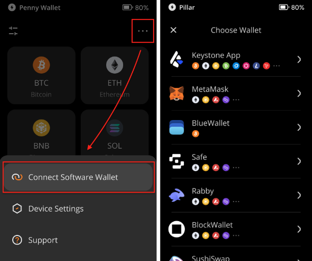
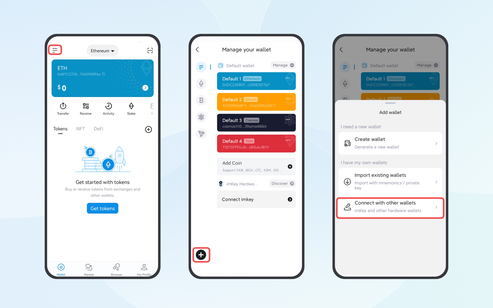

# How to use imToken with Keystone? {#696ea95ad9fe4971a6306937f13976f4}

:::tip

imToken is a multi-chain software wallet based on EVM network. 
- **Supported Network**: EVM

- **Features**: Send, Receive, Swap and so on.

:::

## **Step 1: Preparing for Connection** {#ee91f2aad0ad42c9b4cc7183b5b8361a}

1. [Firmware version](https://keyst.one/firmware?locale=en) 1.1.4 or newer running on Keystone 3 Pro. Please read[ How to upgrade firmware](https://guide.keyst.one/docs/firmware-upgrade) for more details.
1. Install imToken on your mobile phone with version 2.14.0 (Official Website： [https://token.im/](https://token.im/))

## **Step 2: Connecting Keystone with imToken** {#aedaa392da9743b691b7782feb565040}

**On Your Keystone Hardware Wallet:**

1. Tap the "..." icon on the top right.
1. Choose [imToken] and a QR code will appear.

  

**On imToken:**

1. Open the imToken and create a dummy wallet to access [Connect with other wallets] button by following the tips.
1. After finishing the dummy wallet, click the setting button on the up-left corner.
1. Tap [+] button &gt; [Connect with other wallets]&gt; [Keystone] &gt; [Scan to connect].

  

1. Scan the QR code displayed on your Keystone hardware wallet.

Congratulations! You've seamlessly connected your Keystone account on EVM with the imToken.

## **Step 3: Exploring features like Sending ETH** {#4e3dd850326c4834bb04a55bb51be81c}

:::tip

To exploring features on imToken with Keystone connected, what you need to do is initiate the transactions on imToken and sign it with Keystone!

:::

**Initiate a transaction on imToken** **(eg. sending ETH):**

1. On the imToken, click the coin/tokens you need to transfer (eg. ETH) &gt; Tap [Send] and enter the destination account and amount &gt; [Offline-Sign] &gt; [Send]. A QR code shows up then.

**Sign with Keystone:**

1. Unlock your Keystone, and tap the scan button on the main page to scan the QR code displayed on the imToken.
1. Verify your transaction details &gt; Swipe to sign the transaction by passcode or fingerprint &gt; A QR code will displayed.

**Broadcast the transaction:**

1. Back to imToken, click [I have signed with my wallet] to scan the QR code displayed on Keystone.

That’s it! Now the ETH has been sent out successfully once broadcast.

Other features on the imToken are familiar with this process! Happy exploring!

