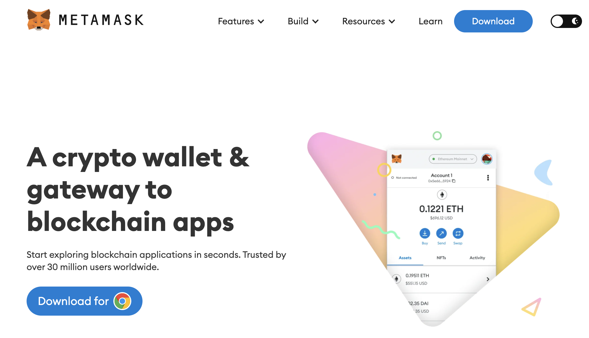
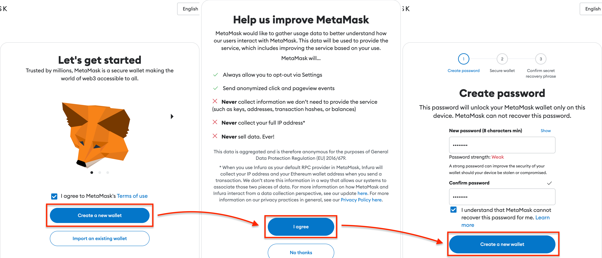
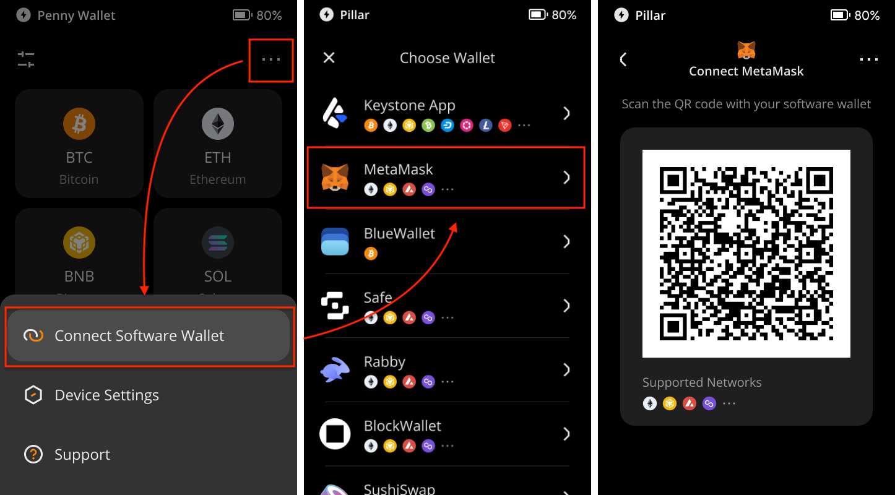
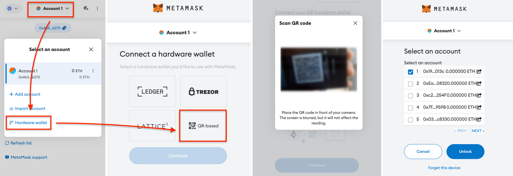
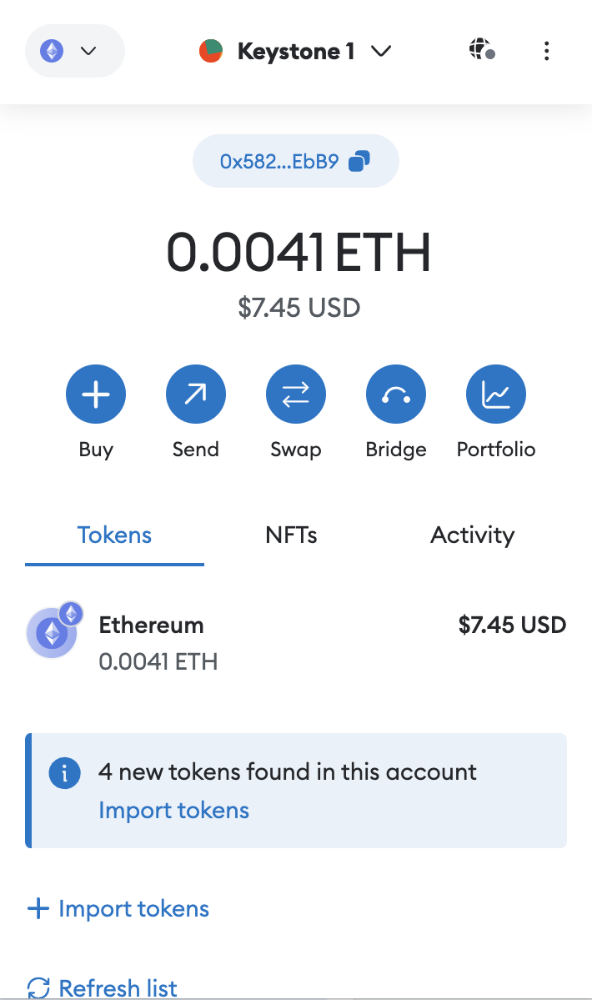
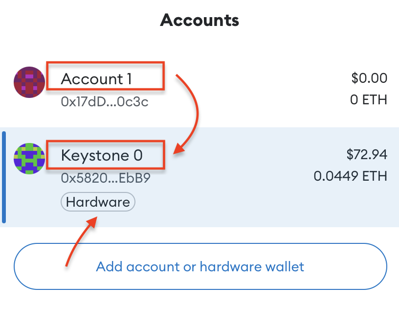
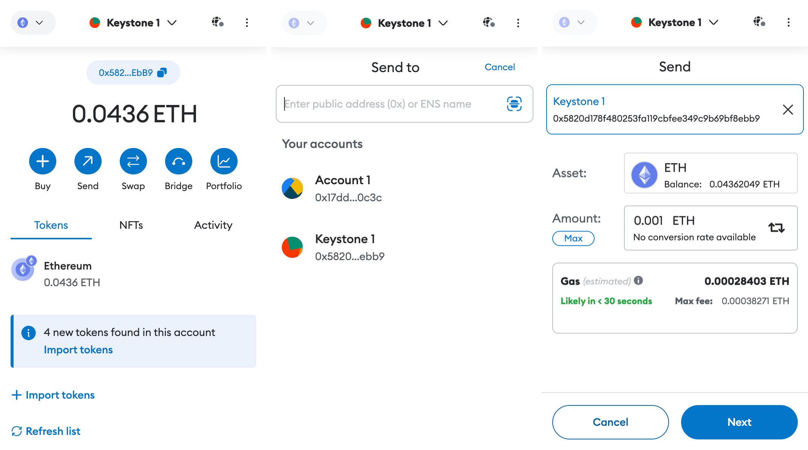
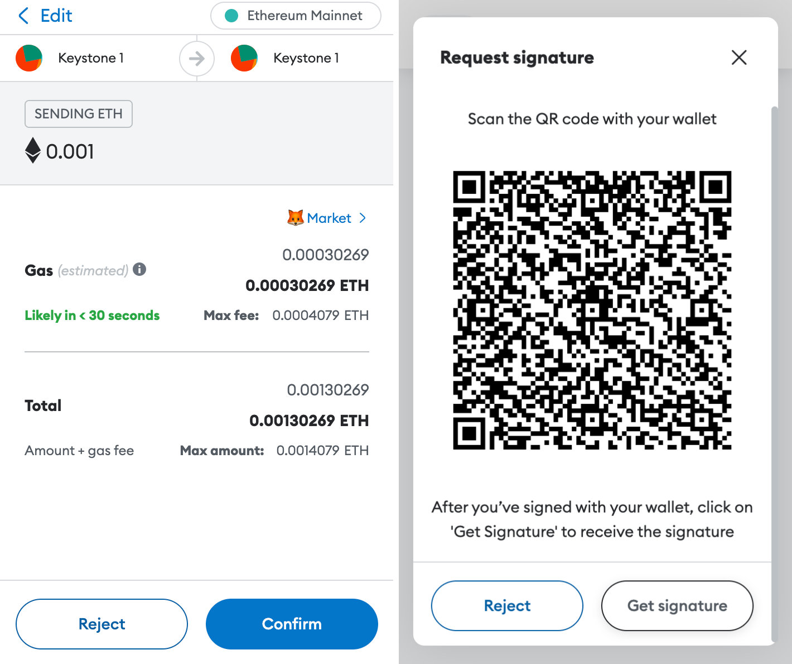
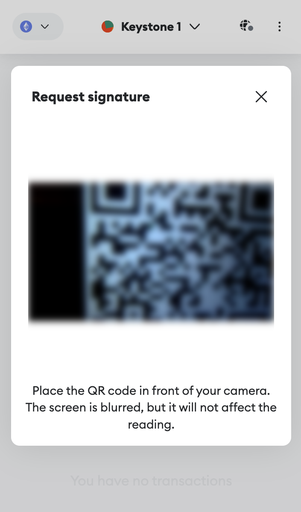

# **How to Connect the Keystone with MetaMask** {#f9cfbb325e1445ebaedf13561676f337}

As a hardware wallet user, you need to connect your Keystone wallet with software wallets like MetaMask to access various online features such as sending, swapping, and checking your NFTs, etc. Connecting with MetaMask allows you to explore all supported EVM chains, including Ethereum Mainnet, BNB Smart Chain, Arbitrum One, and more.

## **Step 1: Preparation** {#fed7e422c5ec4e4ca8bd55eef99dcd47}

Before you start, make sure you have the following:

1. [Firmware](https://keyst.one/firmware?locale=en) version 0.9.0 or newer running on Keystone 3 Pro.
1. MetaMask browser extension installed. Download it from [**MetaMask's official website**](https://metamask.io/).

## **Step 2: Binding MetaMask with Your Keystone Hardware Wallet** {#1cf098c8450f4370b3e35903f5d85d56}

### **1. Create a Dummy Wallet on MetaMask** {#14a48bbfeea34a5d8f4b991c5f0e1416}

To access the "Connect Hardware Wallet" button in MetaMask, you need to create a dummy wallet. Follow these steps:

1. Open the "MetaMask Extension" in your browser.

  

1. Click on "Create a new wallet" and agree to the terms. Set a password for your wallet.

  

1. Choose "Secure my wallet" and carefully save the Secret Recovery Phrase in a safe place. Confirm the Secret Recovery Phrase.

  

1. You have now set up your MetaMask. Familiarize yourself with its main page.

### **2. Connect Keystone with MetaMask** {#3ade4df0437748f897fa3b1f808f98a5}

Now, let's connect your Keystone hardware wallet with MetaMask:

1. On your Keystone hardware wallet, select [MetaMask] in the menu to display a QR code.

  

1. On MetaMask Extension, tap [Account 1], select [Connect Hardware Wallet], and scan the QR code on Keystone.
1. Choose your account and tap [Unlock] to complete the connection. You can unlock the 1st account if you are new here.

That's it! Your Keystone hardware wallet is now successfully connected with MetaMask for EVM chain support.

:::tip

**Tips for Differentiating Keystone and MetaMask Accounts:**
1. Check for distinct names.

1. Keystone accounts have a "Hardware" label below them.

:::

Now you can safely perform transactions on MetaMask without exposing your seed phrase online. Enjoy exploring the features and capabilities of your connected hardware wallet!

## **Sending ETH via MetaMask Connected to Keystone** {#789b3557f3dc423aa7e20a9bbb482ada}

1. Click the "Send" button on MetaMask's home page. Enter the amount of ETH and the recipient's address.

  

1. Review and confirm the transaction details.

  

1. MetaMask generates a QR code; scan it with your Keystone.

  

1. Verify and securely sign the transaction with your Keystone password.

  

1. Return to MetaMask, click the “Get Signature” to scan the QR code on your Keystone, and your transaction is pending confirmation on the Ethereum blockchain.

  

And there you have it! You've successfully sent your cryptocurrency to another address.

Once you've connected Keystone with MetaMask, you can do more than just send currency easily. **You can still access all of MetaMask's features.** 

Keystone, as a hardware wallet, secures your assets, and all transactions after binding require Keystone's signature. Plus, you can explore and use various online features in MetaMask to meet your basic needs.

## FAQ: {#d1b8d2b47c8a43d4a2c5523a05c3ddd9}

  
Which Account to Connect When Binding Keystone with MetaMask?

If you're new, you can use the 1st account for unlocking. You can manage various addresses to suit different asset management needs and personal habits.

  

  
Why is Importing MetaMask Seed Phrase into Keystone Not Recommended?

Seed phrases generated online, like through MetaMask, can have higher hacking risks compared to ones generated entirely offline. **Even if you later import an online seed phrase, it will NOT provide secure protection since it could have already been exposed.** Remember, your seed phrase is the key to your funds.

  

  
How to Access Other EVM-Compatible Networks like Arbitrum or Polygon?

  

