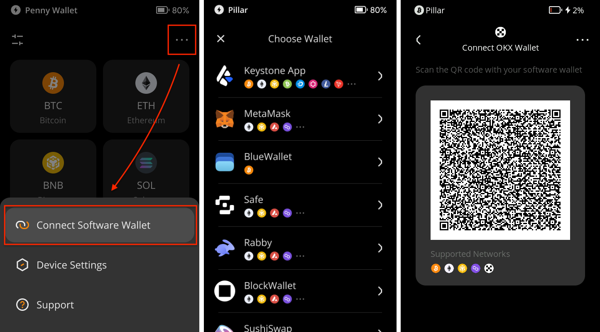
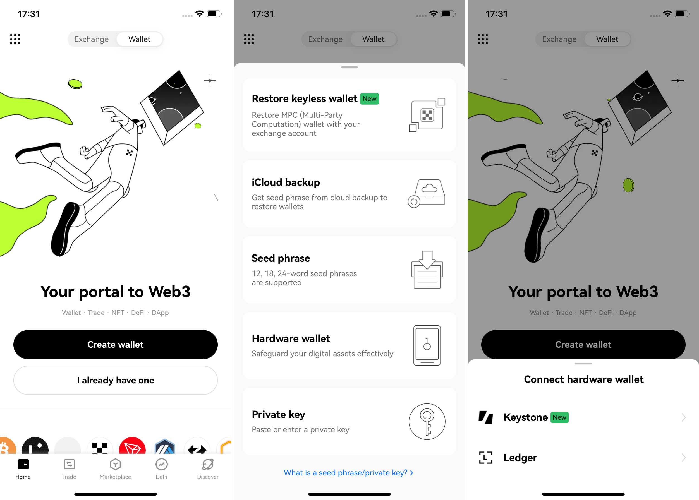
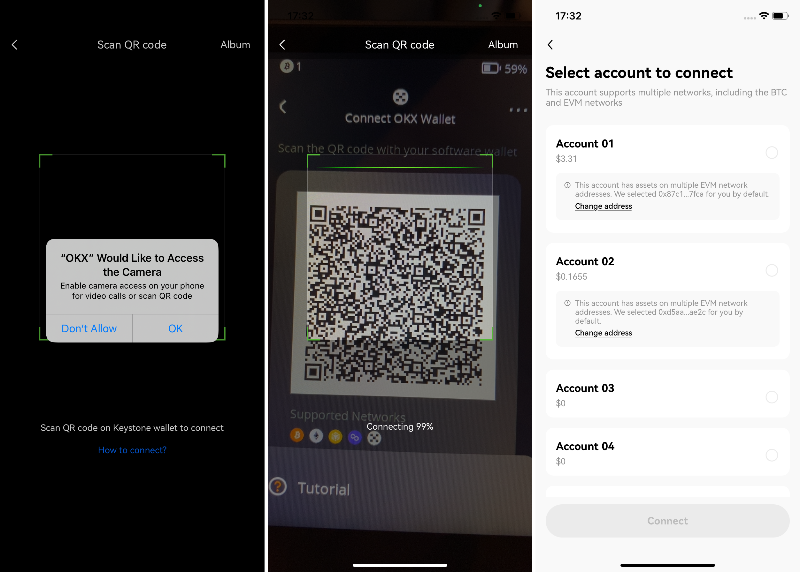
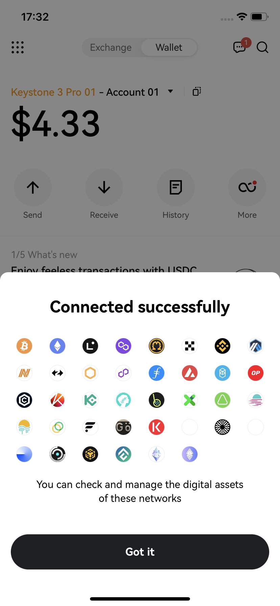

# **How to connect with OKX Wallet Mobile** {#cf3777dd9c0f41eea9db8c1779afefaa}

Welcome to the tutorial that will guide you through the process of connecting your Keystone hardware wallet with the OKX Wallet Mobile. In this tutorial, you'll learn how to establish the connection and explore the fundamental features of OKX Wallet, including sending transactions and utilizing the decentralized exchange (DEX). Let's dive in!

**Supported Chains**: BTC, EVM Chains, Near, Litecoin, Dash and BitcoinCash (Compatible with Keystone)

**Features**: Send, Receive, Swap, and so on.

## Prepare {#add859117991469a982bc9edff993ff5}

Before we begin, please ensure you have the following:

1. [Firmware](https://keyst.one/firmware?locale=en) version 0.9.0 or newer running on Keystone 3 Pro.
1. OKX Wallet is installed on mobile phones. You can download it from the Google Play Store or App Store.

Now you are ready to connect Keystone with OKX Wallet and explore its features!

## **Connect Keystone with OKX Wallet** {#d0a958ee8b1a4f4b80746db445452fa9}

**On Your Keystone Hardware Wallet:**

1. Tap the "..." icon and choose [OKX Wallet].
1. A QR code will appear, ready to be scanned with OKX Wallet.

  

**On OKX Wallet:**

1. Launch the OKX Wallet and tap on [Wallet] at the top.
1. Select [I already have one], then choose [Hardware wallet], and opt for [Keystone].

  

1. Tap [Scan to connect] and carefully follow the provided instructions. Press [Connect now].

  

1. Grant permission for the "OKX" app to access your camera, and use it to scan the QR code displayed on your Keystone hardware wallet. Select an account to unlock.

  

Once you've successfully bound your Keystone wallet with OKX Wallet, you can securely explore the various features it offers.

