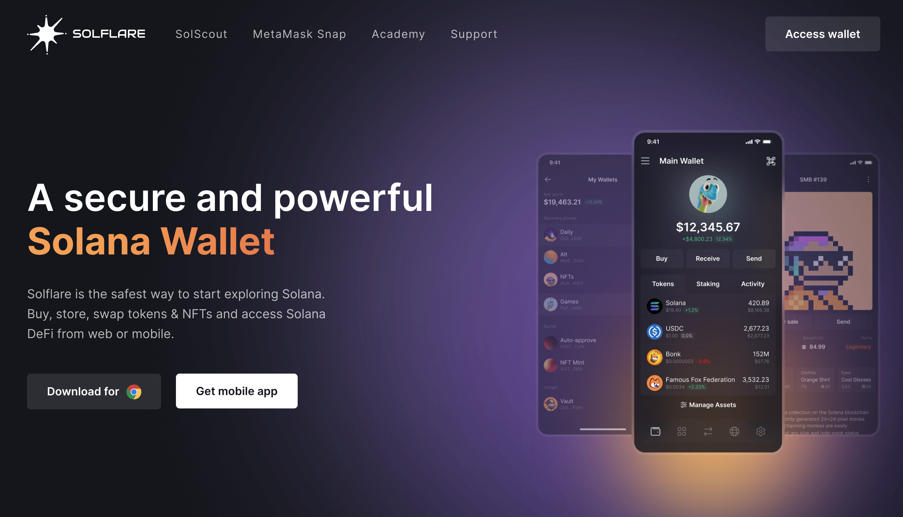
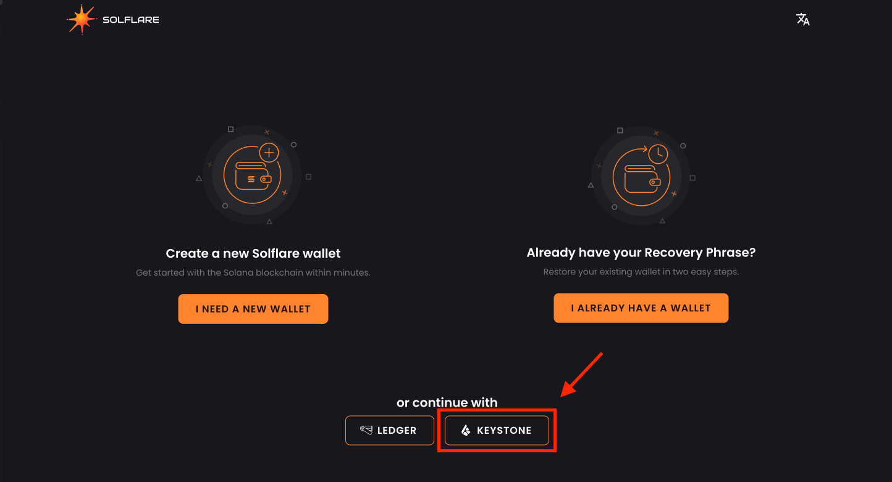
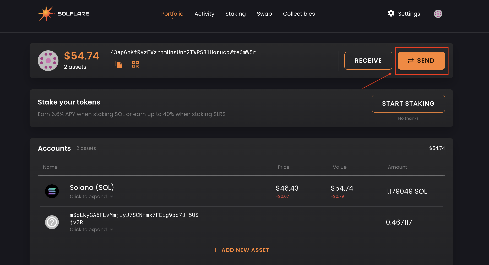
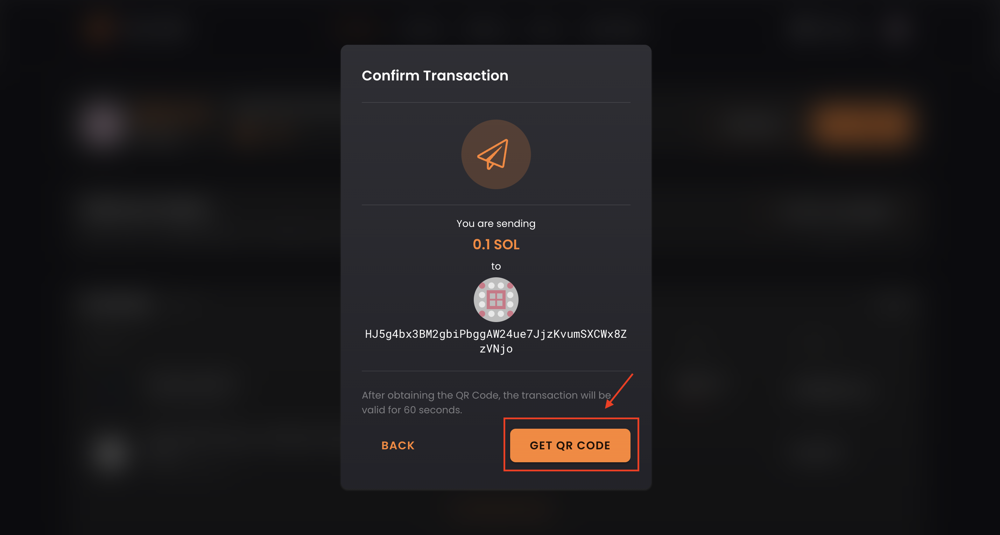
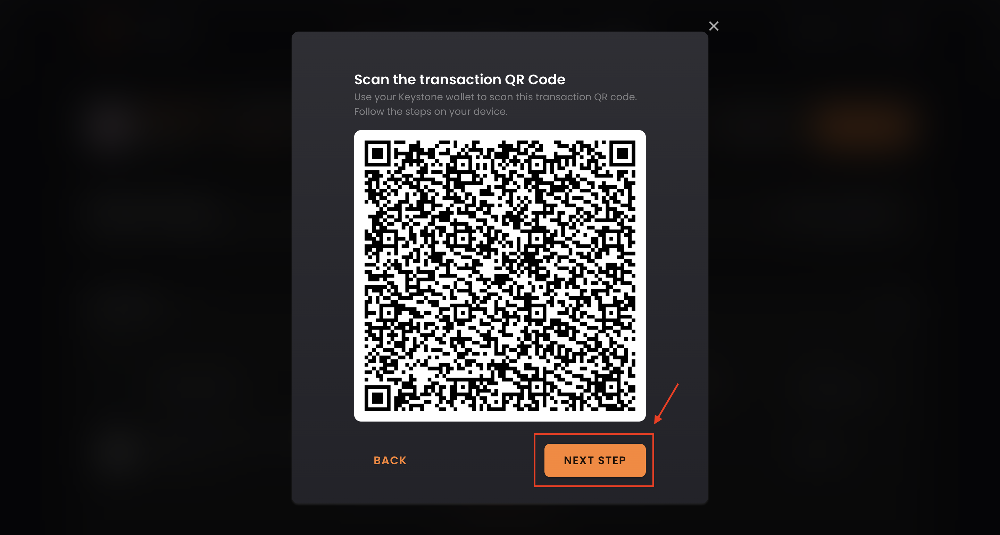

# **How to Connect the Keystone with Solflare Extension** {#cbc744c491424314928bc0d5dbe4791a}

As a hardware wallet user, you need to connect your Keystone wallet with software wallets like Solflare to access various online features such as sending SOL, swapping SOL, etc. Connecting with Solflare allows you to explore all supported SOL blockchain.

## **Step 1: Preparation** {#ba295b725ef7478caf5839b2aca464e3}

Before you start, make sure you have the following:

1. [Firmware](https://keyst.one/firmware?locale=en) version 1.1.0 or newer running on Keystone 3 Pro.
1. Solflare browser extension installed. Download it from [Solflare's official website](https://solflare.com/).

  

## **Step 2:** Connecting your Keystone with Solflare Extension {#0994d5fb0dbb4a08af4e785b78bd6fb6}

### **1.** Run the "Soflare Extension". Click [Keystone] icon on the main page {#815333bc6bd64a249e82d13ac6d77e79}

- Scan Keystone QR code with your computer’s camera.

### **2. Connect Keystone with Solflare** {#54ece8b8191145e3a1fdc6d47dbd9be5}

Now, let's connect your Keystone hardware wallet with Solflare:

1. On your Keystone hardware wallet, select [Solflare] in the menu to display a QR code.
1. On Solflare Extension, tap [Account], select [Connect Keystone], and scan the QR code on Keystone.
1. Choose your account and tap [Unlock] to complete the connection. You can unlock the 1st account if you are new here.
1. Select the accounts that you are going to import then tap [CONTINUE].

That's it! Your Keystone hardware wallet is now successfully connected with Solflare for SOL chain support.

## Step 3: Send SOL with your Keystone hardware Wallet {#4ae0cd1016c743239473acbcd1d5e845}

- **Create a SOL transaction on Solflare Extension**
  - Click [Send] > input the amount and recipient address. Then tap [Next] for the next step.
  - After confirming the transaction by pressing [SEND], click [GET QR CODE].

  

- After confirming the transaction by pressing [SEND], click [GET QR CODE].

  

- Solflare generates a QR code; scan it with your Keystone.
- Verify and securely sign the transaction with your Keystone password.
- Finish the transaction with Solflare Extension.
  - Scan the QR code shown on the Keystone Firmware Wallet with Solflare Extension.

    

  - The transaction should be successfully broadcasted.

And there you have it! You've successfully sent your SOL to another address.

Once you've connected Keystone with Solflare, you can do more than just send currency easily. **You can still access all of Solflare's features.**

Keystone, as a hardware wallet, secures your assets, and all transactions after binding require Keystone's signature. Plus, you can explore and use various online features in Solflare to meet your basic needs.

