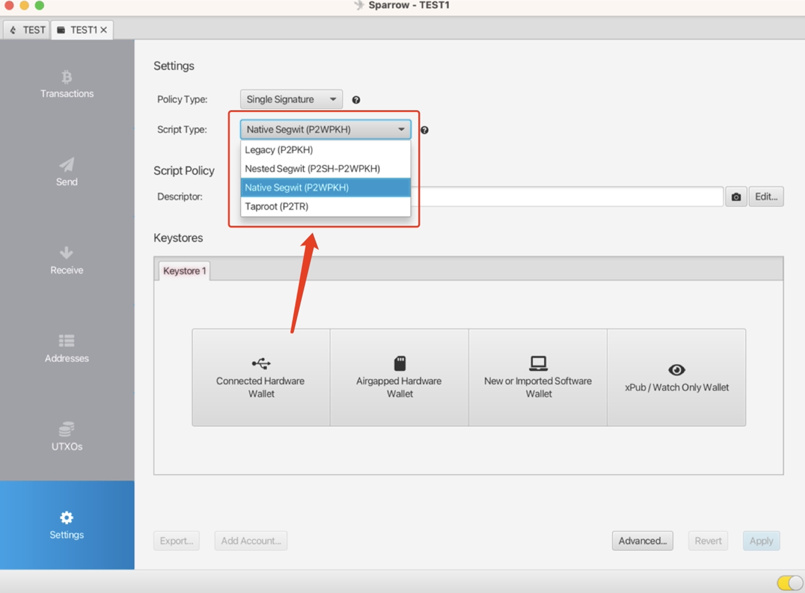

# **Sparrow Wallet** {#42963b896f56400fb05b52f3f00670e2}

With firmware versions 1.1.4 or newer, you can set Sparrow V1.4.2 or newer as a BTC wallet that functions as the companion app for Keystone 3 Pro.

## **I.** **Preparation** {#aea18716aa604ad893e7194d6a646e54}

1. [Firmware](https://keyst.one/firmware?locale=en) version 1.1.4 or newer running on Keystone 3 Pro. (Please read[ How to upgrade firmware](https://support.keyst.one/getting-started/firmware-upgrading) for more details.)
1. PC/Mac with Sparrow Wallet V1.4.2 or newer installed and set up.
1. MicroSD card (FAT32 format with capacity **NOT** exceeding 512GB). ([**How to Format a MicroSD Card to FAT32?**](https://support.keyst.one/getting-started/firmware-upgrading/how-to-format-a-microsd-card-to-fat32)**)**

## **II. Connect Keystone with Sparrow (eg. Native Segwit)** {#ec89ffa9e75e47ff9af4e5286408b681}

**On Your Keystone Hardware Wallet:**

1. Tap the "..." icon on the top right.
1. Choose [Sparrow] and a QR code will appear.

**On Sparrow Wallet:** 

1. Create a new wallet and enter a name &gt; go to [Settings] and click on [Airgapped Hardware Wallet] and locate “Keystone”.
1. Click on [Scan...] on Sparrow Wallet and scan the QR code shown on the Keystone.
1. Once synced, click [Apply] to proceed &gt; set a password for your wallet.

Congratulations! You've seamlessly connected your Keystone BTC addresses with the Sparrow!

**If you need to access Nested Segwit or Legacy, here are the steps:**

1. Create a new wallet and enter a name &gt; go to [Settings]
1. Choose the “Script Type” to “Nested Segwit” or “Legacy”

  

1. Click on [Airgapped Hardware Wallet] and locate “Keystone”.
1. Click on [Scan...] on Sparrow Wallet and scan the QR code shown on the Keystone.
1. Once synced, click [Apply] to proceed &gt; set a password for your wallet.

### **Sending and Receiving Assets with Sparrow Wallet** {#906784f9a2aa4644938ed9ca3857f797}

### **A. Receiving BTC** {#9425cd6bf47745ba8a117a107dbe3aa5}

Users can choose between the Keystone device or the Sparrow Wallet app to generate receive addresses for BTC. But it’s recommended to use Keystone to view or generate receive addresses due to safety concerns. (This way you can verify that the receiving address is actually correct or not, because the internet-connected instance is prone to malware.)

- On Keystone: Tap [BTC] to display the receiving addresses. (You can optionally generate more addresses that the device can display for you.
- On Sparrow Wallet: Click [Receive] to display the receiving addresses. (You can also go into the Addresses menu and use any address displayed, but we mainly recommend using the ones via Receive.)

### **B. Sending BTC** {#2b5838d6e6194e5aa078daffa4cc6aca}

1. **Create a Transaction with Sparrow Wallet**
  1. Run Sparrow Wallet. Click [Send] and set the receive address, label, amount, and fee. Click [Create Transaction].
  2. Click on [Finalize Transaction for Signing].
  3. Click [Show QR] on Sparrow Wallet and show the unsigned transaction data in QR code format.
1. **Sign with Keystone Hardware Wallet**
  1. On the Keystone 3 Pro, tap the [Scan] button and scan the QR code shown on Sparrow Wallet.
  2. Verify your transaction details > Swipe to sign the transaction by passcode or fingerprint > A QR code will displayed.
1. **Broadcast with Sparrow Wallet**
  1. Make sure the Sparrow Wallet has connected to the node successfully.
  2. Click [Broadcast Transaction].
