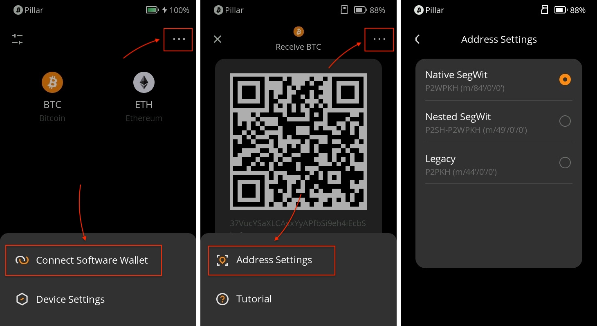
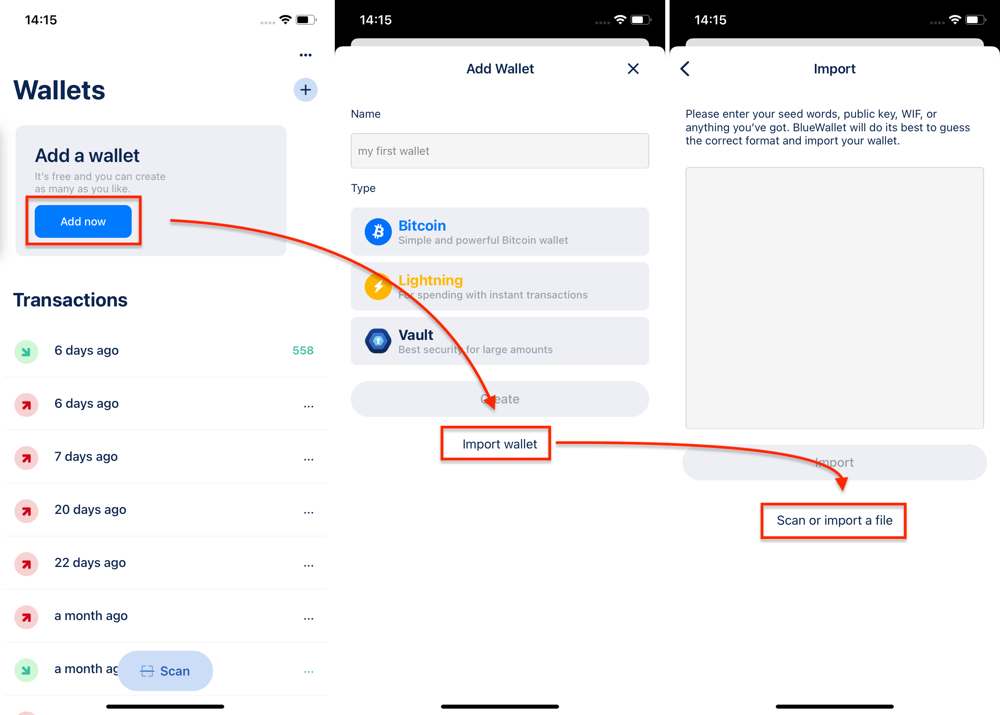
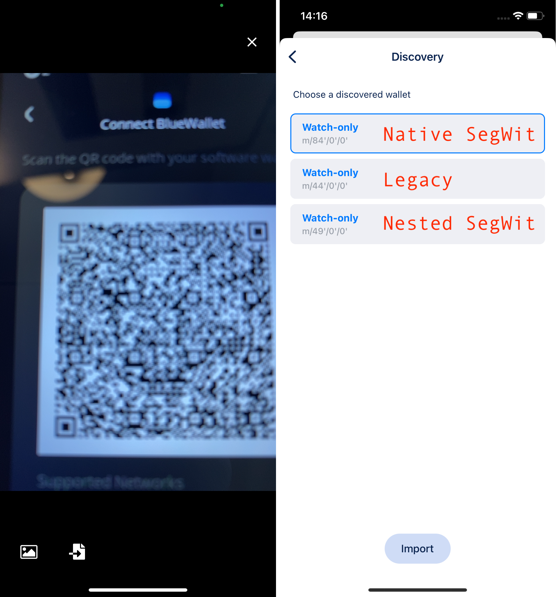

# Which BTC address should I use as there are 3 kinds of BTC? {#c2b969afe7a74ead87d9d90ae73131bc}

If you're using Bitcoin (BTC), you might have noticed that there are three different address formats available: Native SegWit, Nested SegWit, and Legacy. Each of these formats has its own characteristics and advantages. In this tutorial, we'll explore the differences between these address types and guide you on how to choose and use the right one for your needs.

## **Why Are There Three Types of BTC Addresses?** {#e358c34f6d7b444fa64248a02200420c}

Bitcoin has evolved over time, and with that evolution, new technologies have been introduced to improve transaction efficiency, reduce fees, and enhance security. As a result, three different address formats have emerged: Native SegWit, Nested SegWit, and Legacy.

## **Characteristics of the Three BTC Address Formats** {#2d9268db32f847d3a0e797d61914f52f}

1. **Legacy (P2PKH/P2SH):**
  1. Format: Addresses start with '1'.
  2. Characteristics: These are the original Bitcoin addresses and are fully functional. However, they tend to have larger transaction sizes and higher fees compared to newer formats.
  3. Recommended Usage: If you're interacting with older wallets or services that don't support SegWit, you might use Legacy addresses.
1. **Nested SegWit (P2SH-P2WPKH):**
  1. Format: Addresses start with '3'.
  2. Characteristics: These addresses provide a compromise between compatibility with legacy systems and improved transaction efficiency. They have smaller transaction sizes and slightly lower fees than Legacy addresses.
  3. Recommended Usage: If you need compatibility with older wallets or services but still want some of the benefits of SegWit, you can use Nested SegWit addresses.
1. **Native SegWit (P2WPKH):**
  1. Format: Addresses start with 'bc1'.
  2. Characteristics: These addresses offer the highest transaction efficiency, resulting in the smallest transaction sizes and lowest fees. They also have improved security features compared to the other formats.
  3. Recommended Usage: If you want to take full advantage of the latest Bitcoin technology, use Native SegWit addresses whenever possible.

## **Switching BTC Address Formats on Keystone Hardware Wallet** {#5a0d104cd7384ea5a54cb5eedec0fddd}

1. **Access Address Settings:**
  1. Power on your Keystone hardware wallet.
  2. From the main page, navigate to [BTC].
  3. Tap [Address Settings]. You will see options for the three types of BTC addresses.

  

1. **Choose Your Preferred Address:**
  1. Select the BTC address format you wish to use.
  2. To return to the main page, tap the [<] button. The chosen format of the address will now be displayed.

## **Using BlueWallet to Access different BTC with Keystone** {#4a12398d7a46453989db371ee1108cbd}

**Connecting BlueWallet:**

1. On the Keystone main page, tap the menu icon (three dots) in the upper-right corner.
1. Choose [Connect Software Wallet].
1. Locate [BlueWallet] and tap on it. A QR code will be displayed.

  

**Using BlueWallet:**

1. Open BlueWallet on your smartphone.
1. Navigate to the appropriate section for connecting a hardware wallet.
1. Scan the QR code displayed on your Keystone hardware wallet.

**Changing Address Formats on BlueWallet:**

1. If you need to change the BTC address format bound to BlueWallet, follow the re-binding process.
1. During the process of selecting address paths, you can choose the desired BTC format.

By understanding the differences between Native SegWit, Nested SegWit, and Legacy addresses, you can make an informed decision on which BTC address format to use based on your priorities. Whether you value transaction efficiency, lower fees, or compatibility with older systems, selecting the right address format will enhance your Bitcoin experience.

## FAQ {#1d6242dca40b4c40a59a7dcc643c1d4c}

  
Can I send BTC from Nested SegWit to Legacy or Native SegWit addresses?

Yes, you can send BTC from a Nested SegWit address to either a Legacy or a Native SegWit address. The recipient's address format does not affect your ability to send BTC to them.

  

  
Can I convert one address format to another directly?

While you can't directly convert one address format to another, you can send BTC from one address type to another through a regular transaction.

  

