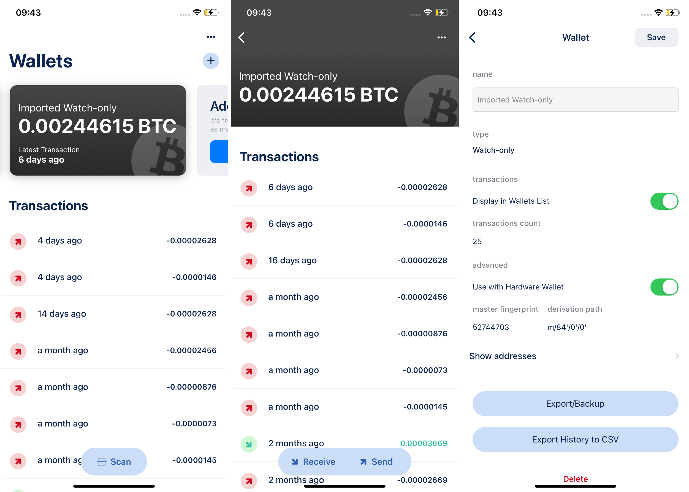
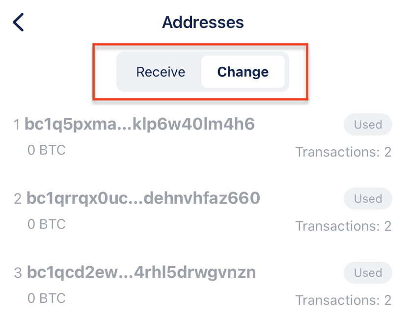

# **Why Are There Two "To" Addresses When Sending Bitcoin?** {#574e941929ff406f84d2bac30029db94}

Welcome to the world of Bitcoin! As you learn the ropes of cryptocurrency transactions, you might come across a curious phenomenon: Why does it sometimes seem like there are two "To" addresses when you send Bitcoin (BTC)? Let's unravel this mystery and understand the role of these addresses in a simple and clear way.

## **Understanding Bitcoin Transactions and Addresses** {#e7a62a28bcaf40d9a2bf7177a13dc5e3}

Before we dive into the two "To" addresses, let's quickly understand a couple of basics about Bitcoin transactions:

1. **Transaction Outputs (UTXOs):** In Bitcoin, when someone sends you BTC, it's like receiving a special coin called an Unspent Transaction Output (UTXO). Think of it as a digital coin in your virtual wallet.
1. **Receiving Addresses:** Just like your mailing address, your Bitcoin wallet has an address. This is where others send BTC when they want to share some with you.

Now, let's explore why you might see two "To" addresses in a Bitcoin transaction!

## **The Mystery of Two "To" Addresses** {#e8df5ddee0244deaa9702ca5a6f15e26}

Imagine this scenario: You want to send a specific amount of BTC to someone. But your wallet has more BTC in it than you want to send. What happens next?

1. **Recipient's Address:** The first "To" address is straightforward. It's the recipient's Bitcoin address – where you want to send the BTC. This part is easy to understand. You're sending some BTC to someone.
1. **Change Address:** Here's where the magic happens. Since your wallet has more BTC than you're sending, the extra BTC needs a place to go. This is where the second "To" address comes in. It's called a "change address." Your wallet creates a new address for you, like a little pocket, and sends the extra BTC there.

## **Why the Change Address?** {#37d831554ca84793b7a37132640690e9}

You might ponder: Why not simply send the precise amount and conclude the matter? The rationale ties into security and privacy. Bitcoin transactions operate in a manner where each UTXO can only be utilized once. By directing the surplus BTC to a fresh address (the change address), you're ensuring that the remainder of your BTC remains safeguarded and doesn't inadvertently mingle with other transactions. This practice upholds the integrity of your transactions and protects your privacy.

In essence, the presence of two "To" addresses in a Bitcoin transaction serves the practical purposes of transferring BTC to the intended recipient and managing the excess BTC securely through a change address. This practice embodies the intricate yet vital dance of security and functionality within the Bitcoin ecosystem.

## **Checking Change Addresses** {#402035abf8014d8bb75320a92cbe1798}

If curiosity strikes, you can examine change addresses using a wallet such as BlueWallet connected with Keystone. Here's how you can explore changing addresses:

1. Choose "Imported Watch-Only Wallet."
1. Tap the options button (...) located in the upper-right corner.
1. Select [Show Address].

  

1. Here, you'll see lists for both "Receive" and "Change" addresses.

It's a handy way to compare your addresses, including the change addresses that play a key role in Bitcoin transactions.

**Note for Keystone Gen3 Users:**
Keystone Gen3 might not display the "Change Address" list due to memory limitations. But rest assured, you can still determine whether a change address belongs to you by using the method mentioned above or exploring third-party tools.

With these insights, you're equipped to explore the realm of change addresses and gain a deeper understanding of how Bitcoin transactions work.

## **FAQs** {#777a28cfb7e64ea68fc11e18d2330022}

  
Do I Own the Change Address?

Your BTC balance is calculated as the sum of the balance on your Receiving address and the balance on the Change Address. Both types of addresses are derived from your seed phrase, and you have the control to manage them using your seed phrase.

  

