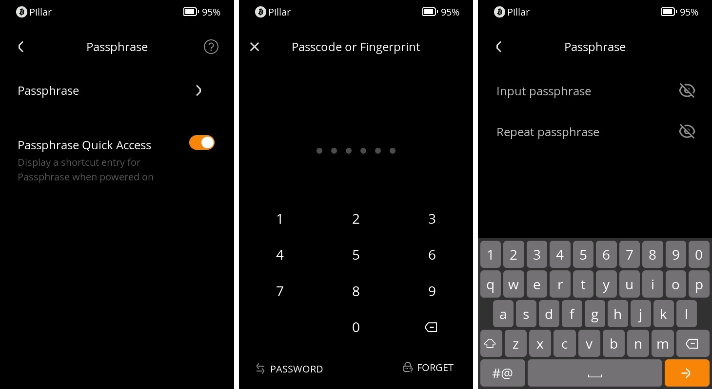

# Passphrase Wallet {#34a2823b57214f02a8e1a3a696a2cbaf}

Welcome to the tutorial on how to use the Passphrase Wallet feature on your Keystone 3 Pro device. The Passphrase Wallet adds an extra layer of security to your device, allowing you to create a separate wallet that can only be accessed with a specific passphrase. This tutorial will guide you through the process of creating, entering, and efficiently using the Passphrase Wallet.

## **What is a Passphrase and Why Use It?** {#5b9c7e06a37e428b8d7b3d443661b920}

In simple terms, a passphrase is like a secret code that gives an extra layer of protection to your digital wallet. Just like you use a password to unlock your phone, a passphrase helps keep your wallet safe. Think of it as a super-strong lock for your digital money. This might sound a bit like extra work, but it's like locking the door to your home to keep your valuables safe.

The Passphrase Wallet feature is designed for people who really care about making sure their money and information stay safe. It's a bit like having a hidden compartment in your wallet that only you can open. By using a passphrase, you're adding a special code that only you know, making it much harder for someone else to access your digital money.

## 1**. Creating or Entering the Passphrase Wallet** {#b83df43f672d41c5bee8133b3f060cfe}

1. Hold your Keystone 3 Pro device and tap the menu icon (usually depicted as “…”) located in the upper-right corner of the screen.
1. From the menu that appears, select "Device Settings."
1. In the "Device Settings" menu, locate and tap "Wallet Settings."
1. Within the "Wallet Settings," find and select "Passphrase."

  

1. You'll be prompted to enter a password or use your fingerprint to unlock this feature.
1. Once unlocked, use the on-screen keyboard to type in your desired passphrase. Remember, this is the passphrase that will protect your Passphrase Wallet.

  

1. After typing your passphrase, you'll have successfully created your Passphrase Wallet. The MasterFingerPrint (MFP) associated with the Passphrase Wallet is distinct from that of the Original Wallet. Consider the MFP as the identification for your wallet.

**Note:** The Keystone 3 Pro doesn't store this passphrase, so you'll need to enter it every time you want to access the Passphrase Wallet.

## 2**. Returning to the Original Wallet** {#7d552ec9dda14ce1b1a981a9e85153b5}

1. If you wish to go back to your original wallet, simply access the Passphrase Wallet again.
1. On this occasion, you won't need to enter anything. Just click the "Next" button and you'll be returned to your original wallet.

  

1. Additionally, when your device restarts or is reset, it will automatically revert to the original wallet.

## 3**. Efficient Access to the Passphrase Wallet** {#44b61e07bb2f4c9684151e335120c766}

To access the Passphrase Wallet more efficiently **when rebooting**, follow these steps:

1. Unlock your device's screen.
1. On the lock screen, an option named "Passphrase Quick Access" will be available. Open this option.

  

1. Input your passphrase directly on the lock screen. There's no need to navigate through settings.
1. Once you've entered and confirmed your passphrase, you'll gain entry to the Passphrase Wallet.

  

## 4**. FAQs** {#618ed46620854995987ebe1293e82e9e}

  
Can I set the Passphrase Wallet as the default wallet?

Unfortunately, this isn't possible. The Passphrase Wallet is designed to enhance security, and storing it as the default would undermine this principle.

  

  
Can I use my password to unlock the Passphrase Wallet?

The design assumes that if a hacker gains access to your device, they might extract your private key. The passphrase is an additional barrier. Storing it when the device is off goes against its security design, so this feature isn't offered.
Remember, while security requires a bit of extra effort, it provides valuable protection for your digital assets. Your commitment to safeguarding your data is commendable!

  

  
What's the limit on the length of the passphrase I can enter?

You can enter a passphrase with up to 128 digits or fewer.

  

  
Is it possible to import the 25th secret seed phrase from other wallets into Keystone?

Within the Standard Seed Phrase mode, also known as the 12/24-word seed phrase, Keystone supports the import of passphrases from wallets that adhere to the BIP39 standard. This standard is widely adopted within the industry, including by wallets such as Trezor and Ledger.

  

That concludes our Passphrase Wallet tutorial for Keystone 3 Pro. Enjoy enhanced security and peace of mind with your Passphrase Wallet.

