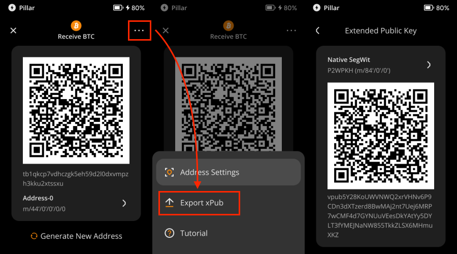
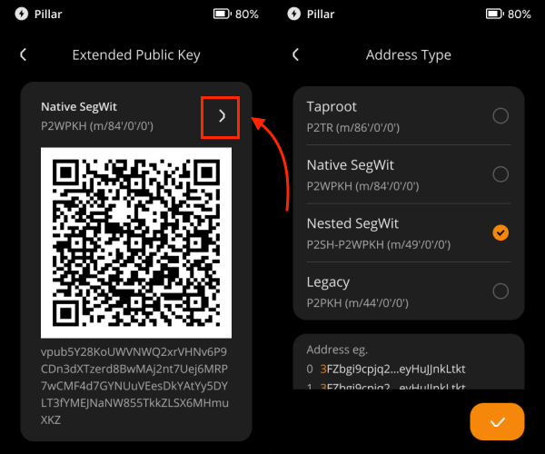

# View BTC xPub {#e2de02daaf544afebe233ee35b197917}

## **I. Introduction** {#da9d1de821444ca69f475ee519acf8e4}

In UTXO-based cryptocurrencies like Bitcoin, change addresses are used to send back the excess amount beyond the intended recipient's address. The xPub, which is the extended public key of your hardware wallet, is used to generate all the public addresses, including both the receiving addresses and change addresses, without exposing the private keys.

Exporting the xPub gives you a comprehensive view of your wallet's transaction history, including all the receiving addresses and change addresses used in transactions. This can be useful for auditing transactions for tax purposes or keeping track of your wallet activity.

The xPub can serve various purposes, such as auditing transactions for **tax purposes** or **monitoring your wallet activity**.

Protect your privacy and be cautious when sharing your xPub key. Anyone with it can monitor your wallet activity, both past and future. Keep your xPub safe and only share your xPub with trusted parties.

## **II. Preparation** {#c76032f554384d2f9b6647f6553b9fa7}

- Keystone 3 Pro, version 1.2.6 or later. Head over to [Firmware Update](https://keyst.one/firmware) page here.

## **III. Export the xPub by Keystone Hardware Wallet** {#064a59deb65d4a65bd3928c3957c4955}

To export the xPub (Extended Public Key) on Keystone 3 Pro, follow these steps:

1. On the homepage, tap the BTC icon to access the “Receive BTC” page
1. Tap the […] on the up-right corner and locate [Export xPub]. The QR code containing xPub of Native Segwit will show up.

  

If you need to export xPub of Nested Segwit or Legacy, changing the mode the exact one and it will show up.

That’s it!

