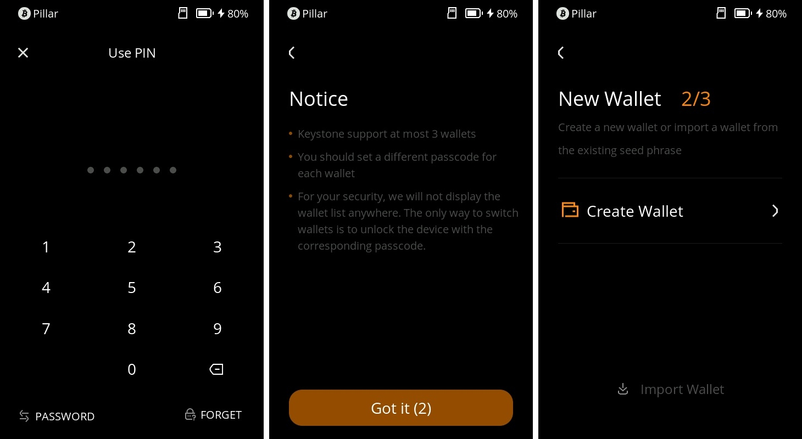

# Create or Import with 3 Seed Phrases {#7f81f3d3124e4b4f89ea9e0ca8c38df3}

Keystone 3 Pro is a device that helps you manage 3 sets of seed phrases at once. This tutorial will guide you through the process of adding, generating, and managing these wallets, ensuring the security of your funds.

## Before You Start {#8ca756244ca647f9bf0a4f2f5fba2b72}

**Your seed phrase is the key to your funds.** Regard it as your most valuable possession, and handle it with utmost care to protect your assets.

1. **Keep Your Seed Phrase Secure:** 
Keep your seed phrase safe where no one else can get to it. Write it down on the Seed Phrase Sheet that comes with your product, and put it in a safe place. You can also use the [Keystone Tablet](https://keyst.one/shop/products/keystone-tablet-plus) which is even tougher and keeps it safe from things like fire and rust.
1. **Create Your Seed Phrase Offline:** 
It's safer to generate your seed phrase without an internet connection. This makes it harder for hackers to compromise your information. When you create your seed phrase using Keystone, it's completely offline. Also, avoid importing an online seed phrase into Keystone, as this can still expose you to online risks.
1. **Keystone Hardware Wallet Approach:** 
For maximum security, only create your seed phrase using a Keystone hardware wallet. Refrain from importing an online seed phrase into a hardware wallet, as this could jeopardize your security. Instead, you can link Keystone with compatible third-party software wallets to access various features in a secure manner, like sending, minting NFT, staking, and so on.
1. **Think Carefully, Sign Confidently:** 
Keystone offers a unique feature that decodes transaction details before you sign them. This way, you're fully aware of what you're approving. This helps you dodge potential phishing attacks. For instance, hackers might mimic your desired receiving address, but Keystone's feature reveals the true transaction details.

## Adding and Generating Walle**ts** {#ac1bf5d263ca47b0acd6b357f30d0d62}

1. After setting up your device, click the "..." icon on the top-right corner of the home screen. Then select "Device Settings" and choose "Wallet Settings."

  

1. In the Wallet Settings page, tap the "+ Add Wallet" button at the bottom. You'll need to enter your password to proceed.
1. Read the Notice and decide whether to create a new wallet or import mnemonic phrases. For this example, we'll create a new wallet.

  

1. Set a new password and confirm it. This password will be needed to unlock the newly generated wallet.

  

1. Give your wallet a name and choose the type of mnemonic phrase you want to generate: standard 12 or 24 words, or shard mnemonic (Shamir Backup). The system will display the corresponding mnemonic words. Keep these words safe, either on Keystone Tablet or write them down on the provided mnemonic card and store it securely.
1. Confirm the mnemonic words: Click the words on the screen in the correct order to ensure you've saved them accurately.

  

Congratulations, you've successfully managed two wallets on your device. You can repeat these steps to manage up to three wallets using Keystone.

## **Managing Different Wallets** {#415c4eb3931e416687629bf10462e069}

Now that you've created a new wallet, managing three wallets is easy. Just repeat the steps above for each wallet, **using its corresponding password for access**.

## **Deleting a Wallet** {#4454e5f609824791bfaab34382bbb6f4}

If you need to delete a wallet, follow these steps:

1. Unlock the wallet you want to delete using its password.
1. Click the "..." icon on the top-right corner of the home screen. Then select "Device Settings" and choose "Wallet Settings."
1. In the Wallet Settings page, click the "..." icon on the top-right corner, then click "Delete Wallet."

  

## **Securing Mnemonic Phrases** {#d7532ccefa9d459c9a5668437e6c3954}

Keystone 3 Pro comes with three secure elements, 2 of which protect your seed phrases. These phrases are distributed across the chips in a complex manner, making physical hacking difficult. 

Always verify transaction details on Keystone 3 Pro before proceeding. **Exercise caution when dealing with unfamiliar transactions or contracts.** This is crucial for safeguarding your funds in the cryptocurrency world.

By following this tutorial, you've learned how to manage 3 sets of seed phrases at once on Keystone 3 Pro. Through managing different wallets, you can flexibly handle your digital assets while ensuring their safety and privacy.

