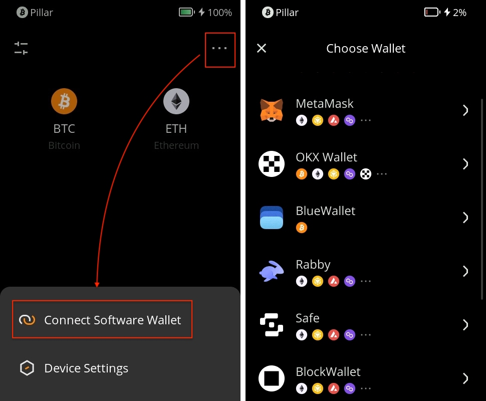

# Connecting Software Wallets {#82e390f9dc3a4d3da16d442a677248f3}

Once you've linked Keystone, you can do more than just send currency easily. You can still access all of the software wallets' features. Keystone, as a hardware wallet, secures your assets, and all transactions after binding require Keystone's signature. Plus, you can explore and use various online features in 3rd-party wallets to meet your basic needs.

:::tip

**Note**: Keystone 3 Pro supports QR code connection. The USB feature is coming soon.

:::

## Step 1: **Choose the Right Software Wallet** {#e51f9290dc8244e7b6b062196b9c62cd}

There are different software wallets available, each designed for specific types of digital assets. Here are some options:

- **OKX Wallet (Extension & Mobile)**: Use this app to manage BTC and EVM tokens. More chains will be supported soon.
- **BlueWallet (Mobile)**: Great for BTC, with features like Native Segwit, Legacy, and more.
- **MetaMask (Extension & Mobile)**: A reliable wallet for EVM tokens like ETH, AVAX, and BNB.
- **Rabby or BlockWallet (Extension)**: Recommended for EVM tokens like ETH, AVAX, and BNB.
- **Safe (Extension & Mobile)**: Enables multi-sig EVM chain wallet use/creation.

You can learn more about these options on the [**“Supported Assets and Wallets”**](https://keyst.one/supported-wallets-and-assets) page.

:::tip

Keystone 3 Pro supports BTC and EVM chains, with more coming soon.

:::

## **Step 2: Connecting Keystone with Your Chosen Wallet** {#803c2bb285514df698f59fdc2ac5e6d4}

If you have a Keystone 3 Pro device, you can easily connect it to your chosen software wallet. Follow these three simple steps:

1. **Download the App**: Go to the app stores or official websites and download the software wallet that matches your needs.
1. On your Keystone device,  Locate "Connect Software Wallet" and tap it. Choose the software wallet you downloaded earlier.

  

1. **Linking the Wallet**:
  1. After selecting the wallet, a QR code will appear on your Keystone device.
  2. Open the software wallet on your mobile or computer and find the option to scan a QR code.
  3. Scan the QR code displayed on your Keystone device using the software wallet. This links the two together.

That's it! You've successfully chosen a software wallet and connected it with your Keystone device. Happy managing and staying secure!

## FAQ: {#ee9b58ff9f414bbdb352ed8991db365c}

  
Can I import my seed phrases generated by software wallets, like MetaMask, into Keystone?

Yes, technically, you can import seed phrases from software wallets into Keystone. **However, it's essential to prioritize security.** We strongly advise generating your seed phrase offline, as Keystone does. Seed phrases generated by software wallets are created while connected to the internet, which exposes them to potential risks. Even if you import such seed phrases into a hardware wallet like Keystone, these risks cannot be entirely eliminated.

  

  
How many software wallets can I connect with Keystone simultaneously?

You can connect with numerous software wallets concurrently.

  

