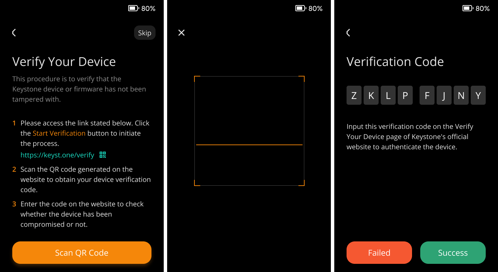

# Device Verification {#0db128f52c7d4192b609a1fc619a9c99}

Device Verification is a crucial step in ensuring the security and integrity of your device. This process helps detect potential tampering during transportation, prevents supply chain attacks, and ensures that the installed firmware is safe and trustworthy. 

Simply, it can confirm if your device is clean and secure.

## QR Code Verification {#d3673965722242ddb5a9abd65104fbe0}

1. Visit the [**Device Verification**](https://keyst.one/authentication) page on the Keystone website.
1. Click on "Scan QR Code" on the official website.
1. Use your Keystone camera on the main page to scan the QR code shown on the website.
1. A verification code will appear on your Keystone screen.

  

1. Enter this code on the website to complete the verification process.

By performing the device verification, you can ensure that your Keystone hardware wallet is genuine, untampered, and safe to use, providing you with peace of mind in your crypto transactions and storage.

