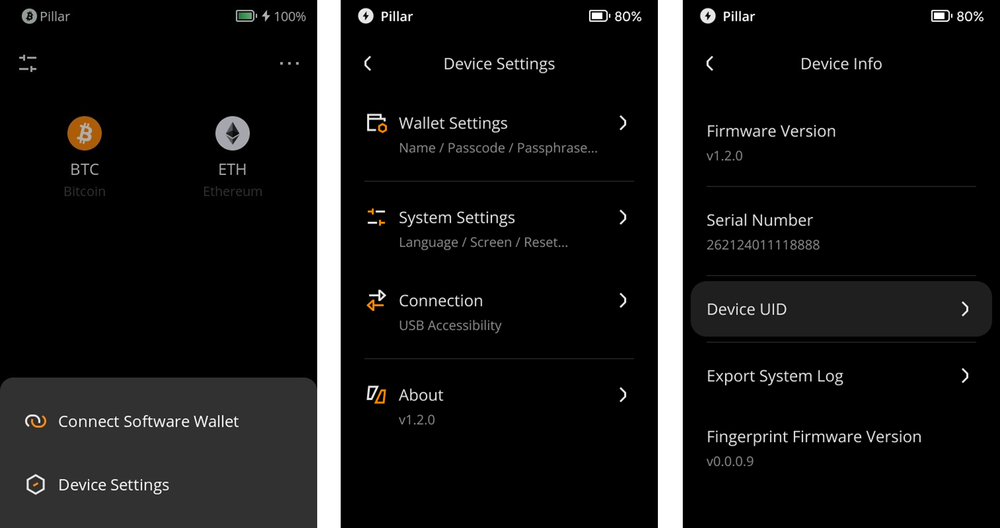

:::tip

**Key takeaways:**
- Keystone now supports exporting system logs to help diagnose issues or bugs and improve performance.

- Rest assured, no sensitive information will be included in the log file. You can verify by reviewing the logs since they are human-readable.

:::

## Steps: {#8bb5f5a94d564c93ba813a05ff62f555}

1. Insert your MicroSD card into Keystone.
1. Tap the [···] icon at the top right of the main page &gt; [Device Settings] &gt; [About] &gt; [Device Info] &gt; [Export System Log].

  

  

