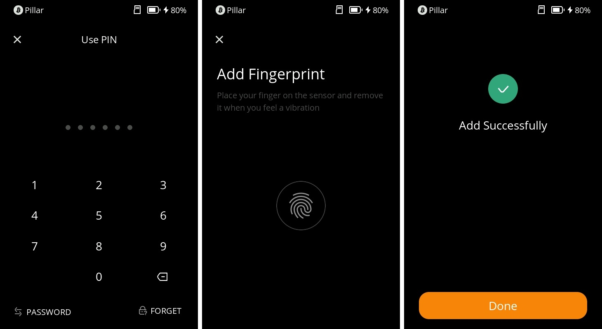

# **Fingerprint Settings** {#6c345d5fda8446b492deee618876950d}

In Keystone 3 Pro, **you can conveniently add up to 3 fingerprints for unlocking your device or signing transactions**. This tutorial will walk you through the process of setting up, applying, and deleting fingerprint unlock features.

## **1. Setting Up Fingerprints** {#e8d35ccb40cf444fab9a0aa3780aa8dd}

1. Begin by opening your Keystone 3 Pro device. From the top-right corner of the home screen, tap the "..." icon, then choose "Device Settings" and select "Wallet Settings."

  

1. In the Wallet Settings page, choose "Fingerprints & Password," then select "Fingerprint Settings."
1. Unlock with password: Before setting up fingerprints, confirm your identity by entering your password.
1. Place your finger on the device's bottom fingerprint sensor and follow the on-screen prompts to record your fingerprint. Once successfully recorded, you'll receive a confirmation message.

  

You can add a total of three fingerprints and define their usage scenarios.

## **2. Configuring Usage Scenarios** {#d5dfb5c22db2459c8ca15a9fd2624e8a}

1. After successfully adding fingerprints, you'll be taken to the "Fingerprint Settings" page.
1. Here, you'll find the "Fingerprint Applicable Scenarios" option. These scenarios can include "Device Unlock" or "Transaction Signing."
1. Slide the corresponding switches to enable or disable different scenarios. Choose which scenarios you'd like to enable or disable based on your needs.

  

## **3. Deleting Fingerprints** {#434d5474c87d4dbbaa3f756a0ececc86}

1. Open your Keystone 3 Pro device. Tap the "..." icon on the top-right corner of the home screen, then select "Device Settings."
1. In the Device Settings page, select "Wallet Settings," and then choose "Fingerprints & Password."

  

1. Under "Fingerprints & Password," select "Fingerprint Settings."
1. In the Fingerprint Settings page, tap on the specific fingerprint you want to delete, such as "Fingerprint 1."
1. On the fingerprint details page, you'll find the option to "Delete Fingerprint." Tap this option.
1. Confirm deletion: The system will ask you to confirm the deletion action. Once confirmed, the selected fingerprint will be removed.

By following this tutorial, you've successfully set up, applied, and managed fingerprint settings on your Keystone 3 Pro device.

