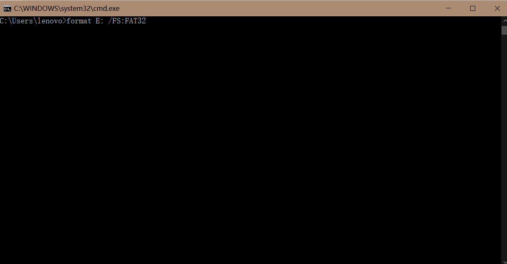
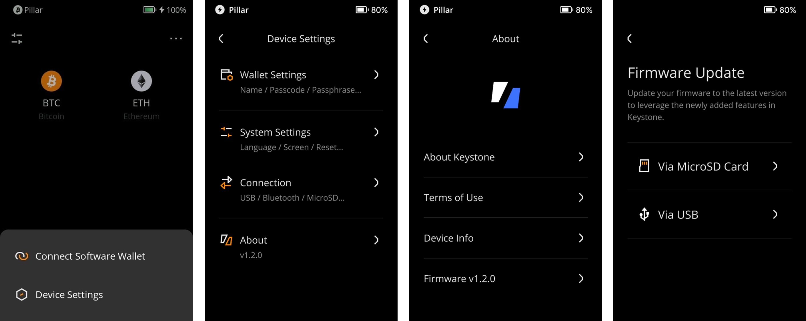

# **Firmware Update via USB or** Micro**SD Card** {#34838b70473b475e9311498d0d8f7fc3}

Firmware updates are important as they bring new features, bug fixes, and support for new blockchains. 

Upgrading your Keystone wallet is easy, and here is the way to update via MicroSD Card.

## Update via MicroSD card {#e611be8536e848e9b49a8a1b7cccb052}

### **What you'll need** {#42adf8e4ca264807b2c4a8ab0e9a4870}

1. Keystone 3 Pro
1. MicroSD card and MicroSD card reader (MicroSD cards with a capacity of 32GB or 64GB are recommended)
1. Computer

### **Steps** {#88c07774bc334e868c5733276f773708}

1. **Check Battery**: Make sure your Keystone wallet has at least 20% battery charge.
1. **Format MicroSD Card**: Insert the MicroSD card into your computer and format it as FAT32.
1. **Get Firmware**: Download the latest firmware version from the [Keystone Firmware Update](https://keyst.one/firmware) and save the "keystone3.bin" file to the root of your MicroSD card. Please make sure the filename is "keystone3.bin", if there is a filename similar to "keystone3 (1).bin", please modify it before installing.
1. **Insert MicroSD Card**: Place the MicroSD card with the firmware into your Keystone wallet.
1. **Start Update**:
  1. Tap the [···] icon at the top right of the main page > [Device Settings] > [System Settings] > [About] > [Firmware Update].

    

  2. Tap [Via MicroSD Card] and access the [Update] option on your Keystone wallet, thenenter your passcode to initiate the update process.

    

### How to format your MicroSD card to FAT32 format {#272b1c8bc77e49c39f6a9e43826d5b3e}

1. **For Windows Users:**
  - Use Command Prompt. Press the **Windows key**, type "**cmd**" or "**Command Prompt**" to enter cmd.exe.
  - Enter **`format [drive letter]: /FS:FAT32`**. Replace **`[drive letter]`** with thedrive letter for your MicroSD card (like **`format E: /FS:FAT32`**).

    

1. **For macOS Users:**
  - Insert your MicroSD card, open "Disk Utility" from Spotlight,
  - Choose your card, click "Erase". select "FAT32" format, name the card, and click "Erase."

    

  That's it! Your Keystone wallet firmware will be updated.

## **Update via USB Cable** {#f794865a31474dd9b57193349c6930f1}

### **What you'll need** {#233ec1d5e6594c339d625df948266fec}

1. Keystone 3 Pro
1. USB Cabel
1. Computer

### **Steps** {#bc14d1fbb9204dc5aeb07a57bfdcd586}

1. If your firmware version is below 1.0.4, you will need to perform the initial update using a MicroSD card before you can proceed with USB updates.
1. **Check Battery**: Ensure your Keystone wallet has at least 20% battery charge.
1. **Connect**:
  1. Tap the [···] icon at the top right of the main page > [Device Settings] > [System Settings] > [About] > [Firmware Update].
  2. Tap on [via USB] and use the USB cable to connect your Keystone wallet to your computer. Tap [Approve] to grant your Keystone wallet USB access, as it might otherwise only allow charging.

  

  

1. **Update**: Open your computer's web browser and go to the [**Firmware Update**](https://keyst.one/firmware) page.
1. **Install**: On the update page, click the "Install Updae" button and follow the provided instructions to install the latest firmware.

That's it! Your Keystone wallet firmware will be updated.

## FAQ {#1cbd53ed0dad4b97a357a51fc5aab3d4}

To ensure the security of your device during updates, follow these steps:

  
How to Protect Against Malicious Attacks During Updates

1. **Trust Official Sources:** Only download firmware updates from the [official Keystone website](https://keyst.one/) or [GitHub](https://github.com/KeystoneHQ). These updates are signed with our private keys, preventing any unauthorized or malicious firmware from being installed.
2. **Avoid Third-Party Sources:** Do not download firmware from unofficial sources or links provided by unknown parties.
3. **Verify Checksum:** Always compare the checksum provided on the firmware download page with the checksum on your device to ensure they match.

  By following these precautions, you can safeguard your device from potential malicious attacks during the update process.

  

  
Is Firmware Update Necessary?

Firmware updates typically introduce support for new blockchains, address bug fixes, and offer new features. If your current version already meets your requirements and you do not need the new functionalities or fixes, upgrading may not be necessary. However, staying up-to-date with the latest firmware ensures that your device remains secure and compatible with the evolving blockchain landscape.

  

