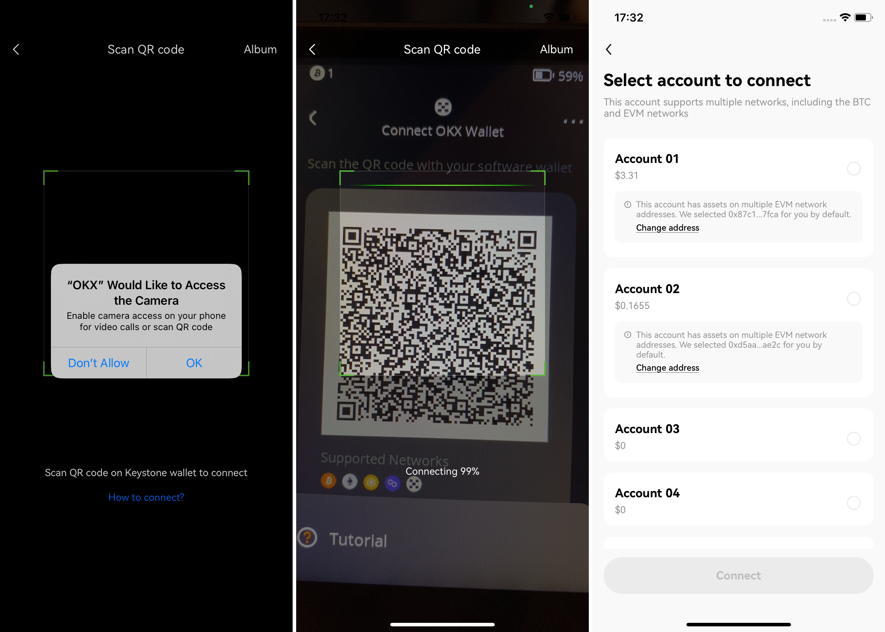

# Get Started {#0c633e81f65a43fdb24a328ca0036d3c}

## **A Must-Read Guide for Keystone Users: Ensuring Security Before You Explore** {#1175773f0b6141afa6c64de1e3b338da}

If you're new to hardware wallets and have been using software wallets, you might have heard about seed phrases and their importance. Seed phrases give you control over your digital assets. With them, you can receive and send coins securely. However, it's crucial to be aware of certain important things to protect your assets.

  
Keep Your Seed Phrase Secure

Keep your seed phrase safe where no one else can get to it. Write it down on the Seed Phrase Sheet that comes with your product, and put it in a safe place. You can also use the [Keystone Tablet](https://keyst.one/shop/products/keystone-tablet-plus) which is even tougher and keeps it safe from things like fire and rust.

  

  
Create Your Seed Phrase Offline

It's safer to generate your seed phrase without an internet connection. This makes it harder for hackers to compromise your information. When you create your seed phrase using Keystone, it's completely offline. Also, avoid importing an online seed phrase into Keystone, as this can still expose you to online risks.

  

  
Keystone Hardware Wallet Approach

For maximum security, only create your seed phrase using a Keystone hardware wallet. Refrain from importing an online seed phrase into a hardware wallet, as this could jeopardize your security. Instead, you can link Keystone with compatible third-party software wallets to access various features in a secure manner, like sending, minting NFT, staking, and so on.

  

  
Think Carefully, Sign Confidently

Keystone offers a unique feature that decodes transaction details before you sign them. This way, you're fully aware of what you're approving. This helps you dodge potential phishing attacks. For instance, hackers might mimic your desired receiving address, but Keystone's feature reveals the true transaction details.

  

Remember, your seed phrase is the foundation of your crypto security. Handle it with the utmost care and make the most of the advanced security features Keystone offers.

## **Preparation** {#cd89299e0077492c9949a6f42bc4891e}

You'll need:

1. Keystone 3 Pro or Keystone 3.
1. **Battery**: Ensure over 20% charge.
1. **USB Cable** or **Micro SD Card**:
  1. USB cable for firmware updates (included).
  2. Micro SD card (under 1 TB) for updates (purchase separately).
1. **PC Access** to [**Keystone's official website**](https://keyst.one/get-started) for Verification and Firmware Update.

## **Step-by-Step Setup Guide (For Beginners)** {#88d2da6f5b314ccfbf123b150026c7c2}

For users new to the setup process, follow these detailed steps:

### 1. **Choose Your Language** {#af9e67232b5e4d4cb770509be05e0467}

### 2. **Device Verification (Skippable)** {#b986a6a761d74e2ea40aa921ae6c86c0}

**Why Device Verification**: Device Verification is crucial to detect potential contamination during transportation, prevent supply chain attacks, and ensure the safety of installed firmware.

  
Device Verification via QR Code

1. Visit the [**Device Verification**](https://keyst.one/authentication) page on the Keystone website.
2. Click on "Scan QR Code" on the official website.
3. Use your Keystone camera to scan the QR code shown on the website.
4. A verification code will appear on your Keystone screen.
5. Enter this code on the website to complete the verification process.

  

### 3. **Firmware Update (Skippable)** {#05ab632876214123b3736dd4505c4819}

**Why Update**: Firmware updates typically include support for new blockchains, bug fixes, or new features. If your current version suits your needs, feel free to skip this step.

  
Update via MicroSD card

1. **Check Battery**: Make sure your Keystone wallet has at least 20% battery charge.
2. **Format SD Card**: Insert the SD card into your computer and format it as FAT32.
3. **Get Firmware**: Download the latest firmware version from the [**Keystone Firmware Upgrade**](https://keyst.one/firmware) and save the "keystone3.bin" file to the root of your MicroSD card.
4. **Insert SD Card**: Place the SD card with the firmware into your Keystone wallet.
5. **Start Upgrade**: Access the "Upgrade" option on your Keystone wallet, then follow the on-screen instructions to initiate the upgrade process.

  

  
Update via USB Cable

1. If your firmware version is below 1.0.4, you will need to perform the initial upgrade using a MicroSD card before you can proceed with USB upgrades.
2. **Check Battery**: Ensure your Keystone wallet has at least 20% battery charge.
3. **Connect**: Tap on [via USB] and use the USB cable to connect your Keystone wallet to your computer. Tap [Approve] to grant your Keystone wallet USB access, as it might otherwise only allow charging.
4. **Upgrade**: Open your computer's web browser and go to the [**Firmware Upgrade**](https://keyst.one/firmware) page.
5. **Install**: On the upgrade page, click the "Install Upgrade" button and follow the provided instructions to install the latest firmware.

  

### 4. **Create or Import Wallet - Seed Phrase** {#574afa768b6f45c59b4350267d763f6d}

1. **Secure Password:** Choose a strong PIN or password to protect your wallet.

  

1. **Name Your Wallet (Optional):** Optionally, give your wallet a name for easy identification or skip this step.

---

:::tip

**Guard Your Seed Phrase Like Treasure:**
Your seed phrase is the key to your funds. Regard it as your most valuable possession, and handle it with utmost care to protect your assets.

1. **Write it Down**: Put your seed phrase on the Secret Recovery Sheet or use the [Keystone Tablet](https://keyst.one/shop/products/keystone-tablet-plus) for extra protection against fire and rust.

1. **Keep it Private**: Don't share it with anyone and avoid using it online.

1. **Stay Offline**: Store your seed phrase offline to prevent unauthorized access. Avoid importing online-generated seed phrases into Keystone, as they are already exposed to online risks.

:::

  
New User? Create a Wallet

1. Select "Create New Wallet" if you are setting up a wallet for the first time.
2. Your device will generate a 24-word seed phrase.
3. Write down this seed phrase and store it securely.
4. Confirm the seed phrase by verifying the words in the correct order as displayed on the screen.

  

  

  
Already Have a Keystone Seed Phrase? Import Wallet

1. To mitigate online risks, don't import online-generated seed phrases into Keystone. Instead, generate a fresh seed phrase on Keystone.
2. If you have a compatible wallet's seed phrase, select "Import Wallet."
3. Enter your existing seed phrase using the on-screen keyboard.
4. Confirm the seed phrase to import your existing wallet.

:::tip

Note: It’s always recommended to use offline generated seed phrase for optimal security protection. If you import a seed phrase generated online (e.g. through a mobile app, etc.), it will not be protected offline, even if it is imported into the hardware wallet.

:::

  

### 5. **Choose the Software Wallet You Need (Multiple Choices)** {#2ca208a1a61241f194e84697a4d11991}

  
Choose your software wallet

Optimize your digital asset management with the right software wallet. Here are some recommendations:

1. **OKX Wallet (Extension & Mobile)**: Get this app to manage BTC and EVM tokens. We're expanding support for additional chains, aiming for an all-in-one solution.
2. **BlueWallet (Mobile)**: Ideal for BTC with features like Native Segwit, Nested Segwit, Legacy, coin control, Tor, and more.
3. **MetaMask (Extension & Mobile)**: Reliable wallet for EVM tokens like ETH, AVAX, and BNB.
4. **Rabby or BlockWallet (Extension)**: Recommended for EVM tokens like ETH, AVAX, and BNB.
5. **Safe (Extension & Mobile)**: Enables multi-sig EVM chain wallet use/creation.

Explore Keystone's [**“Supported Assets and Wallets”**](https://keyst.one/supported-wallets-and-assets) page for compatible options.

*Keystone 3 Pro supports BTC and EVM chains, with more coming soon.

  

  
Connect/bind Keystone with the Software Wallet (Take OKX Wallet for example)

1. **Download the App:** download OKX Wallet from the App Store or official websites.
2. **On the Keystone device**: Tap […] on the main page > Tap [Connect Software Wallet] and choose [OKX Wallet]. The QR code for connection to OKX Wallet will appear.

  

3. **On OKX Wallet Mobile:**
  - Open the OKX Wallet and select "I already have one"
  - Opt for "Hardware Wallet" and then select "Keystone."

  

  - Tap [Scan to connect] and carefully follow the provided instructions. Press [Connect now].

    

  - Grant permission for the "OKX" app to access your camera, and use it to scan the QR code displayed on your Keystone hardware wallet. Select an account to unlock.

    

  - Once you've successfully bound your Keystone wallet with OKX Wallet, you can securely explore its various features.

  Right now, you can use the OKX wallet to access BTC and ETH once you've connected with Keystone. We're also working on adding more coins, so stay tuned for updates!

  

Congratulations! Your device is now set up and ready to use. Remember to keep your seed phrase safe and never share it with anyone to ensure the security of your funds.

