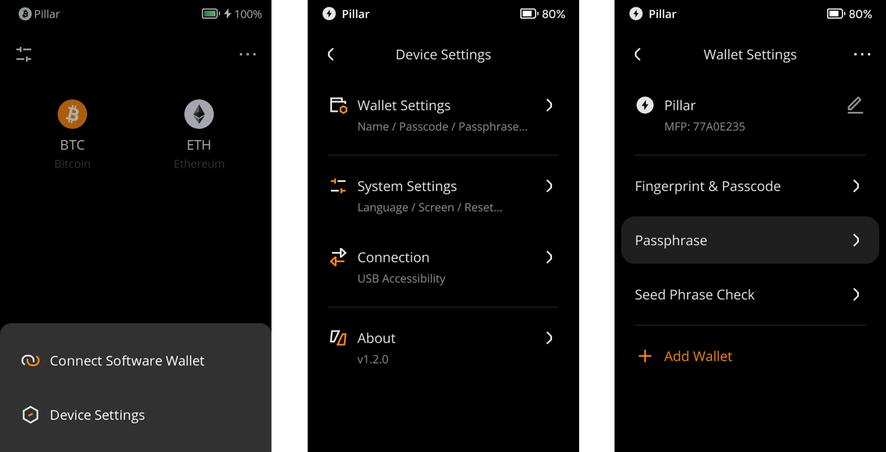

:::tip

**Key takeaways:**
- You can customize the name and logo for your own wallet with this feature.

- Keystone 3 Pro now supports the management of three sets of seed phrases simultaneously, you can also use this feature to differentiate between different wallets.

- Never include any private message in the name you put in.

:::

## Steps: {#4a44611427084d45abf3e036d9d831d7}

1. Tap the [···] icon at the top right of the main page &gt; [Device Settings] &gt; [Wallet Settings].

  

1. Click on the pencil icon to customize your wallet by assigning the name and selecting an icon. (Never include any private message in the name you put in.)

  

