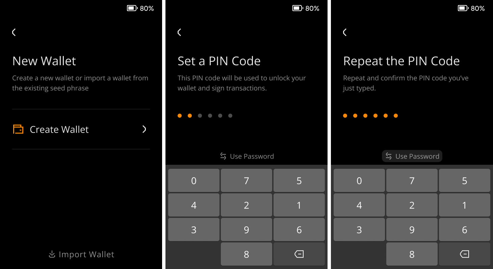
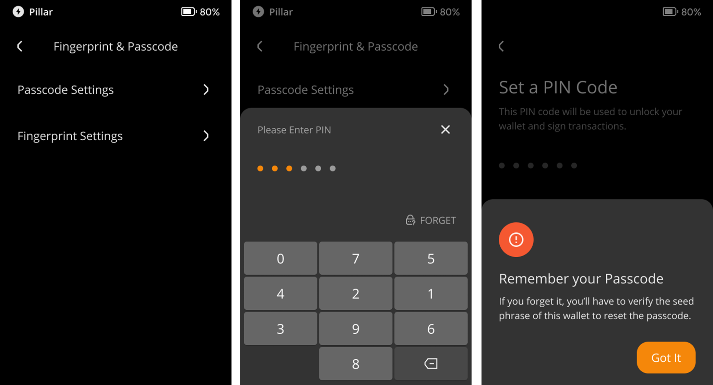
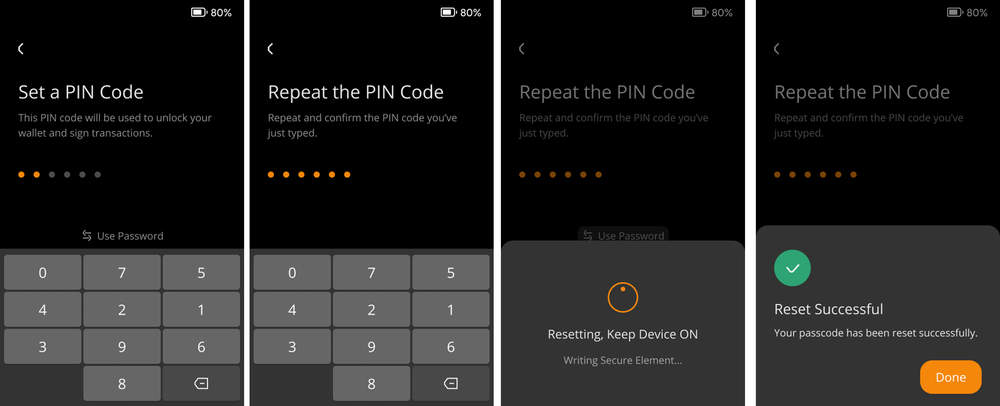
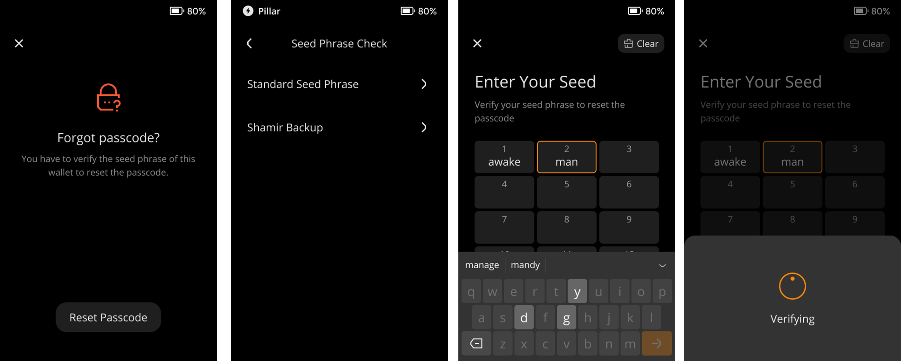
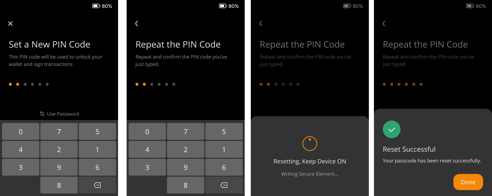

:::tip

**Key takeaways:**
- You can use a numeric PIN code or a password consisting of numbers, letters, and symbols as your passcode to control your device.

- You can easily modify your passcode by following this tutorial.

- If you forgot your passcode, you can reset the passcode by verifying the seed phrase.

:::

## Steps: {#432840b94e8f4d6781c962877879f194}

1. In the initial setup stage, you can choose a strong PIN code or password to protect your wallet after you click ‘Create Wallet’

  

1. If you still have your passcode:
  1. Tap the [···] icon at the top right of the main page > [Device Settings] > [Wallet Settings] > [Fingerprint & Passcode]
  2. Select [Reset Passcode] and put in your PIN code or password set at the setup stage.
  3. Follow the instructions to set a new PIN code or password.

  

  

1. If you forgot your passcode:
  1. Tap the [···] icon at the top right of the main page > [Device Settings] > [Wallet Settings] > [Fingerprint & Passcode]
  2. Select [Reset Passcode] > [Forgot Passcode]
  3. Verify your Seed Phrase to reset your passcode.

  

  

  

