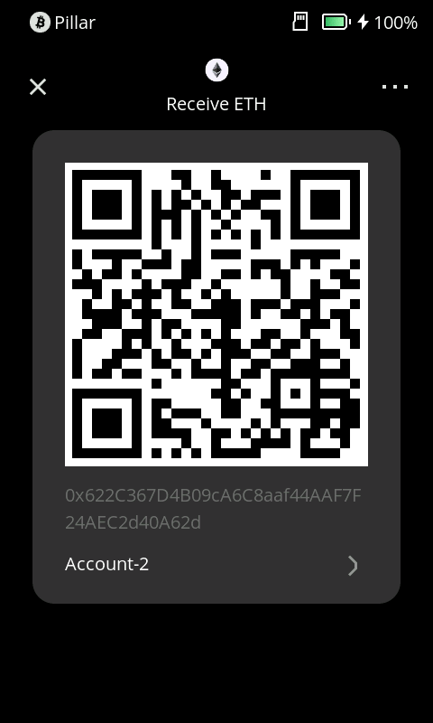

# Receiving Cryptocurrency {#3a84935314d14ff9b93c762132c1b151}

A Keystone hardware wallet offers a secure and straightforward way to receive various cryptocurrencies, including both main coins and tokens. This tutorial will guide you through the process.

**1. Select the Desired Main Coin or Token**

- On the wallet interface, choose the specific main coin or token you want to receive. Remember that Keystone usually displays main coins, so if you intend to receive tokens, you can still use the main coin's address, as tokens often share the same address.

  

**2. Obtain the Receiving Address**

- Once you've selected the main coin or token, Keystone will show you a unique receiving address. This address is akin to your bank account number but consists of letters and numbers.
- In most cases, you can use this main coin's address to receive tokens since they typically share the same address.

  

**3. Verify the Receiving Address**

- Before using the receiving address, thoroughly verify it to avoid any typos or missing characters. You can use Keystone's built-in QR code scanning feature to minimize errors.

**4. Share the Receiving Address**

- With the verified receiving address in hand, provide it to the person or entity that intends to send you funds.
- Ensure that the provided address matches the main coin or token you wish to receive.

**5. Wait for Funds to Arrive**

- Once someone sends funds to your receiving address, you'll need to wait for the network to confirm the transaction. The time required for confirmation depends on the speed of the cryptocurrency network being used.

**6. Check Your Balance**

- After the transaction is successfully confirmed, you can check your balance on the software wallets connected with Keystone. Your funds are now securely stored within your hardware wallet, under your control.

## FAQ {#4b0fa88c2d00451b9b7f2c1fc5fe7b58}

  
Why doesn't my Keystone display my balance?

Keystone is an offline device and requires an online connection to update balance information. To check your balance, send assets, or access additional features, we recommend connecting Keystone with compatible third-party wallets.

  

  
How can I receive my Arbitrum or Polygon assets when only an ETH address is displayed?

Chains like Arbitrum and Polygon are EVM-compatible, which means they share the same address format as Ethereum (ETH). You can use your "ETH" address to receive tokens on both Arbitrum and Polygon networks.

  

