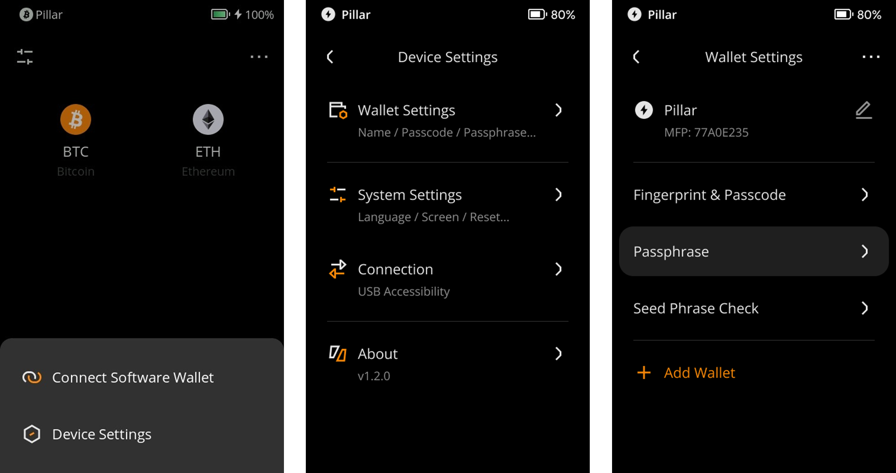
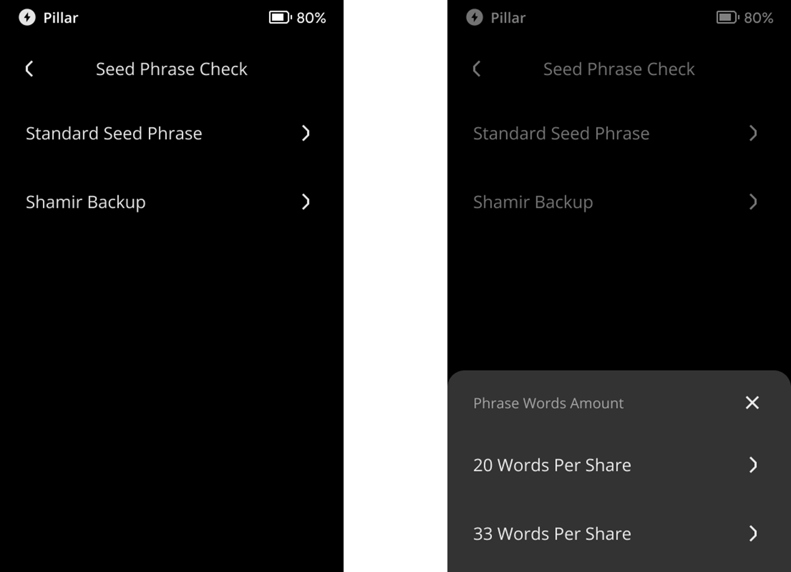
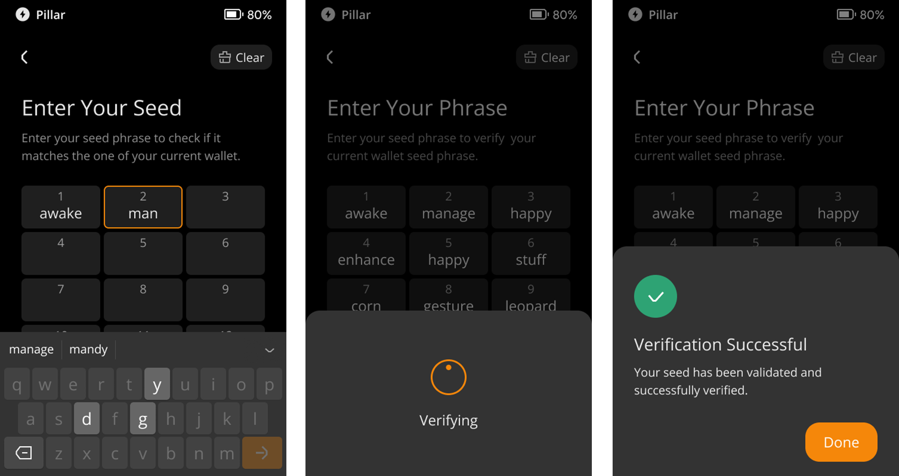

:::tip

**Key takeaways:**
- Kindly utilize the function provided to securely verify your recovery phrase.

- Both standard seed phrase and Shamir Backup are supported to be checked.

- Passphrase checking is not available.

:::

## **Steps:** {#c577fae072a44902ae1c5c67d3133b1a}

1. Tap the [···] icon at the top right of the main page &gt; [Device Settings] &gt; [Wallet Settings] &gt; [Seed Phrase Check].

  

1. Select a way of checking the length of the recovery phrase.

  

1. Input the backed-up recovery phrase and press [Confirm Recovery Phrase].
1. Check the result.

  

