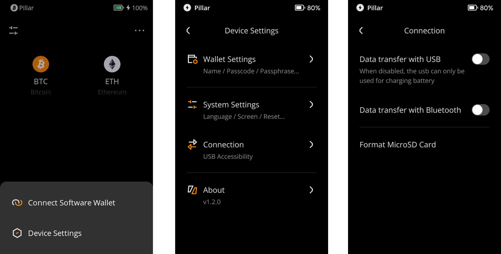

:::tip

**Key takeaways:**
- Keystone 3 Pro supports secure USB data transmission.

- You can choose to disable data transfer with USB by following the steps below.

:::

## Steps: {#ed964997ed1349c683d59c3465b7958a}

1. Tap the [···] icon at the top right of the main page &gt; [Device Settings] &gt; [Connection] &gt; [Data transfer with USB].
1. Disable it when you want to change it to a charge-only mode.

  

