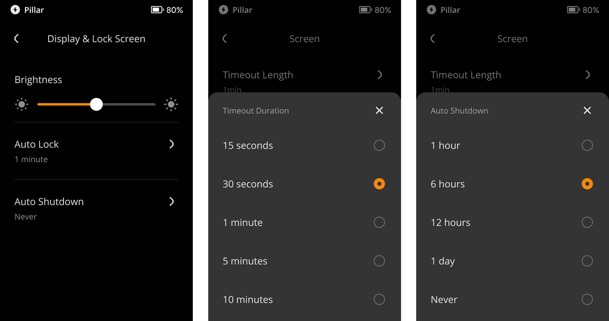

:::tip

**Key takeaways:**
- You can turn on/off the vibration directly by following the steps below.

- You can conveniently adjust screen brightness, auto-lock time, and auto-shutdown time to tailor your device's display settings to your preferences.

:::

## Steps: {#f45d4a11b3f7467fa8fc21bf04addaab}

### Vibration {#b06c8429162b48b494d0c5177ccc6471}

- Tap the [···] icon at the top right of the main page &gt; [Device Settings] &gt; [System Settings] &gt; [Vibration].

  

### Display & Lock Screen {#8a707d16c03c465fb35afea034925140}

1. Tap the [···] icon at the top right of the main page &gt; [Device Settings] &gt; [System Settings] &gt; [Display & Lock Screen].

  

1. You can adjust screen brightness, auto lock time, and auto shutdown time to your preferences.

  

