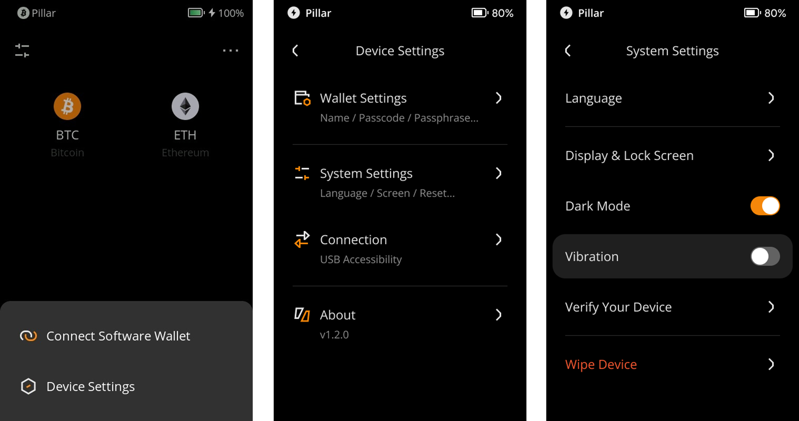

:::tip

**Key takeaways:**
- This feature allows you to wipe the device and erase all user data.

- Once the device is wiped, all user data on the Keystone will be erased, but the firmware version won’t be rolled back.

- The device requires at least 20% power to continue the process.

:::

## Steps: {#6535dd7f31cc475a98c8c6cb47c4950b}

1. Tap the [···] icon at the top right of the main page &gt; [Device Settings] &gt; [System Settings] &gt; [Wipe Device].

  

1. Entering your password allows you to wipe the device.

  

