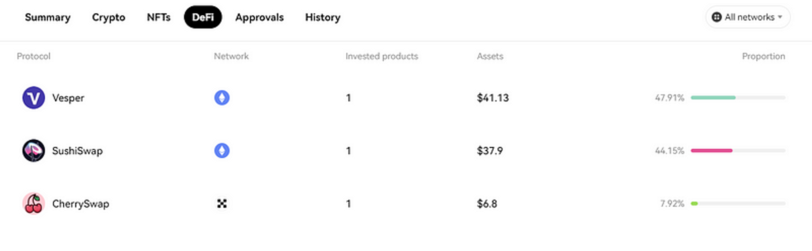
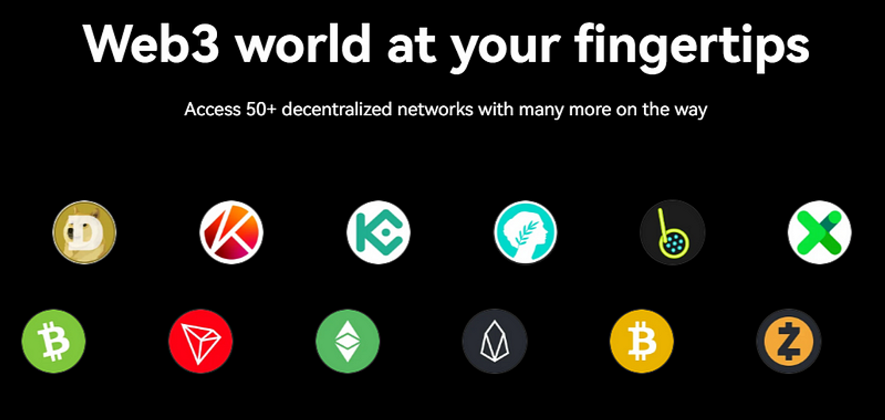

import ReactPlayer from "react-player";
import { TwitterTweetEmbed } from "react-twitter-embed";

### A New Alliance: Keystone and OKX Wallet Collaborates {#ae2f8745fdb84fca84c6b0eff4233105}

The [**Keystone**](https://twitter.com/KeystoneWallet) team is thrilled to announce a new milestone in our journey — An integration with [**OKX wallet**](https://www.okx.com/web3).

Keystone, for those who may not be familiar, is a hardware wallet device designed to ensure top-tier security against cyber threats like hacking, by facilitating offline storage of digital assets. With a focus on user-friendliness and solid security measures, Keystone has become a preferred choice for many digital asset investors seeking reliable protection for their investments.

This strategic partnership fuses the benefits of a software wallet’s convenience and accessibility with a hardware wallet’s robust security, offering Web3 users an optimal blend of features. Furthermore, it reinforces the security framework of the entire Web3 ecosystem by broadening the options for users to securely store their assets on a hardware wallet.

  

    <TwitterTweetEmbed tweetId="1673722864347004930" />
  

### A Closer Look at OKX {#792712b91b544008b0bf39f82ceacb45}

[**OKX**](https://www.okx.com/) has consistently held its position as one of the most rapidly expanding centralized exchanges. The platform boasts a staggering trading volume of approximately $1 billion per day, making it a popular choice amongst seasoned and beginner traders alike. Its extensive array of trading features, combined with a user-friendly interface, KYC-free trading options, and the security offered by a licensed and regulated platform, have all propelled OKX to be the preferred crypto exchange for many.

### Exploring The OKX Wallet {#53800e82d6244f52bdf2fe6c16facd72}

The [**OKX wallet**](https://www.okx.com/web3) functions as a gateway to the world of Web3 - Decentralized Finance (DeFi), Non-Fungible Tokens (NFTs), and Decentralized Applications (DApps). Developed by OKX, the wallet champions decentralization and non-custodial functionality, ensuring that users retain complete control over their digital assets.

**Key features of the OKX Wallet include:**

- Full control and ownership of funds
- Multi-chain wallet compatible with over 40 blockchains, including Ethereum, OKC, and BSC etc.
- Supports the importing of multi-seed phrases and derivation of addresses in a single wallet

  <ReactPlayer
    url="https://www.youtube.com/watch?v=NOE87kNelA4&t=1s"
    width="100%"
    height="100%"
    style={{
      position: 'absolute',
      top: 0,
      left: 0,
    }}
  />

### Embracing Multi-Chain Access with OKX Wallet {#2b6c417f247e47fa834ee54a894b6c74}

The OKX Wallet acts as a bridge to the OKX DEX, a built-in DEX aggregator facilitating multi-chain and cross-chain transactions. It grants easy access to the OKX NFT Marketplace, a comprehensive multi-chain NFT trading and creation platform, and serves as a Web3 portal, unlocking access to over 2,000+ DApps on different chains.

It also simplifies the process of engaging with multiple networks. By automatically recognizing and connecting to supported networks, the OKX Wallet streamlines the user experience, making DeFi and GameFi far more accessible.

  

    <TwitterTweetEmbed tweetId="1673234579715665921" />
  

### Demystifying the OKX X Routing Technology {#587fdc54634a4f25a0f32fa1ebb9aef2}

OKX Wallet’s proprietary X Routing technology revolutionizes cross-chain swaps by seeking the best exchange rates. It scans through multiple blockchains and Decentralized Exchanges (DEXs) to yield the most competitive price across all supported DEXs. The X Routing technology takes into account gas fees and slippage and offers a variety of quotes along with the best pricing for all swaps.

  <ReactPlayer
    url="https://www.youtube.com/watch?v=dAFd5GEQ8N0"
    width="100%"
    height="100%"
    style={{
      position: 'absolute',
      top: 0,
      left: 0,
    }}
  />

### Unleashing The Potential of NFTs with OKX Wallet {#643ec14da9bf42ba9d5ee99eaacfbf59}

The OKX Wallet has full NFT integration, enabling users to buy, sell, trade, and even create their own NFTs right within the wallet through the OKX NFT Marketplace. Users can also easily access NFT orders from leading NFT markets such as OpenSea, LooksRare, Magic Eden, and IMX Official, among others. The wallet also supports the minting of new NFTs, where users can create and sell or trade their own NFTs.

  <ReactPlayer
    url="https://www.youtube.com/watch?v=ixRIoGfbmTI&t=90s"
    width="100%"
    height="100%"
    style={{
      position: 'absolute',
      top: 0,
      left: 0,
    }}
  />

### DApp Gateway: Connecting The Dots {#e78b11bc786441ef86a381858c2a29bd}

The OKX Wallet serves as a universal gateway to a diverse range of DApps, eliminating the hassles of connecting to various platforms and blockchains. With a simple connection, users can explore leading DeFi platforms such as Lido, Aave, and Curve, along with new GameFi applications like Splinterlands and Axie Infinity.

### Conclusion {#4d52a4bb331743159a980ad71f794658}

The OKX Wallet is a one-stop solution for those seeking a non-custodial wallet that can connect to multiple DApps and support any NFT. With the integration of Keystone, the usability and versatility of the OKX Wallet is set to soar, making it a critical tool for anyone engaged in DeFi, GameFi, token swapping, or NFT trading.

Current Keystone owners will have to upgrade their firmware to the latest version to be able to connect their Keystone Essential or Pro to the OKX Wallet Web Extension App. Existing Keystone users can refer to our firmware upgrading guide [**here**](https://bit.ly/3yvP6t8) & update their firmware [**here**](https://keyst.one/firmware?locale=en).

Visit the [**OKX Wallet website**](https://www.okx.com/web3) to download their app, and be sure to keep an eye out for more upcoming updates!

  

    <TwitterTweetEmbed tweetId="1673677559295295491" />
  

### About OKX Wallet {#eaea8c8baeb1425ca037a137ade1c07f}

OKX Wallet stands as a versatile, all-encompassing crypto wallet designed for multiple platforms. It grants users effortless access to the expansive Web3 ecosystem, which includes a plethora of tokens and dApps across more than 60 chains and roll-ups. As a self-custodial and decentralized wallet solution, users maintain full control over their private keys and

digital assets.

Embodying a truly multi-chain wallet, OKX Wallet accommodates both EVM and non-EVM chains. With continuous support for emerging chains, users can effortlessly interact with dApps across various chains without the need for manual RPC input or switching wallets.

[**Website**](https://www.okx.com/web3) | [**Twitter**](https://twitter.com/okxweb3) | [**Discord**](https://discord.com/invite/em57qYyEVt) | [**Telegram**](https://t.me/OKCNetwork)

### About Keystone {#30b3ec92e79c462ea8e87243d85cc755}

[**Keystone**](https://keyst.one/) is a 100% air-gapped QR code hardware wallet. The wallet is [**designed**](https://blog.keyst.one/keystone-product-design-principles-cd833bc11125) to maximize attack cost, minimize trust, prevent potential human error, avoid single-point-of-failures and boost interoperability. Keystone is integrated with MetaMask ([**Extension**](https://twitter.com/MetaMask/status/1469351219290382341) and [**Mobile**](https://twitter.com/MetaMask/status/1517256930389110785)) as well as other top software wallets like [**Solflare**](https://twitter.com/KeystoneWallet/status/1536713613175496704?s=20&t=ARJFK2l8SSXITIVhjijGzw), [**Sender**](https://twitter.com/SenderWallet/status/1564894871445446657?s=20&t=ARJFK2l8SSXITIVhjijGzw), [**Fewcha**](https://twitter.com/KeystoneWallet/status/1582186370209939456?s=20&t=ARJFK2l8SSXITIVhjijGzw) etc.

[**Website**](https://keyst.one/) **|** [**Twitter**](https://twitter.com/KeystoneWallet) **|** [**Discord**](https://keyst.one/discord) **|** [**Telegram**](https://t.me/KeystoneWallet) **|** [**GitHub**](https://github.com/KeystoneHQ)

