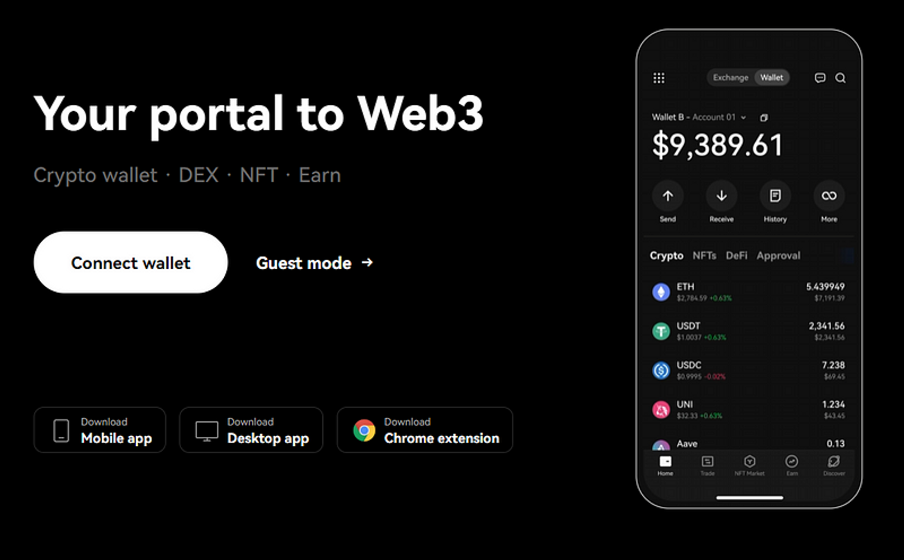
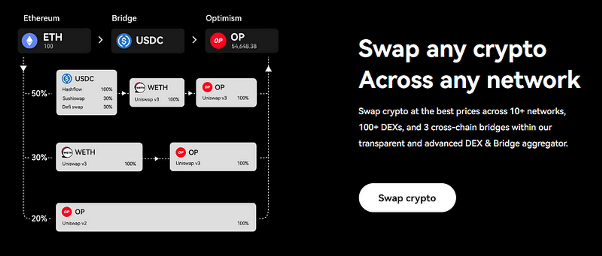
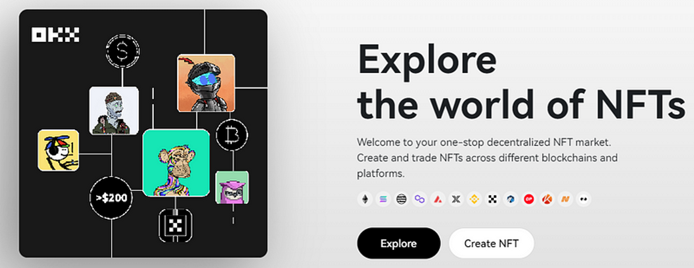

import ReactPlayer from "react-player";
import { TwitterTweetEmbed } from "react-twitter-embed";

### 一個新聯盟：Keystone 與 OKX 錢包合作 {#3463b1ff99a2427ba62481b2119f6386}

[**Keystone**](https://twitter.com/KeystoneWallet) 團隊非常高興地宣布我們旅程中的一個新里程碑 - 與 [**OKX wallet**](https://www.okx.com/web3) 錢包 進行整合。

對於可能不熟悉 Keystone 的人來說，Keystone 是一款硬件錢包設備，旨在通過方便離線儲存數字資產，確保頂級的安全性，以對抗像黑客一樣的網絡威脅。注重用戶友好性和可靠的安全措施，Keystone 已成為許多數字資產投資者尋求可靠保護其投資的首選之一。

這個戰略合作將軟件錢包的便利和易用性與硬件錢包的強大安全性相結合，為 Web3 用戶提供了最優秀的功能組合。此外，它擴大了使用者在硬件錢包上安全儲存資產的選擇，進一步加強了整個 Web3 生態系統的安全框架。

  

    <TwitterTweetEmbed tweetId="1673722864347004930" />
  

### 細看 OKX {#5e9ddfc6e2174f3ea49fd7fdb5cd1add}

[**OKX**](https://www.okx.com/) OKX 一直保持著作為最快擴張的中心化交易所之一的地位。該平台每天的交易量高達約 10 億美元，使其成為經驗豐富和初學者交易者的熱門選擇。它廣泛的交易功能，結合用戶友好的界面、無需 KYC 的交易選項以及許可和規管平台提供的安全性，都推動 OKX 成為許多人首選的加密貨幣交易所。

### 探索 OKX 錢包 {#68c27818d2f540a6956ae16d2e37ede6}

[**OKX wallet**](https://www.okx.com/web3) 是進入 Web3 世界 - 去中心化金融 (DeFi)、非同質化代幣 (NFT) 和去中心化應用 (DApps) 的門戶。由 OKX 開發，該錢包倡導去中心化和非託管功能，確保用戶完全掌控其數字資產。

**OKX 錢包的關鍵功能包括：**

- 完全控制和擁有資金
- 多鏈錢包，兼容超過 40 條區塊鏈，包括以太坊、OKC 和 BSC 等
- 支持在單一錢包中導入多種種子短語和地址派生

  <ReactPlayer
    url="https://www.youtube.com/watch?v=NOE87kNelA4&t=1s"
    width="100%"
    height="100%"
    style={{
      position: 'absolute',
      top: 0,
      left: 0,
    }}
  />

### OKX 錢包：擁抱多鏈訪問 {#9c35548aa01849c6a7686e4381e69da9}

OKX 錢包是 OKX DEX 的橋樑，它是一個內置的 DEX 聚合器，促進多鏈和跨鏈交易。它為 OKX NFT Marketplace 提供了便捷的訪問，這是一個全面的多鏈 NFT 交易和創建平台，並作為 Web3 門戶，解鎖了對不同鏈上 2,000 多個 DApps 的訪問權限。

它還簡化了與多個網絡互動的過程。通過自動識別和連接支持的網絡，OKX 錢包簡化了用戶體驗，使 DeFi 和 GameFi 更加易於訪問。

  

    <TwitterTweetEmbed tweetId="1673234579715665921" />
  

### 揭秘 OKX X 路由技術 {#d174132cf1714137a8c9d2b90c92d08b}

OKX 錢包的專有 X 路由技術通過尋求最佳匯率，徹底改變了跨鏈交換的方式。它掃描多個區塊鏈和去中心化交易所 (DEXs)，以獲得在所有支持的 DEXs 中最有競爭力的價格。X 路由技術考慮到燃氣費和滑點，並提供各種報價以及所有交換的最優價格。

  <ReactPlayer
    url="https://www.youtube.com/watch?v=dAFd5GEQ8N0"
    width="100%"
    height="100%"
    style={{
      position: 'absolute',
      top: 0,
      left: 0,
    }}
  />

### OKX 錢包：釋放 NFT 的潛力 {#4ec45326d64a4e21ae94891d0478ac8b}

OKX 錢包完全整合了 NFT，使用戶可以通過 OKX NFT Marketplace 在錢包內購買、出售、交易甚至創建自己的 NFT。用戶還可以輕鬆訪問來自領先的 NFT 市場，如 OpenSea、LooksRare、Magic Eden 和 IMX 官方等的 NFT 訂單。該錢包還支持發行新的 NFT，用戶可以創建並出售或交易自己的 NFT。

  <ReactPlayer
    url="https://www.youtube.com/watch?v=ixRIoGfbmTI&t=90s"
    width="100%"
    height="100%"
    style={{
      position: 'absolute',
      top: 0,
      left: 0,
    }}
  />

### DApp Gateway: Connecting The Dots {#83cb839f594944149c48bc9f7d2b2b98}

The OKX Wallet serves as a universal gateway to a diverse range of DApps, eliminating the hassles of connecting to various platforms and blockchains. With a simple connection, users can explore leading DeFi platforms such as Lido, Aave, and Curve, along with new GameFi applications like Splinterlands and Axie Infinity.

### Conclusion {#a29ed1f825bc40f5962b51eb8818f320}

The OKX Wallet is a one-stop solution for those seeking a non-custodial wallet that can connect to multiple DApps and support any NFT. With the integration of Keystone, the usability and versatility of the OKX Wallet is set to soar, making it a critical tool for anyone engaged in DeFi, GameFi, token swapping, or NFT trading.

Current Keystone owners will have to upgrade their firmware to the latest version to be able to connect their Keystone Essential or Pro to the OKX Wallet Web Extension App. Existing Keystone users can refer to our firmware upgrading guide [**here**](https://bit.ly/3yvP6t8) & update their firmware [**here**](https://keyst.one/firmware?locale=en).

Visit the [**OKX Wallet website**](https://www.okx.com/web3) to download their app, and be sure to keep an eye out for more upcoming updates!

  

    <TwitterTweetEmbed tweetId="1673677559295295491" />
  

### About OKX Wallet {#677b785b1e6d435881fc437a4d66e4ce}

OKX Wallet stands as a versatile, all-encompassing crypto wallet designed for multiple platforms. It grants users effortless access to the expansive Web3 ecosystem, which includes a plethora of tokens and dApps across more than 60 chains and roll-ups. As a self-custodial and decentralized wallet solution, users maintain full control over their private keys and

digital assets.

Embodying a truly multi-chain wallet, OKX Wallet accommodates both EVM and non-EVM chains. With continuous support for emerging chains, users can effortlessly interact with dApps across various chains without the need for manual RPC input or switching wallets.

[**Website**](https://www.okx.com/web3) | [**Twitter**](https://twitter.com/okxweb3) | [**Discord**](https://discord.com/invite/em57qYyEVt) | [**Telegram**](https://t.me/OKCNetwork)

### About Keystone {#53faf72c57f4486186393054282c2714}

[**Keystone**](https://keyst.one/) is a 100% air-gapped QR code hardware wallet. The wallet is [**designed**](https://blog.keyst.one/keystone-product-design-principles-cd833bc11125) to maximize attack cost, minimize trust, prevent potential human error, avoid single-point-of-failures and boost interoperability. Keystone is integrated with MetaMask ([**Extension**](https://twitter.com/MetaMask/status/1469351219290382341) and [**Mobile**](https://twitter.com/MetaMask/status/1517256930389110785)) as well as other top software wallets like [**Solflare**](https://twitter.com/KeystoneWallet/status/1536713613175496704?s=20&t=ARJFK2l8SSXITIVhjijGzw), [**Sender**](https://twitter.com/SenderWallet/status/1564894871445446657?s=20&t=ARJFK2l8SSXITIVhjijGzw), [**Fewcha**](https://twitter.com/KeystoneWallet/status/1582186370209939456?s=20&t=ARJFK2l8SSXITIVhjijGzw) etc.

[**Website**](https://keyst.one/) **|** [**Twitter**](https://twitter.com/KeystoneWallet) **|** [**Discord**](https://keyst.one/discord) **|** [**Telegram**](https://t.me/KeystoneWallet) **|** [**GitHub**](https://github.com/KeystoneHQ)

