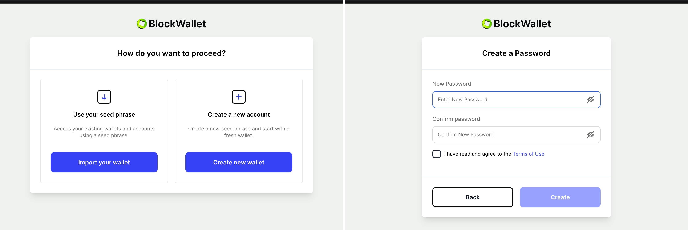
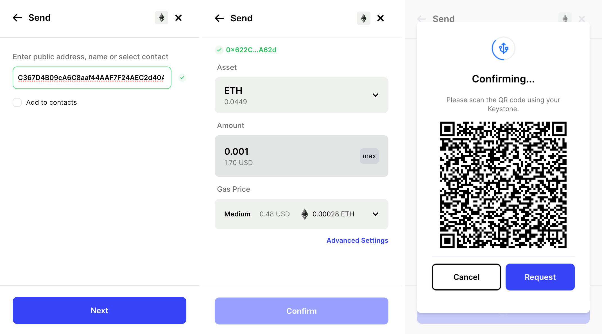
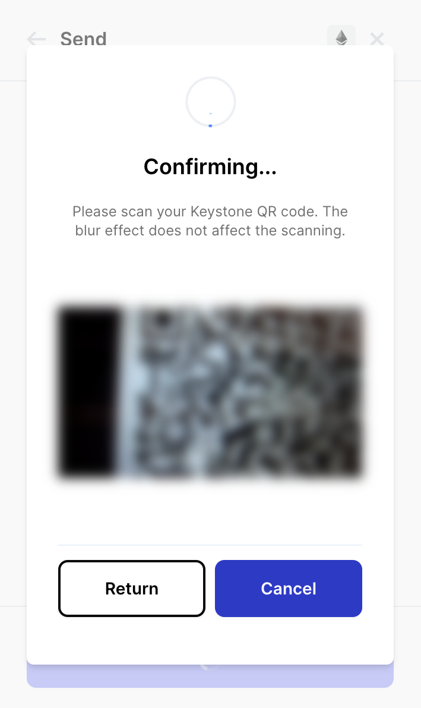

# **如何连接 BlockWallet 扩展程序端** {#8577edc74d6f42bfabded38b8f904cd1}

通过BlockWallet，您可以迅速、安全、私密地管理您的数字资产。通过直观的界面，您可以掌控加密货币，提供低费用、创新的gas fee预测和一流的加密，从而获得无与伦比的安全性。在确保在线安全体验的同时，通过连接您的Keystone硬件钱包，拥抱数字货币管理的未来。

**支持**：All EVM Chains

**功能**：Send, Buy, Swap, Bridge

## **步骤1：准备工作** {#408d064c40264708852db906f464f8a1}

1. 一台Keystone 3 Pro硬件钱包。
1. 安装[**BlockWallet浏览器扩展程序**](https://blockwallet.io/)。

  

## **步骤2：在BlockWallet上创建虚拟钱包** {#d3d2d579030a437589af2f7987264c7c}

为了在BlockWallet中访问“连接硬件钱包”按钮，您需要创建一个虚拟钱包。请按照以下步骤操作：

1. 在浏览器中打开“BlockWallet扩展程序”，然后点击[开始]。

  

1. 选择[创建新钱包]，并为您的BlockWallet钱包设置一个强密码。

  

1. 将您的助记词妥善保存，并进行确认。

  

1. 使用默认的浏览器钱包，开始使用BlockWallet。这将完成您的成功登录。

  

### **步骤3：将Keystone与BlockWallet连接** {#60b6c03c40104bf5bdc7d730c6779320}

现在，让我们建立您的Keystone硬件钱包与BlockWallet之间的连接：

**在您的Keystone硬件钱包上：**

1. 点击“...”图标，选择“连接软件钱包”。
1. 选择“BlockWallet”，将显示一个二维码。

**在您的BlockWallet扩展程序上：**

1. 访问BlockWallet用户界面。
1. 点击[设置]按钮 &gt; [连接硬件钱包] &gt; [Keystone] &gt; [继续]。

  

1. 阅读提示，点击[继续]，然后扫描您Keystone上的QR码。
1. 选择要绑定的帐户，切换它，并点击[导入]以成功完成绑定。

  

恭喜！您的Keystone硬件钱包现已无缝连接到BlockWallet。

## **发送ETH** {#0c3a6bf830c244acbd837ab9ad86e315}

1. 在 BlockWallet 主页上，查找“发送”按钮。

  

1. 输入您想发送的以太币（ETH）金额以及收款人地址，然后确认交易信息是否正确。确认后，BlockWallet将生成一个代表交易的二维码。

  

1. 拿出Keystone 然后扫描 BlockWallet 上生成的 二维码。此时，Keystone会对二维码内容进行解析，展示真实的交易详情，请检查金额和收款人地址。

  

1. 输入 Keystone 的密码或者用指纹来签署交易后，将生成一个已授权交易的二维码。

  

1. 返回到 BlockWallet，点击“Request”后扫码Keystone上的二维码。此时，等待区块链广播和确认即可。

就是这样！您已成功将加密货币发送到另一个地址。

将Keystone与BlockWallet连接后，不仅可以发送货币，**还能使用BlockWallet的各种功能。**

Keystone会保护您的资产，绑定后的所有交易都需要Keystone的签名。此外，您还可以探索并使用BlockWallet中的各种在线功能，以满足您的基本需求。

## **常见问题：** {#2f50e6f347da4da88612988ebb2755f8}

  
在将Keystone与BlockWallet绑定时应连接哪个帐户？

对于新手，建议使用第一个帐户进行解锁。您可以管理各种地址，以满足不同的资产管理需求和个人偏好。

  

