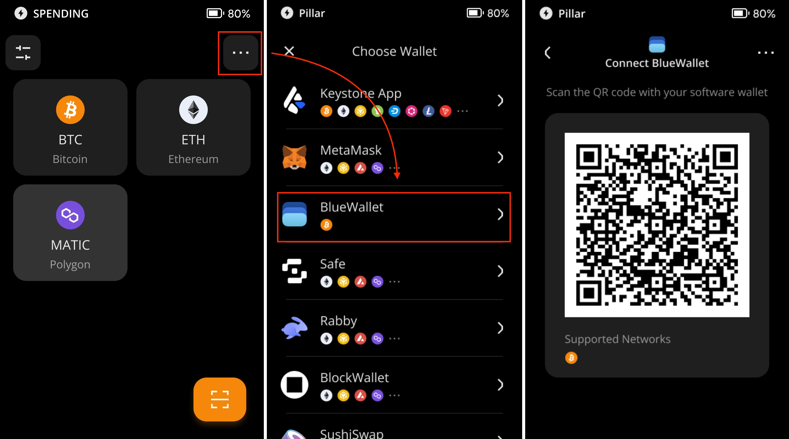
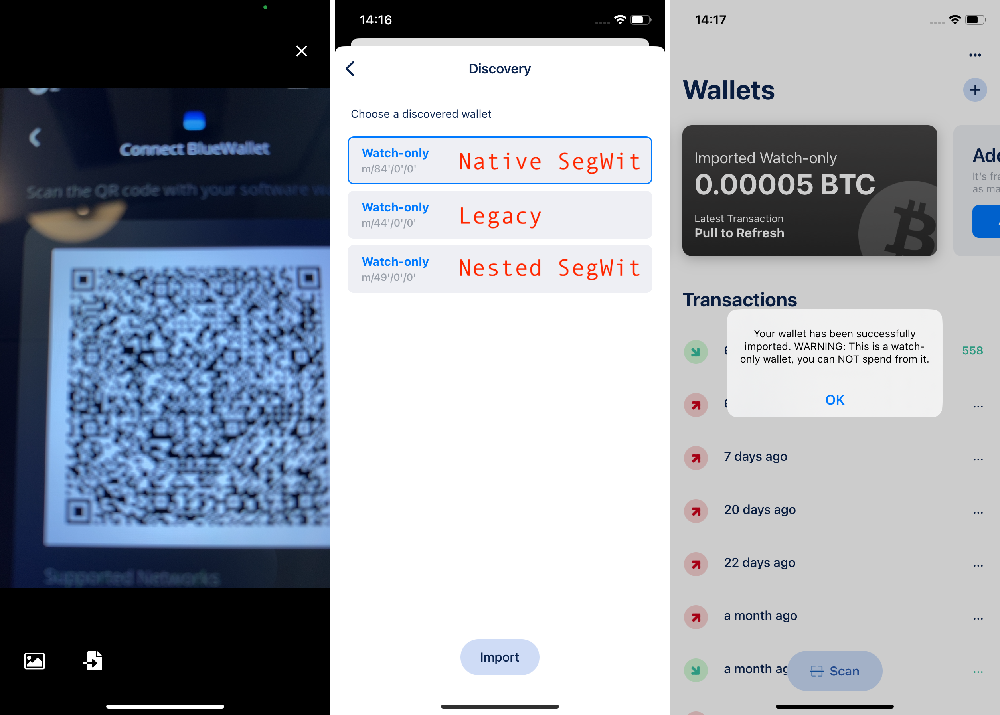
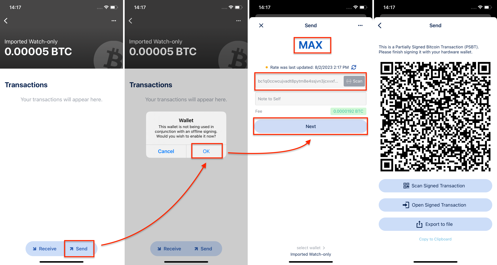

# 如何将Keystone与BlueWallet连接 {#7941738219474d2ea09937a4dae1fc4f}

## 1. 准备工作 {#cafc9ef9e185467d9734d0afc3502f83}

1. 一台Keystone 3 Pro硬件钱包。
1. 下载BlueWallet应用：访问Google Play商店或App Store，下载并安装BlueWallet应用。

## 2. 将BlueWallet与您的Keystone硬件钱包绑定 {#39fe3c04334a4f62919f89bd213874e9}

**在您的Keystone硬件钱包上：**

1. 点击“...”图标，然后选择“连接软件钱包”。
1. 选择“BlueWallet”，然后会显示一个二维码。

  

**在BlueWallet上：**

1. 打开您设备上的BlueWallet应用。
1. 点击[立即添加]，然后选择[导入钱包]，接着选择[扫描或导入文件]。

  

1. 使用您的手机上的BlueWallet扫描显示在您的Keystone硬件钱包上的二维码。
1. 选择比特币地址的路径。如果您对BTC 的3种格式不熟悉，建议使用“Native Segwit”以获得更低的手续费。

完成！您已成功将您的BTC地址与BlueWallet同步。现在您可以探索BlueWallet的功能，并使用您的Keystone硬件钱包安全地签署交易。享受增强的比特币安全性和安心！

## **3. 发送BTC** {#d0c62ca9fe8442f6b63ec63bde04a425}

**在BlueWallet上：**

1. 选择“导入的只读”钱包。
1. 点击“发送”，然后会显示一个提示。点击“确定”。
1. 输入金额和接收地址，然后点击“下一步”。将显示一个二维码，需要您的Keystone的签名。

  

**拿出Keystone硬件钱包：**

1. 点击扫描按钮。
1. 扫描步骤3中显示的二维码。Keystone将会将交易解码成易于理解的格式，显示在您的软件钱包上的实际交易。
1. 确认细节并滑动以进行签名。输入密码，新的二维码将被生成。

  

**返回到BlueWallet应用：**

1. 选择“扫描已签名交易”。
1. 扫描显示在您的Keystone硬件钱包上的二维码，以广播您的交易。一旦广播成功，您的交易就完成了。

  

以此类推，您在绑定Keystone后，可以使用BlueWallet上的各种功能，比如Coin Control或者使用洋葱网络。

