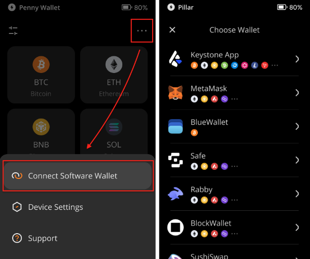
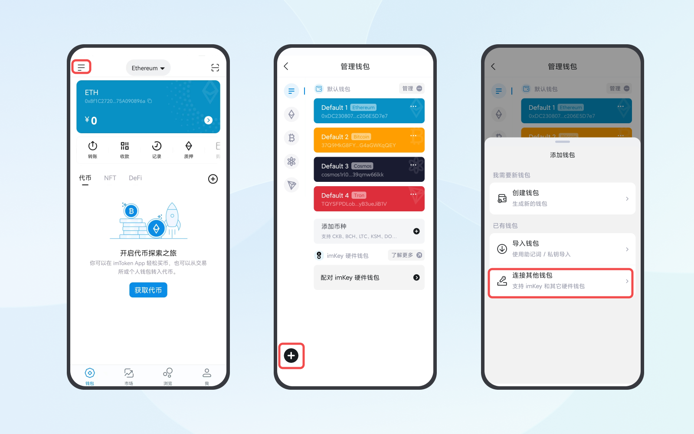

# 如何通过 **Keystone 使用 imToken** {#dceb98bc65434343b1574633c737896b}

### **第一步：准备** {#b87c78b145de46919354076c974c954c}

1. 确保 Keystone 固件版本为 1.1.4 或更新。
1. 在手机上安装版本为 2.14.0 的 imToken 应用（官网：[https://token.im/](https://token.im/)）。

### **第二步：连接 Keystone 与 imToken** {#47461761dccc41ca84163d175fa0fa3e}

**在 Keystone 硬件钱包上：**

1. 点击右上角的 "..." 图标。
1. 选择 [imToken]，将显示一个二维码。

  

**在 imToken 上：**

1. 打开 imToken 并创建一个临时钱包以找到 [连接其它钱包]的入口。
1. 创建完临时钱包后，点击左上角的设置按钮 &gt; [+] &gt; [连接其它钱包] &gt; [Keystone] &gt; [扫码连接]。

  

1. 扫描显示在 Keystone 硬件钱包上的二维码。

### **第三步：探索线上功能（例如发送 ETH ）** {#36add8e167e243679159ae49b06715fc}

**在 imToken 上发起交易：**

1. 在 imToken 上，点击您需要转账的币/代币（例如 ETH）&gt; 点击 [转账]，输入收款账户和金额 &gt; [离线签名] &gt; [下一步]，此时将显示一个二维码。

**使用 Keystone 签名：**

1. 解锁 Keystone，并在主页面点击扫描按钮，扫描在 imToken 上显示的二维码。
1. 查看交易详情 &gt; 滑动下方按钮，以密码或指纹的方式签署交易，将显示一个二维码。

**广播交易：**

1. 返回 imToken，点击 [我已完成签名] 以扫描在 Keystone 上显示的二维码。

就是这样！一旦广播交易，ETH 将成功发送。

以此类推，将 Keystone 与 imToken 连接后就能探索 imToken 上的其他功能。祝您愉快探索！

