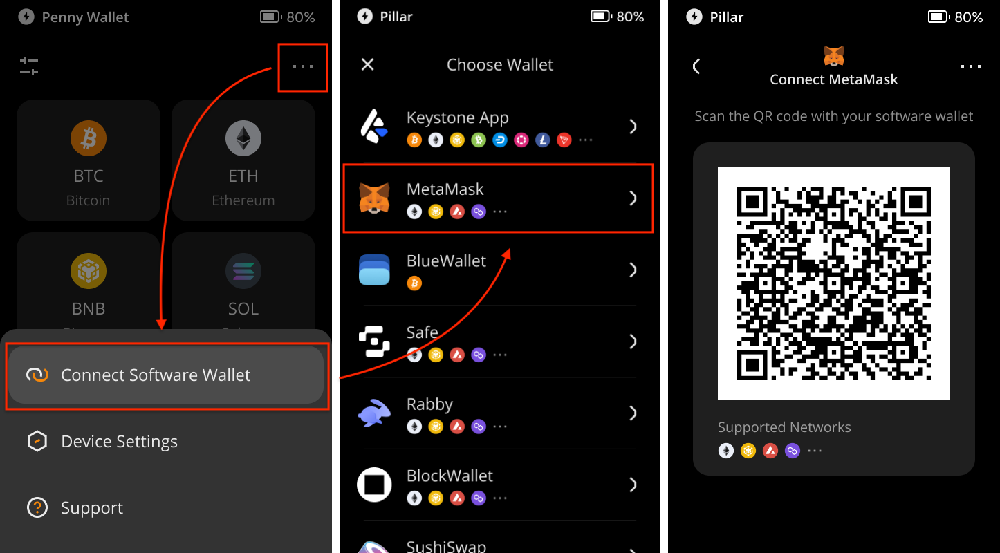
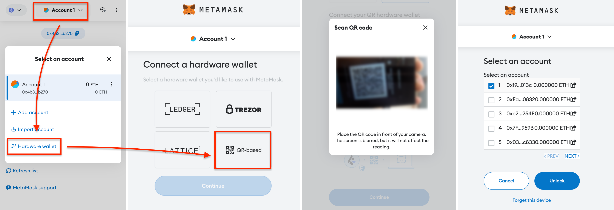
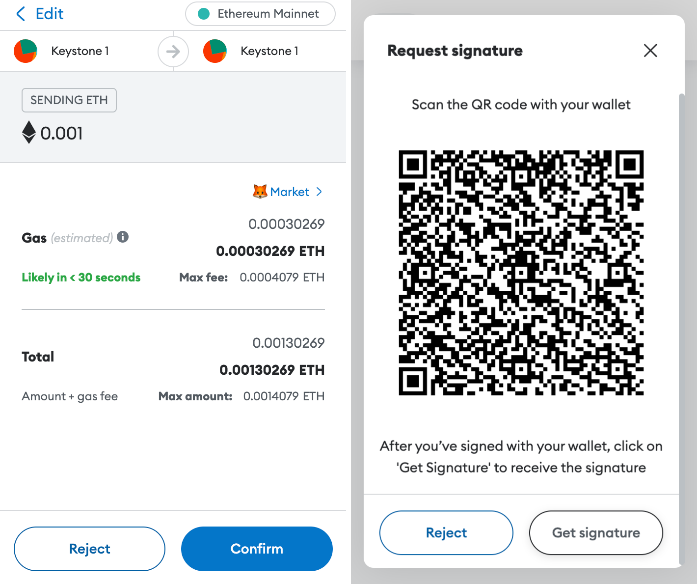

# **如何将Keystone硬件钱包与MetaMask扩展程序端连接？** {#da4c3510f48046558ec4962870872819}

作为一个硬件钱包，您需要将Keystone钱包与MetaMask等软件钱包连接，从而才能实现各种在线功能，如发送、兑换虚拟货币、或者查看您的NFT。

连接MetaMask可以让您探索所有支持的EVM链，包括Ethereum主网、BNB智能链、Arbitrum One等。

## **第一步：准备工作** {#5e4dd5f279274d51bccd6981eb3a94dd}

开始之前，请确保您拥有以下内容：

1. 一台Keystone 3 Pro硬件钱包。
1. 在[**MetaMask官方网站**](https://metamask.io/)下载并安装MetaMask浏览器扩展。

  

## **第二步：绑定Keystone硬件钱包与MetaMask** {#d5e77ec441b74d36a05acd9407dd3a70}

### **1. 在MetaMask上创建虚拟钱包** {#4824a2c96de948a69ee36584d2a1ff3e}

您需要进入MetaMask的账户主页，才能找到【连接硬件钱包】的按钮。请按照以下步骤进行操作：

1. 打开您的浏览器中的“MetaMask扩展程序端”。
1. 点击“创建新钱包”，然后同意相关条款。设置钱包密码。

  

1. 选择“保护我的钱包”，并小心地将秘密恢复短语保存在安全的地方。确认秘密恢复短语。

  

您现在已经设置好了MetaMask。熟悉一下它的主页面。

### **2. 将Keystone与MetaMask连接** {#8f948255ca1441d69d0d0487ff1bbd18}

现在，让我们将您的Keystone硬件钱包与MetaMask连接起来：

**在您的Keystone硬件钱包上**：点击“...”图标，然后选择“连接软件钱包”。选择“MetaMask”，然后会显示一个QR码。

**回到浏览器中的MetaMask扩展**：

1. 点击顶部的“Account1”，然后点击“硬件钱包”。
1. 选择“基于QR码”，然后点击“继续”。
1. 使用计算机的摄像头扫描Keystone硬件钱包上显示的QR码。
1. 选择您想要绑定的账户，然后点击“解锁”。

完成！您的Keystone硬件钱包现在已经成功连接到支持EVM链的MetaMask。

现在，您可以在MetaMask上安全地执行交易，而无需在线暴露您的助记词。尽情探索连接硬件钱包带来的功能和能力吧！

## **发送ETH** {#6b5e3a3426864a47aab4918fce356974}

1. 在 MetaMask 主页上，查找“发送”按钮。输入您想发送的以太币（ETH）金额以及收款人地址**。**

  

1. 此时MetaMask将显示交易信息，请确认交易信息是否正确。确认后，MetaMask将生成一个代表交易的二维码。

  

1. 拿出Keystone 然后扫描MetaMask上生成的 二维码。此时，Keystone会对二维码内容进行解析，展示真实的交易详情，请检查金额和收款人地址。

  

1. 输入 Keystone 的密码或者用指纹来签署交易后，将生成一个已授权交易的二维码。

  

1. 返回到 MetaMask，点击“获取签名”后扫码Keystone上的二维码。此时，等待在以太坊区块链上广播和确认即可。

就是这样！您已成功将加密货币发送到另一个地址。

将Keystone与MetaMask连接后，不仅可以发送货币，**还能使用MetaMask的各种功能。**

Keystone会保护您的资产，绑定后的所有交易都需要Keystone的签名。此外，您还可以探索并使用MetaMask中的各种在线功能，以满足您的基本需求。

## **常见问题：** {#d7ec34347f514a039c8281103fb8b467}

  
在将Keystone与MetaMask绑定时应连接哪个账户？

如果您是新手，您可以使用第一个账户进行解锁。您可以管理不同的地址以满足不同的资产管理需求和个人习惯。

  

  
为什么不建议将MetaMask生成的种子短语导入Keystone？

在线生成的种子短语，例如通过MetaMask生成，与完全离线生成的种子短语相比，可能具有更高的风险。即使稍后将在线生成的种子短语导入，也无法提供安全保护，因为它已经触网了。

请记住，您的种子短语是访问您的资产的关键。

  

  
如何访问其他与EVM兼容的网络，例如Arbitrum或Polygon？

1. 将Keystone与MetaMask绑定。
2. 访问Chainlist，并搜索要添加到MetaMask的所需网络/链。
3. 确认您需要管理的代币。

  

