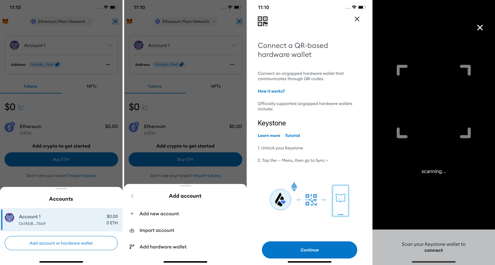
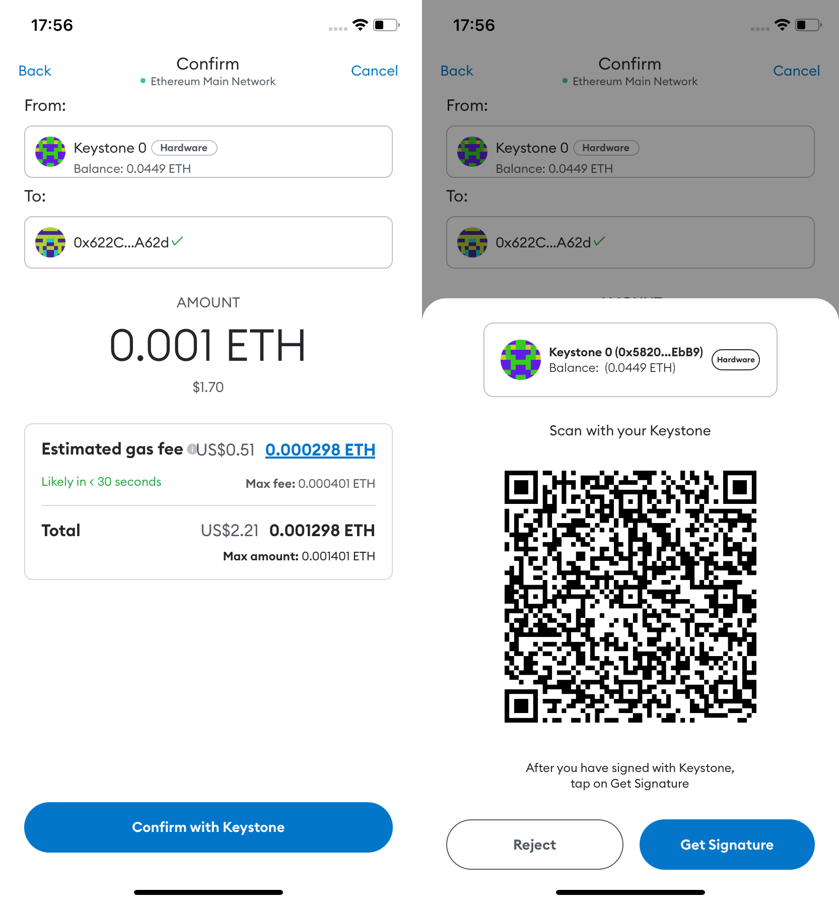
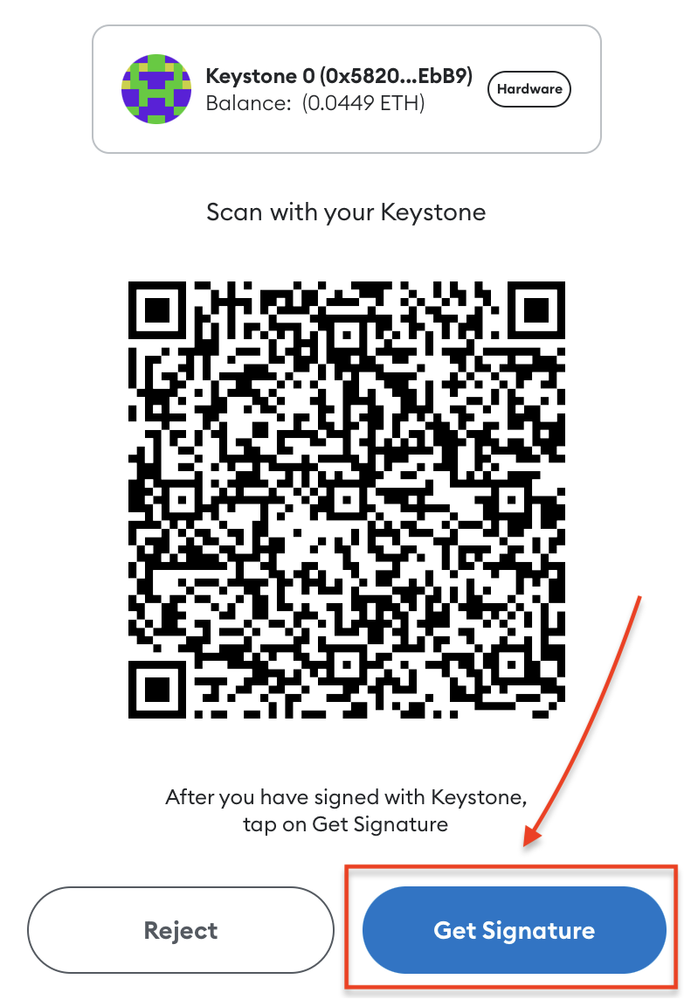

# 如何将您的Keystone硬件钱包与MetaMask移动端连接？ {#30c46ead193b42898adf2159b8e9f9cf}

## 步骤一：准备工作 {#47e45b33791344558b2a9e2670a8cbc4}

1. 一台Keystone 3 Pro硬件钱包。
1. 下载MetaMask移动端：访问Google Play商店或苹果应用商店，下载最新版本的或更新版本。

## 步骤二：在MetaMask移动端上设置虚拟钱包 {#94083bcd13ce4c31871a146b4d6c7e53}

1. 打开MetaMask移动端：在您的移动设备上运行“MetaMask移动端”。

  

1. 创建虚拟钱包：点击[创建新钱包]，然后按照提示设置一个安全的密码。

  

1. 完成备份：按照流程“保护您的钱包”，并仔细阅读相关注意事项。

  

1. 确认您虚拟钱包的密码和秘密恢复短语。点击[继续]重新确认秘密恢复短语，然后点击[完成备份]完成设置。

  

恭喜！您已成功设置了MetaMask移动端。现在，您可以花些时间探索各种可用的功能和特性。

## 步骤三：将Keystone硬件钱包连接到MetaMask移动端 {#2a50533de9c049a6ab845b54d81b9003}

**打开Keystone硬件钱包**：在您的Keystone硬件钱包上，点击“...”图标，然后选择[MetaMask]。一个QR码将会显示出来。

  

**回到MetaMask移动端：**

1. 回到MetaMask移动端，点击[账户1]，然后点击[添加账户或硬件钱包]，并选择[连接硬件钱包]。
1. 点击[继续]，使用MetaMask移动端扫描显示在您的Keystone硬件钱包上的QR码。
1. 选择连接账户：扫描QR码后，选择您要连接的账户，然后点击[解锁]完成连接。

  

恭喜！您的Keystone硬件钱包现已成功连接到MetaMask移动端。您现在可以通过MetaMask移动端方便地探索和使用您的硬件钱包的功能。

## **发送ETH** {#e64a8771a64a4850b5c318ebb3ae86e6}

1. 在 MetaMask 主页上，查找“发送”按钮。

  

1. 输入您想发送的以太币（ETH）金额以及收款人地址**。**

  

1. 此时MetaMask将显示交易信息，请确认交易信息是否正确。确认后，MetaMask将生成一个代表交易的二维码。

  

1. 拿出Keystone 然后扫描MetaMask上生成的 二维码。此时，Keystone会对二维码内容进行解析，展示真实的交易详情，请检查金额和收款人地址。

  

1. 输入 Keystone 的密码或者用指纹来签署交易后，将生成一个已授权交易的二维码。

  

1. 返回到 MetaMask，点击“获取签名”后扫码Keystone上的二维码。此时，等待在以太坊区块链上广播和确认即可。

就是这样！您已成功将加密货币发送到另一个地址。

将Keystone与MetaMask连接后，不仅可以发送货币，**还能使用MetaMask的各种功能。**

Keystone会保护您的资产，绑定后的所有交易都需要Keystone的签名。此外，您还可以探索并使用MetaMask中的各种在线功能，以满足您的基本需求。

## **常见问题：** {#2ec0e06b6d4e4fcdaaea35faeff827fe}

  
在将Keystone与MetaMask绑定时应连接哪个账户？

如果您是新手，您可以使用第一个账户进行解锁。您可以管理不同的地址以满足不同的资产管理需求和个人习惯。

  

  
为什么不建议将MetaMask生成的种子短语导入Keystone？

在线生成的种子短语，例如通过MetaMask生成，与完全离线生成的种子短语相比，可能具有更高的风险。即使稍后将在线生成的种子短语导入，也无法提供安全保护，因为它已经触网了。

请记住，您的种子短语是访问您的资产的关键。

  

  
如何访问其他与EVM兼容的网络，例如Arbitrum或Polygon？

1. 将Keystone与MetaMask绑定。
2. 访问Chainlist，并搜索要添加到MetaMask的所需网络/链。
3. 确认您需要管理的代币。

  

