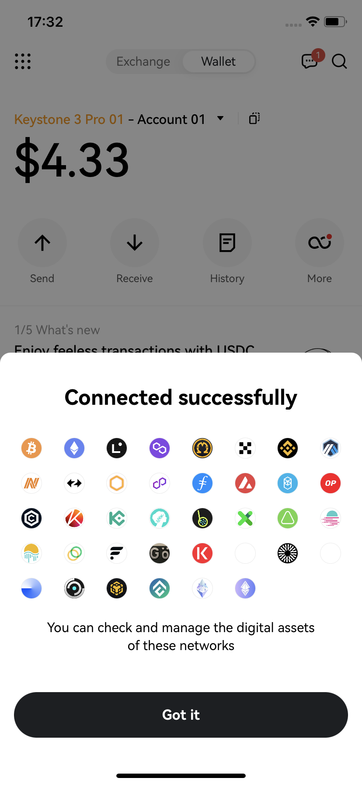

# OKX Wallet（移动端） {#38c0859469554d01a2f83feeead5b6d2}

欢迎来到这个教程，它将指导您连接您的Keystone硬件钱包与OKX移动端的过程。在本教程中，您将学习如何建立连接并探索OKX钱包的基本功能，包括发送交易和利用去中心化交易所（DEX）。让我们开始吧！

**支持的链：**目前与Keystone连接后，可以兼容BTC、EVM链、Tron、Litecoin、Bitcoin Cash、Dash。

**功能：**发送、接收、交换等。

## 准备 {#001c233471934be28ef6b35988236e18}

1. 一台 Keystone 3 Pro 硬件钱包。
1. 手机上已安装了 [**OKX Wallet**](https://s3-us-west-2.amazonaws.com/secure.notion-static.com/580f84d6-1d06-4fc4-9ead-85d44edee418/1.png) 应用程序**。**

现在，您可以准备将Keystone与OKX Wallet连接并探索其功能了！

## **连接 Keystone 与 OKX Wallet** {#56c0630c6e364fa4ae81182d1e18b313}

**在Keystone硬件钱包上：**

1. 点击“...”图标，然后选择OKX Wallet。
1. 会出现一个二维码，准备好用OKX Wallet扫描。

  

**在OKX Wallet上：**

1. 打开OKX Wallet应用，点击顶部，切换到[Wallet]模式。
1. 选择[I already have one]，然后选择[Hardware wallet]，然后选择[Keystone]。

  

1. 点击[Scan to connect]，并仔细按照提供的说明操作。然后点击[Connect now]。

  

1. 授予“OKX”应用访问摄像头的权限，并使用它扫描显示在Keystone硬件钱包上展示的二维码。选择一个账户以解锁。

  

成功绑定您的Keystone钱包与OKX Wallet后，您可以安全地探索其提供的各种功能。

