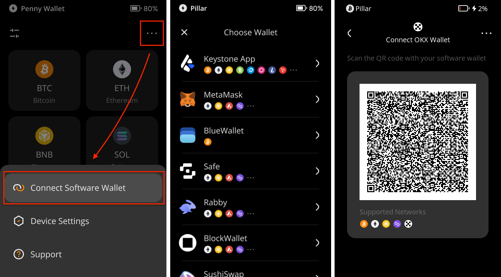
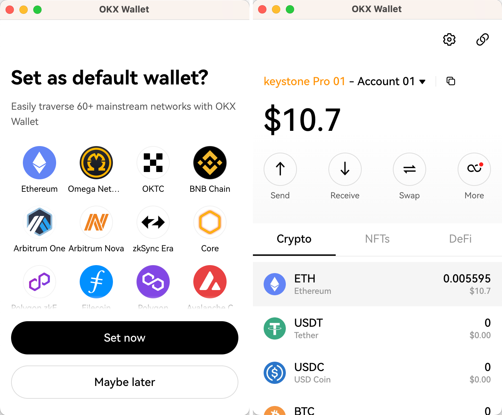

# 如何连接OKX钱包扩展程序端 {#5daaf7d4cdf04f0189901eadb207be2e}

欢迎来到这个教程，它将指导您连接您的Keystone硬件钱包与OKX扩展的过程。在本教程中，您将学习如何建立连接并探索OKX钱包的基本功能，包括发送交易和利用去中心化交易所（DEX）。让我们开始吧！

**支持的链**: 目前与Keystone连接后兼容BTC和EVM链。

**功能**: 发送、接收、交换等。

## **步骤1：连接准备工作** {#e8831eb21aaf406fb837d814d14956b7}

1. 一台Keystone 3 Pro硬件钱包。
1. 下载最新版本的[OKX钱包扩展程序端](https://chrome.google.com/webstore/detail/okx-wallet/mcohilncbfahbmgdjkbpemcciiolgcge)。

## **步骤2：将Keystone与OKX钱包连接** {#415c4641849f458e90bc572fcb9d184d}

**在您的Keystone硬件钱包上：**

1. 点击“...”图标，选择“连接软件钱包”。
1. 选择“OKX Wallet”，将显示一个二维码。

  

**在OKX钱包上：**

1. 打开OKX扩展程序端并选择“我已经有一个钱包”。
1. 选择“硬件钱包”，然后选择“Keystone”。

  

1. 允许OKX钱包访问您设备的摄像头。扫描显示在您的Keystone硬件钱包上的QR码。
1. 选择所需的帐户并设置默认钱包。创建一个强密码来解锁您的钱包。

  

1. 您可以选择“以后再说”来跳过此步骤。一旦完成，您就已成功登录到OKX钱包。

  

恭喜！您已成功将Keystone账户与OKX钱包在EVM链上无缝连接。现在，您已准备好安全地探索其功能。

