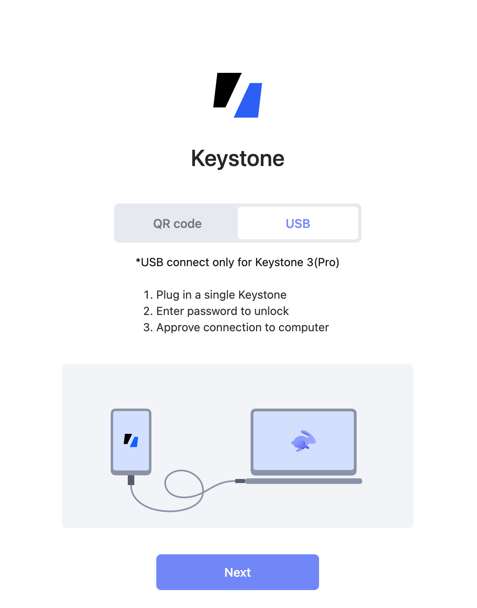

# **如何将Keystone与Rabby钱包连接** {#07ac0ba44a1f40dda229a2646d3ea5b6}

Rabby钱包是专为Keystone Essential或Pro硬件钱包设计的与EVM兼容的扩展程序。通过Rabby，您可以安全便捷地管理您的ETH、ERC-20和其他资产。

使用Rabby与Keystone的好处：

1. **多组助记词：** 与MetaMask等其他钱包不同，Rabby可以连接多组助记词，同时与Keystone连接。这使您在管理不同钱包和资产时更加灵活。
1. **切换支持的网络：** Rabby允许您在不同的网络之间切换，如Arbitrum和Polygon，让您访问各种EVM兼容的区块链生态系统。
1. **与其他软件钱包连接：** 您还可以将Rabby与其他软件钱包（如MetaMask）连接，实现无缝互联的体验。

通过连接Keystone，您可以在享受这些功能的同时，安心知道您的助记词和私钥仍安全存储在硬件钱包的安全元素中，提供增强的安全性。

## 二维码交互： {#47c7ae1de3c14ff186ed87af13c0c6e0}

### **步骤1：准备** {#d1463c7d78d54eae8b6d56982c58a73e}

1. 一台Keystone 3 Pro硬件钱包。
1. 从[Rabby钱包的官网](https://rabby.io/)下载最新的Rabby浏览器扩展程序。

  

有两种交互方式：二维码连接/签名，USB连接/签名，以下是详细地操作方式：

### **步骤2：连接Keystone与Rabby钱包** {#26919d57e7c540abaa01ae3c03872113}

**在您的Keystone硬件钱包上：**

1. 点击“...”图标，选择[Rabby]。将显示一个二维码供您在Rabby钱包中扫描。

  

**在Rabby钱包上：**

1. 在浏览器中运行“Rabby扩展程序”。
1. 阅读信息，点击[下一步]，然后点击[开始]。

  

1. 点击[连接硬件钱包]，选择[Keystone]。
1. 设置一个密码，在Rabby上解锁您的钱包，并使用摄像头扫描Keystone上显示的QR码。

  

1. 一系列地址将显示出来。如果您是新用户，可以使用第一个地址进行解锁。您可以使用几个地址根据不同的需求和习惯管理您的资产。
1. 选中您需要的地址，完成连接。

  

您已成功将Keystone在EVM链上的帐户与Rabby钱包连接。现在您可以使用Rabby轻松签署各种支持的活动，例如发送ETH、兑换、浏览您的NFT等。您还可以切换到不同的网络。

### **步骤3：发送ETH** {#b0e9663a7fc3496e9c80bc5936c5bac0}

1. 在 Rabby 主页上，查找“发送”按钮。输入您想发送的以太币（ETH）金额以及收款人地址**。**

  

1. 此时Rabby将显示交易信息，请确认交易信息是否正确。确认后，Rabby将生成一个代表交易的二维码。

  

1. 拿出Keystone 然后扫描Rabby上生成的 二维码。此时，Keystone会对二维码内容进行解析，展示真实的交易详情，请检查金额和收款人地址。

  

1. 输入 Keystone 的密码或者用指纹来签署交易后，将生成一个已授权交易的二维码。

  

1. 返回到 Rabby，点击“获取签名”后扫码Keystone上的二维码。此时，等待在以太坊区块链上广播和确认即可。

就是这样！您已成功将加密货币发送到另一个地址。

## USB交互 {#4ccaae994093460293c1ad9880e3fcc0}

### **步骤1：准备** {#70810bd28d85467d9d278144183cfa60}

1. 一台Keystone 3 Pro硬件钱包，固件版本为1.1.4或以上。
1. 从[Rabby钱包的官网](https://rabby.io/)下载最新的Rabby浏览器扩展程序。

  

### **步骤2：通过USB连接Rabby** {#4f251c6ce3774bc8979a82512e7905a0}

**在您的Keystone上：**

1. 通过USB线将设备连接到电脑上。
1. 在设备上点击[Approve]以支持USB连接。

**在Rabby钱包上：**

1. 在浏览器中运行“Rabby Extension”。阅读信息并点击[Next]，然后点击[Get Started]。

  

1. 点击[Connect Hardware Wallet]并选择[Keystone]。设置在Rabby上解锁钱包的密码，并将连接方式切换到“USB”。

  

1. 点击[Next] &gt; [Allow]以继续，选择[Keystone 3 Pro]并连接它。

  

:::tip

 注意：您需要保持Keystone 3 Pro处于主页上（进入硬件钱包的其他页面可能会中断连接），并确保设备已解锁。

:::

返回**Keystone 3 Pro：**

1. 在设备上点击[Approve]。

**再次返回Rabby Extension：**

1. 连接成功后，将显示一批地址。切换到您需要的地址，就这么简单！（如果您是第一次使用，可以使用第一个地址进行解锁。）

  

您已成功将您的Keystone账户与Rabby在EVM链上进行了关联。现在，您可以轻松地使用Rabby支持的各种活动进行签名，如发送ETH、交换、浏览您的NFT等。您还可以切换到不同的网络。

## **第三步：使用USB通过Keystone和Rabby钱包发送ETH** {#dd179039dbc34997aed4c5f4f01e6d60}

1. 保持Keystone 3 Pro与Rabby钱包的USB连接。
1. 在Rabby主页上找到“Send”按钮。输入ETH的数量和接收方地址，然后输入密码以确认交易。

  

1. 查看并确认交易详情，点击[Begin singing process]以进行USB签名。
1. 具体的交易将在Keystone 3 Pro展示。
1. 使用Keystone密码或指纹验证，来签署交易。
1. 一旦确认，您的交易将在以太坊区块链上等待确认。

至此，您已成功将加密货币发送到另一个地址。

将Keystone与Rabby连接后，不仅可以发送货币，**还能使用Rabby的各种功能。**

Keystone会保护您的资产，绑定后的所有交易都需要Keystone的签名。此外，您还可以探索并使用Rabby中的各种在线功能，以满足您的基本需求。

