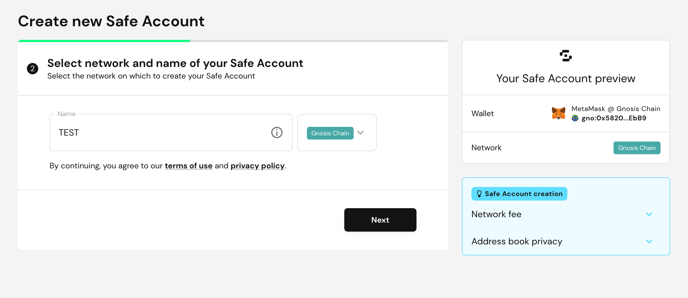

# **Safe Wallet (Web)** {#5940e8a405284bc3b35233b97991ab0d}

欢迎使用Safe Wallet，这是一个强大的多重签名钱包解决方案，可在EVM链上提供支持。在Safe Wallet中创建一个多重签名钱包涉及到连接一个主要的钱包，也被称为“owner key”。通过选择适当的网络，您可以导入其他地址，以建立补充的“owner key”。这种组合最终形成了一个多重签名钱包。值得注意的是，向这个钱包转移任何资产都需要一个或多个owner key的授权，才能成功执行交易。

使用多重签名钱包可以为您的资产增加额外的安全保障。

本教程将概述使用OKX Wallet和Keystone作为owner key来创建多重签名钱包的过程。

## **准备** {#ae5faf5c4b7943b9a7f755892e014e45}

1. 一台Keystone 3 Pro硬件钱包。
1. [Safe 钱包](https://app.safe.global/welcome)网页端
1. 已注册的OKX钱包（扩展程序端）（为了本教程的目的，我们假设您已经在Keystone和OKX钱包之间建立了连接。了解如何连接请点击**这里**。）

## **使用Keystone创建多重签名钱包** {#b13fcfa1da374933ac9dd3fe595a4339}

### **与Safe连接** {#fdaeedf6e6e74307bcfc314ae23ab3e8}

1. 在访问[Safe 钱包](https://app.safe.global/welcome)网页端时，通过点击[创建Safe账户]来启动该过程。

  

1. 点击[连接]选项。

  

1. 选择[OKX]图标。

  

1. OKX钱包扩展将显示一个[连接钱包]消息。点击[连接]继续。

  

### 命名**您的Safe钱包** {#c43d5e318a2c4a319d296d2f91b7b0af}

1. 命名您的钱包，然后点击[下一步]继续。

  

### **加入第二个Owner Key** {#92ce844f588b424a8a59f73562f76803}

1. 点击[Add new owner]，然后点击二维码图标。

  

1. 启动您的Keystone钱包，在主页上导航到[ETH]，然后选择一个地址。
因为我在将Keystone与OKX连接时选择了第一个账户，所以为了避免重复，我会选择一个不同的账户。

  

1. 在Safe 钱包中，使用电脑的摄像头扫描所选地址的二维码，这样就可以成功添加该地址。

  

1. 滚动到下方，设置您的签名时所要求的owner数，然后点击[下一步]。比如您和我一样设置的是一个1-2的多签钱包，那么在这个多签钱包里发起交易时，只需要一个owner就可以成功广播交易。如果您设置为2-2，则会要求两个owner都签名才可以成功广播交易。

  

### 检查 {#5a824d94b0dd4e0da9ac53b08c1b9c06}

1. 仔细查看您的多重签名钱包的详细信息。为创建钱包费用选择首选的支付方法。通过点击[下一步]结束这一步骤。

  

### **钱包创建确认** {#bcbd1109a685451fb0ac1bc47ab906a0}

1. 这个阶段可能需要几分钟的时间。一旦可以点击，选择[开始使用Safe]。

  

1. 恭喜！您的钱包创建成功。随意探索新创建的多重签名钱包页面。

  

