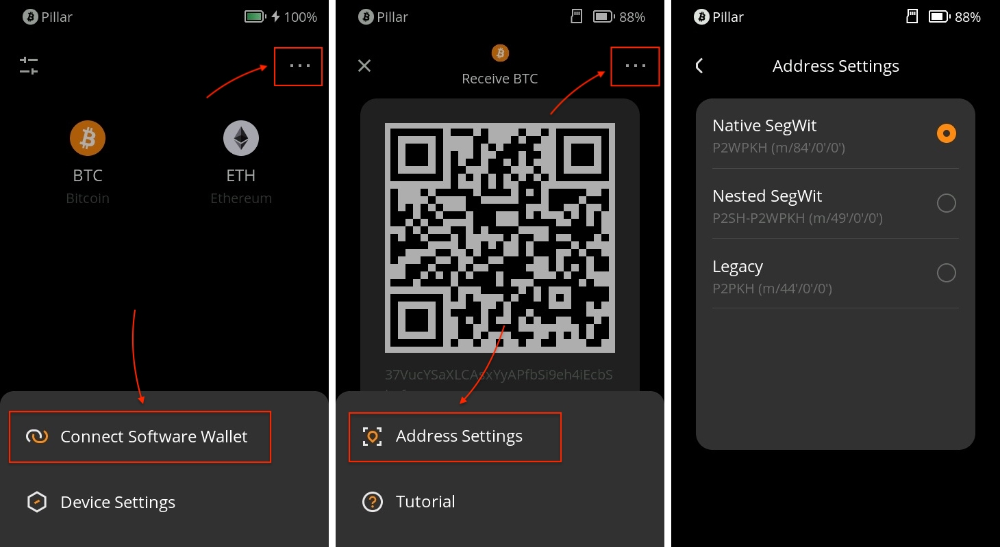
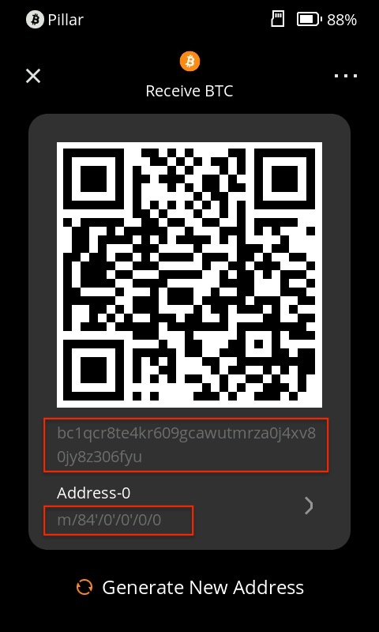
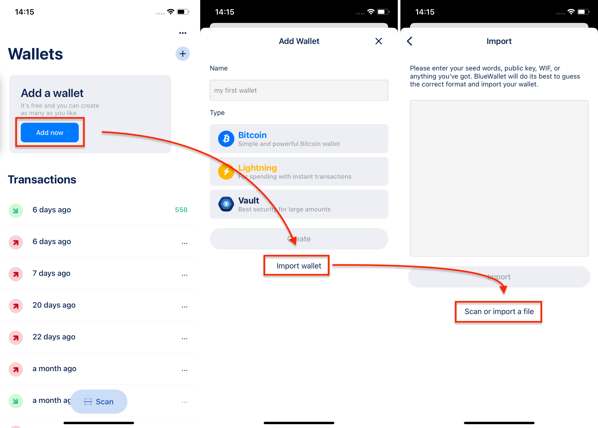
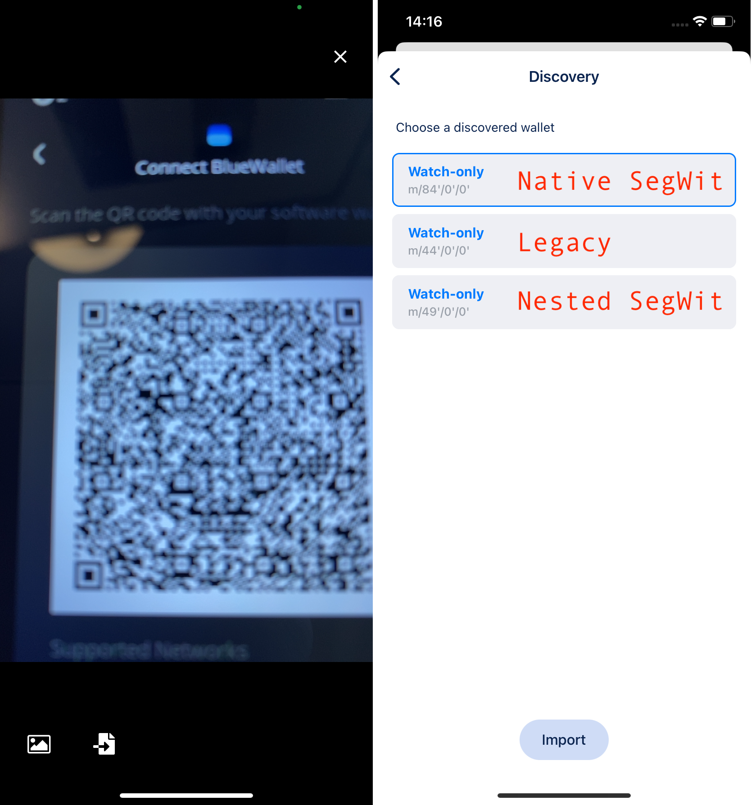

# BTC有三种地址，该选哪一种？ {#28052cdfee2c46fb964e3d4a1c5e1cf2}

当您使用比特币（BTC）时，您可能会注意到有三种不同的地址格式可用：原生隔离见证（Native SegWit）、嵌套隔离见证（Nested SegWit）和传统地址（Legacy）。每种格式都有其自身的特点和优势。在本教程中，我们将探讨这些地址类型之间的区别，并为您指导如何根据您的需求选择和使用合适的地址格式。

## **为什么会有三种BTC地址类型？** {#c319e4a20f844f52a5b141fa83f4a3c3}

比特币随着时间的推移不断发展，随之引入了新技术，以提高交易效率，降低费用并增强安全性。因此，出现了三种不同的地址格式：原生隔离见证、嵌套隔离见证和传统地址。

## **三种BTC地址格式的特点** {#8a72514264c64df68ba2a7d720fe8252}

1. **Legacy（P2PKH/P2SH）：**
  1. 格式：地址以'1'开头。
  2. 特点：这些是最初的比特币地址，功能齐全。然而，与新格式相比，它们往往具有较大的交易大小和较高的费用。
  3. 推荐用途：如果您与不支持隔离见证的旧钱包或服务进行交互，您可能会使用传统地址。
1. **Nested SegWit（P2SH-P2WPKH）：**
  1. 格式：地址以'3'开头。
  2. 特点：这些地址在兼容传统系统和提高交易效率之间提供了一种折中方案。它们的交易大小较小，费用略低于传统地址。
  3. 推荐用途：如果您需要与旧钱包或服务兼容，但仍希望享受一些隔离见证的好处，您可以使用嵌套隔离见证地址。
1. **Native SegWit（P2WPKH）：**
  1. 格式：地址以'bc1'开头。
  2. 特点：这些地址提供了最高的交易效率，从而实现了最小的交易大小和最低的费用。与其他格式相比，它们还具有改进的安全功能。
  3. 推荐用途：如果您想充分利用最新的比特币技术，请尽可能使用原生隔离见证地址。

## **在Keystone硬件钱包上切换BTC地址格式** {#595eef4f0beb4d289f46227d7fc64a5c}

**打开您的Keystone硬件钱包：**

  1. 从主页面导航至[BTC]。
  2. 点击[地址设置]。您将看到三种BTC地址类型的选项。

    

**选择您偏好的地址：**

  1. 选择您希望使用的BTC地址格式。
  2. 要返回主页面，请点击[<]按钮。现在将显示所选地址的格式。

    

## **使用BlueWallet访问Keystone的不同BTC地址** {#cc27e3a8da8c453585b13cb6a855bd84}

**连接BlueWallet：**

  1. 在Keystone主页面上，点击右上角的菜单图标[…]。
  2. 选择[连接软件钱包]。
  3. 找到[BlueWallet]并点击。将显示一个二维码。

  

**使用BlueWallet：**

  1. 在您的手机上打开BlueWallet软件。
  2. 导航到连接硬件钱包的适当部分。
  3. 扫描显示在您的Keystone硬件钱包上的二维码。

    

**在BlueWallet上更改地址格式：**

  1. 如果您需要更改与BlueWallet绑定的BTC地址格式，请按照重新绑定流程操作。
  2. 在选择地址路径的过程中，您可以选择所需的BTC格式。

    

通过了解原生隔离见证、嵌套隔离见证和传统地址之间的区别，您可以根据自己的优先事项做出明智的决策，选择合适的BTC地址格式。无论您重视交易效率、较低的费用还是与旧系统的兼容性，选择正确的地址格式都将增强您的比特币体验。

## 常见问题解答 {#74a1a5d36c4f4554ab7c30a52deb58ec}

  
可以把比特币从Nested SegWit发送到Legacy或Native SegWit地址上吗？

是的，您可以把比特币从Nested SegWit发送到Legacy或Native SegWit地址上。对于比特币上的这几种格式来说，地址格式不影响您正常交易比特币。

  

  
我可以直接将比特币从一种地址格式转换成另一种吗？

虽然您不能直接将一种地址格式转换为另一种，但您可以通过常规交易将比特币从一种地址类型发送到另一种地址类型。

  

