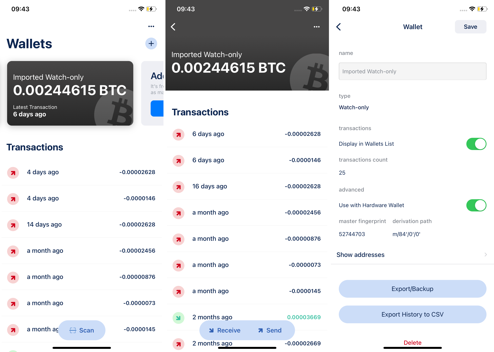

# 为什么在交易BTC的时候，钱包上显示了两个 “To” 地址？ {#902584cb31924bbd8b2750333f24213d}

欢迎来到当您了解比特币交易的时候，可能会产生某种疑问：为什么有时在发送比特币（BTC）时会出现两个“收款”地址？让我们以一种简单明了的方式帮助大家理解这些地址的作用。

## **理解比特币交易和地址** {#3963b6a368bb4d57aa96fb00fcf42d32}

在我们深入了解这两个“收款”地址之前，让我们快速了解一些关于比特币交易的基础知识：

1. **交易输出（UTXOs）：** 在比特币中，当有人向您发送BTC时，就像收到一枚特殊的硬币，称为未花费的交易输出（UTXO）。把它想象成您虚拟钱包中的数字硬币。
1. **接收地址：** 即接收比特币时所需的收款地址。

现在，让我们探讨一下为什么在比特币交易中可能会看到两个“收款”地址！

## **两个 “To” 地址** {#23aa66381b0a439683124cf041c1afc3}

想象一下这种情况：您想要向某人发送特定数量的BTC。但是您的钱包中的BTC比您想发送的数量多。接下来会发生什么？

1. **收款人的地址：** 第一个“收款”地址很简单。它是收款人的比特币地址 - 您想要发送BTC的地方。
1. **找零地址：** 由于您的钱包中的BTC超过了您要发送的数量，剩余的BTC则需要返回到你的钱包里。这就是第二个“收款”地址的作用。它被称为“找零地址”。您的钱包为您创建了一个新地址，就像一个小口袋，然后将多余的BTC发送到那里。

## **为什么需要找零地址？** {#e5d1ca9450c14ba9b4ded798d271aae3}

为什么不能直接发送精确金额呢？这涉及到比特币的安全性和隐私性。比特币交易的运作方式是，每个未花费交易输出（UTXO）只能使用一次。通过将多余的BTC引导到一个新地址（即找零地址），从而确保保留您其余BTC的隐私。如果您的所有金额都集中在同一个地址上，通过公开的账本，恶意者可能轻易追踪并监视您的账户，从而对该地址进行恶意行为。因此，将找零金额发送到新地址可以确保交易的完整性和您的隐私保护。

实际上，在比特币交易中出现两个“收款”地址的作用是将BTC转移到预期的收件人，并通过找零地址安全地处理多余的BTC。这种做法体现了比特币生态系统内安全性和功能性的复杂而重要的协调。

## **检查找零地址** {#9d77e1d68c924a30812b57ed305bb191}

如果您感到好奇，您可以使用诸如连接到Keystone的BlueWallet等钱包来检查找零地址。以下是您可以探索找零地址的方式：

1. 选择“导入仅查看钱包”。
1. 点击右上角的选项按钮（...）。
1. 选择[显示地址]。

  

1. 在这里，您将看到“接收”和“找零”地址的列表。

这是一个方便的方法，可以比较您的地址，包括在比特币交易中起关键作用的找零地址。

**Keystone Gen3用户须知：**
由于内存限制，Keystone Gen3可能不会显示“找零地址”列表。但请放心，您仍然可以通过使用上述提到的方法或探索第三方工具来确定找零地址是否属于您。

有了这些了解，您就可以探索找零地址的领域，并更深入地了解比特币交易的工作原理。

## **常见问题解答** {#b79d9e8e65294276bd1aa70d5d334193}

**问：我是否拥有找零地址？**

**答：** 您的BTC余额是通过计算您的收款地址余额和找零地址余额之和来确定的。这两种类型的地址都是从您的助记词派生的，您可以使用助记词来管理它们。

