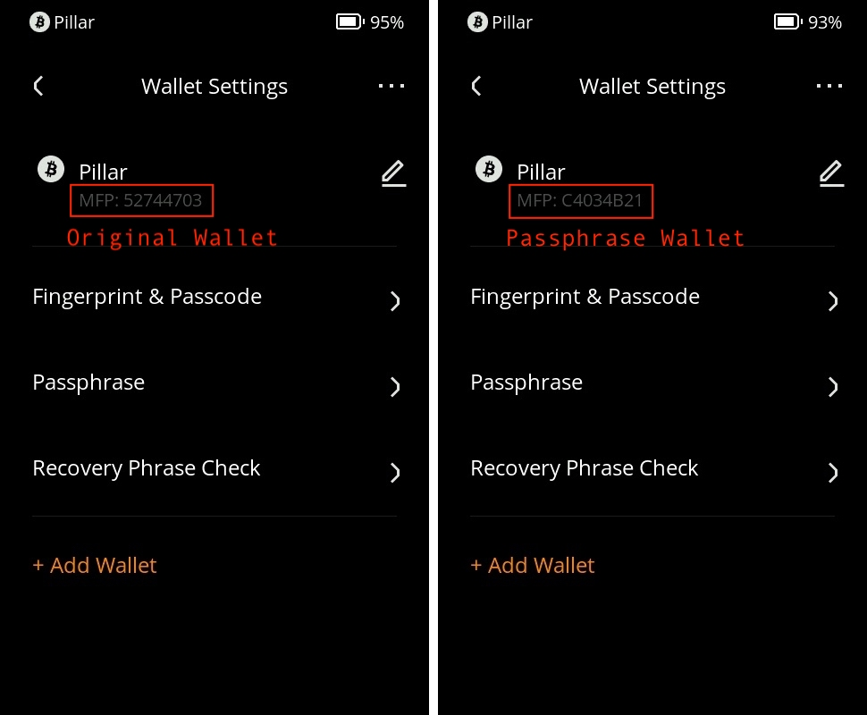

# **密语钱包** {#680c60aa855c45eca3aa1f36c94d204f}

欢迎来到密语钱包功能的教程，本教程将带您了解如何在您的Keystone 3 Pro设备上使用密语钱包功能。密语钱包为您的设备添加了额外的安全层，允许您创建一个仅能通过特定密语访问的独立钱包。本教程将引导您逐步完成创建、输入和高效使用密语钱包的过程。

## **1. 什么是密语钱包及其用途？** {#30de2d06cffd406c9ef65ef9f725cb4a}

简单来说，密语就像是一个隐藏钱包，为您的数字钱包提供了额外的保护层。就像您使用密码解锁手机一样，密语有助于保护您的钱包安全。

密语钱包功能专为那些注重资金和信息安全的人设计。这有点像在您的钱包中设置了一个只有您能打开的隐藏隔间。通过使用密语，您添加了一个只有您知道的特殊密码，这会大大增加他人访问您的数字资金的难度。

## **2. 创建或输入密语钱包** {#35c7ea8687f144a6bf5552cdc9d68d5a}

1. 握住您的Keystone 3 Pro设备，点击位于屏幕右上角的菜单图标（通常为“…”）。
1. 在出现的菜单中，选择“设备设置”。
1. 在“设备设置”菜单中，找到并点击“钱包设置”。
1. 在“钱包设置”中，找到并选择“密语钱包”。

  

1. 系统会提示您输入密码或使用指纹解锁此功能。
1. 解锁后，使用屏幕键盘输入您想要的密语。请记住，这个密语将保护您的密语钱包。

  

1. 输入完毕后，您已成功创建了密语钱包。您可以从“MFP”区分是否进入了其它钱包。（你可以把MFP看作每个钱包独有的ID）

**注意：** Keystone 3 Pro不会储存这个密语，因此每次访问密语钱包时都需要输入它。

## **3. 返回初始钱包** {#0da4c2bb8ec54de28a502681864ba0d1}

1. 如果您希望回到初始钱包，只需再次访问密语钱包。
1. 在这种情况下，您无需输入任何内容。只需点击“下一步”，您将返回到初始钱包。

  

1. 此外，当您的设备重新启动或重置时，它会自动恢复为初始钱包。

## **4. 高效访问密语钱包** {#1eb6b755573b4b558db88b4bd769acbb}

为了重新启动设备后，可以更加便捷地访问密语钱包，请按照以下步骤操作：

1. 解锁您设备的屏幕。
1. 在锁定屏幕上，将会有一个名为“密语快速访问”的选项。点击打开此选项。

  

1. 直接在锁定屏幕上输入您的密语。无需在设置中导航。
1. 输入并确认您的密语后，您将成功进入密语钱包。

  

## **5. 常见问题** {#7a92efd62e054fbdb80123464c193dc2}

  
我能将密语钱包设置为默认钱包吗？

**答：** 不可以。密语钱包旨在增强安全性，将其设置为默认钱包将削弱这一原则。

  

  
能否增加一个功能，使得我可以在锁屏界面直接密码解锁密语钱包？

**答：** 我们没有推出此类功能。假设黑客访问了您的设备，他们可能会提取您的私钥。密语是额外的防护措施。如果设备存储了你的密语，就意味着这种情况下黑客能轻松获取你的密语，它们就失去了额外的防护作用。由于这项功能违反了我们的安全原则，因此我们不提供这项功能。请记住，安全必然意外着便捷性的牺牲，它为您的数字资产提供了宝贵的保护。

  

  
最多能输入多长的密语？

**答：**最长可以输入128位。

  

  
Keystone兼容第25个助记词吗？

**答：**第25个助记词又称为“密语”。在标准模式下（即12位或24位助记词）Keystone与其它BIP39类的钱包密语是通用的，只要您的“第25个助记词”是由BIP39类钱包生成的，即可导入。

  

