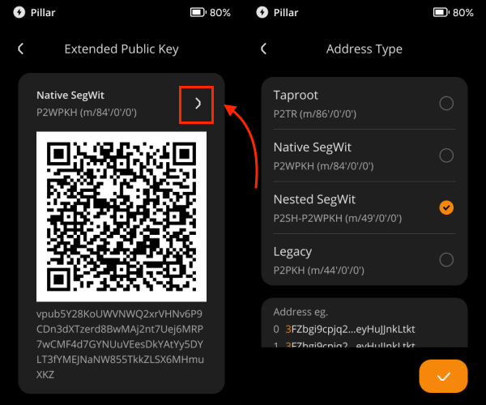

# 查看比特币的扩展公钥（xPub） {#81e30adc7db44099b98277e636e0b762}

导出 XPUB 功能重要用于了解钱包的交易历史，包括交易中使用的所有接收地址和找零地址。通常，有报税需求或者浏览钱包所有交易历史等需求的，会使用到这一功能。

Keystone 3 Pro 在 1.2.8 版本推出了这一功能。如果你有兴趣了解，可以参考以下内容。

:::tip

**注意：**
请勿随意将您的扩展公钥与他人共享！任何拥有它的人都可以监控您过去和未来的钱包交易信息。确保您的隐私安全，并且只与受信任的一方共享您的扩展公钥。

:::

## 一、准备 {#b21dae775928461cb97a35dba7371c89}

- Keystone 3 Pro，版本1.2.8或更新版本。如需更新，请前往[固件升级页面](https://keyst.one/firmware)。

## 二、步骤 {#9b32df0b681544ba9ec145df14e0fff4}

1. 打开 Keystone 3 Pro 的主页，点击 “BTC” 的图标，进入 “Receive BTC” 界面；
1. 点击右上角的 “…”，找到“Export xPub”。此时，Native Segwit 的扩展公钥将会以二维码的形式呈现。

  

如果你想要到处 Nested Segwit 或者 Legacy 的扩展公钥，可以根据以下提示找到对应的信息：

以上就是导出扩展公钥教程的全部内容。 

