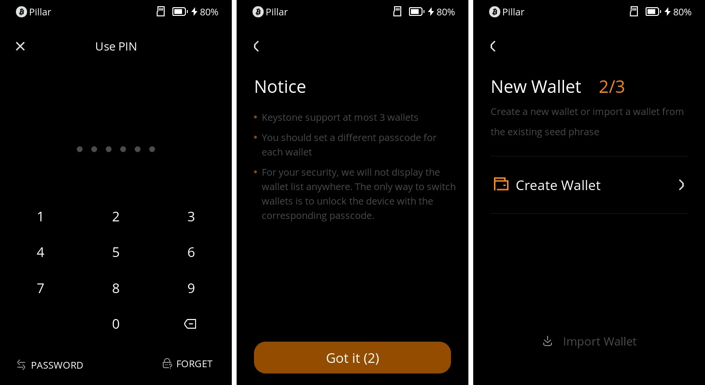
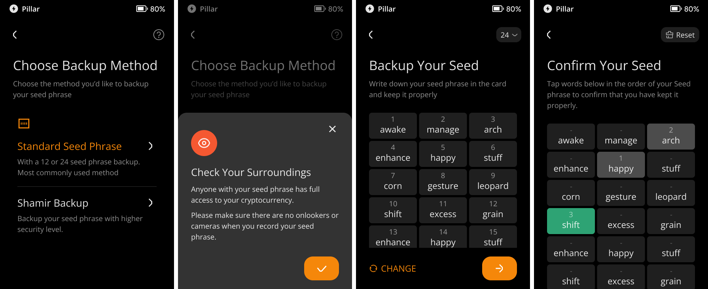
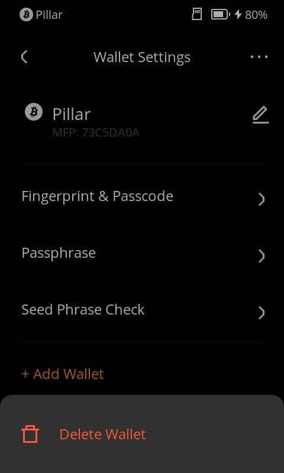

## **如何管理三组助记词** {#808556c86ff54efc82c5d411fbd42a05}

在Keystone 3 Pro中，您可以添加三组助记词，通过不同的密码访问不同的助记词。本教程将详细介绍如何操作，以便您能够轻松管理多个钱包。

### **添加和生成钱包** {#8264b38668cd4e3f88e843630950f095}

1. 完成设备初始化设置后，点击主页右上角的“...”图标，然后选择“设备设置”，再选择“钱包设置”。

  

1. 在钱包设置页面，点击底部的“+添加钱包”按钮。您需要输入您的密码来解锁此操作。
1. 阅读注意事项，并选择是否生成一个新钱包。如需导入助记词，则点击底部的“输入钱包”按钮。此处以生成新钱包为例。

  

1. 选择生成钱包，需要设置一个新密码，然后确认密码。请注意：需要设置新密码用户解锁这个新生成的钱包。

  

1. 为您的钱包取一个名称，然后选择您希望生成的钱包类型：标准的12位或24位助记词，或者是分片助记词（Shamir Backup）。根据提示，系统将显示相应的助记词。务必将这些助记词安全地储存，可以保存在Keystone Tablet中，或抄写到产品包装中的助记卡上，然后将其放在安全的地方。
1. 确认助记词：按顺序点击屏幕上显示的助记词，以确认您已正确保存。

  

此时，你已经在设备上管理了2套钱包。以此类推，Keystone可以一次性管理3个钱包。

### **管理不同钱包** {#8ef46029ef4b4725a8718e002355f818}

现在您已经成功生成了一个新的钱包。如果您想要同时管理3个钱包，您只需重复上述步骤。每个钱包都可以用其对应的密码进行访问。

### **删除钱包** {#8c724913e31d480eb3a8314129a59aae}

如果您需要删除某个钱包，您可以执行以下操作：

1. 使用相应的密码解锁进入需要删除的钱包。
1. 点击主页右上角的“...”图标，然后选择“设备设置”，再选择“钱包设置”。
1. 在钱包设置页面，点击右上角的“...”图标，然后点击“删除钱包”。

  

### **保障助记词的安全性** {#d03816ceb56d424aad85b4d9eb32e7d6}

Keystone 3 Pro内置了三颗安全芯片，其中两颗专门用来保护您的助记词安全。这些助记词以复杂的方式分布在两片安全芯片中，使得黑客难以进行物理破解。在执行任何交易时，请仔细检查Keystone 3 Pro上显示的交易内容，对于任何不熟悉的交易或合约，请谨慎签署。这样做，才能在加密货币世界中，保障您的资金安全。

通过本教程，您已经学会了如何在Keystone 3 Pro中管理多组助记词。通过管理不同的钱包，您可以更灵活地管理您的数字资产，同时确保您的资金安全和隐私。

