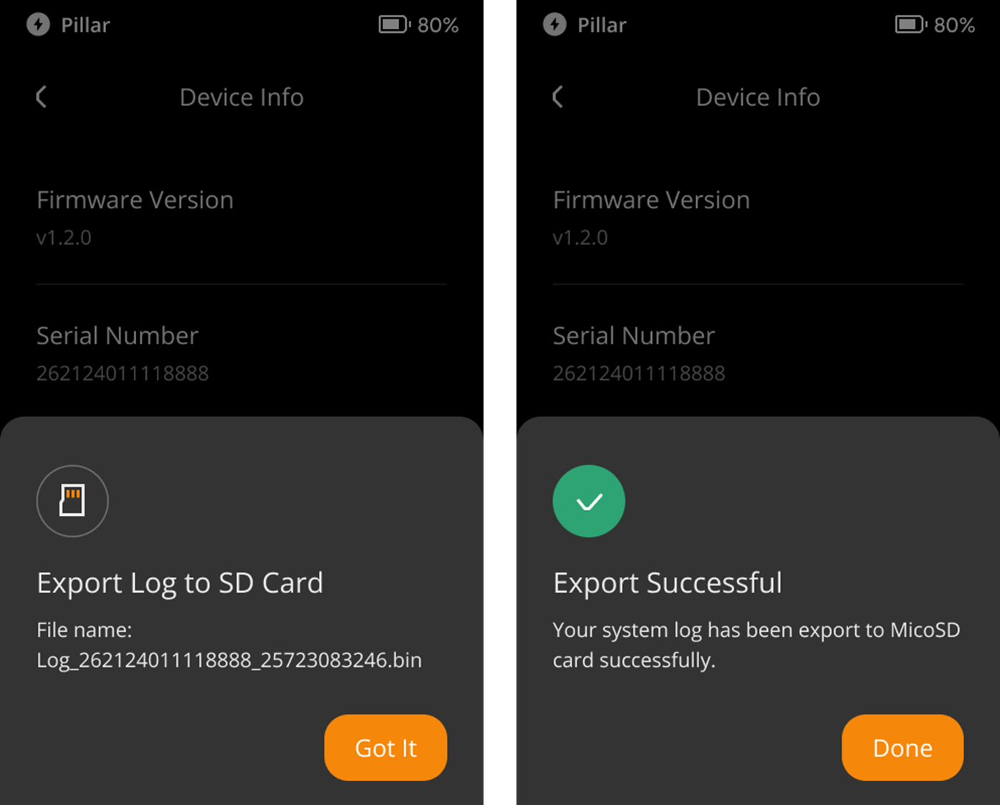

:::tip

要点总结**:**
- Keystone 3 Pro支持用户自己导出系统日志。在使用过程中遇到问题时，导出系统日志有助于更好地定位问题来源。

- 请放心，系统日志中不会含有任何私密信息。导出的系统日志均为可阅读文件，您可以自行研制。

:::

## 步骤: {#99b07f291d8d47dea44d771704cc8059}

1. 插入SD卡。
1. 点击屏幕右上角的 [···] 符号 &gt; [Device Settings] &gt; [About] &gt; [Device Info] &gt; [Export System Log].

  

  

