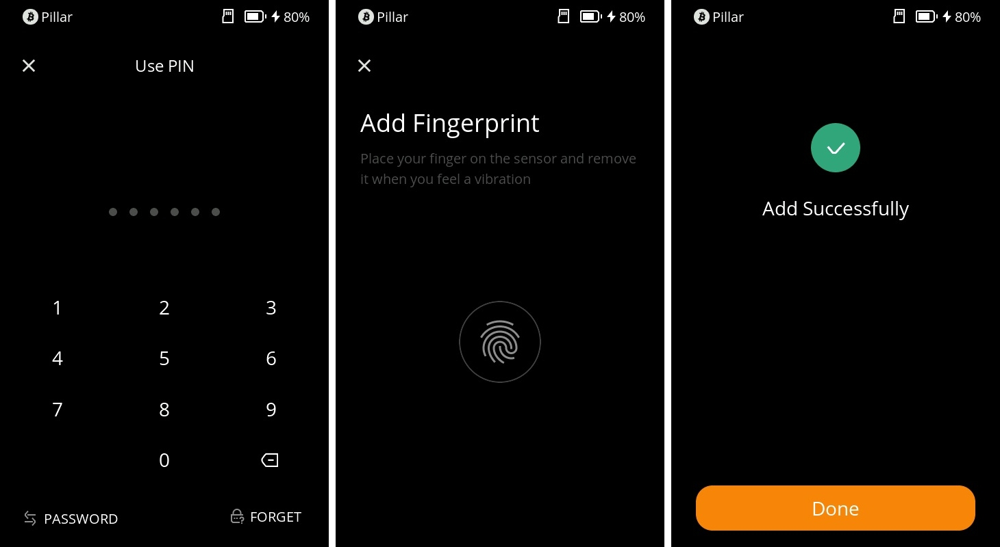
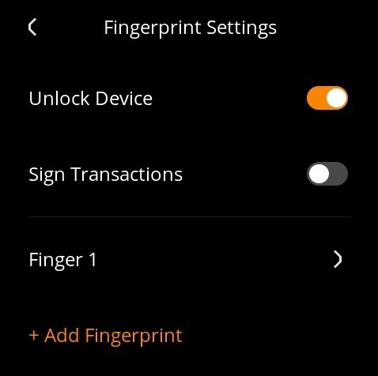
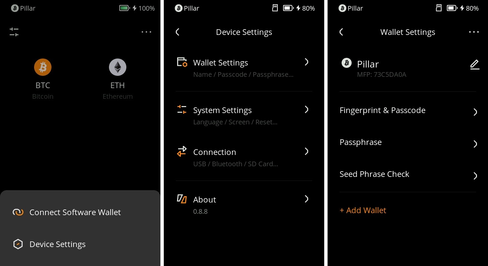
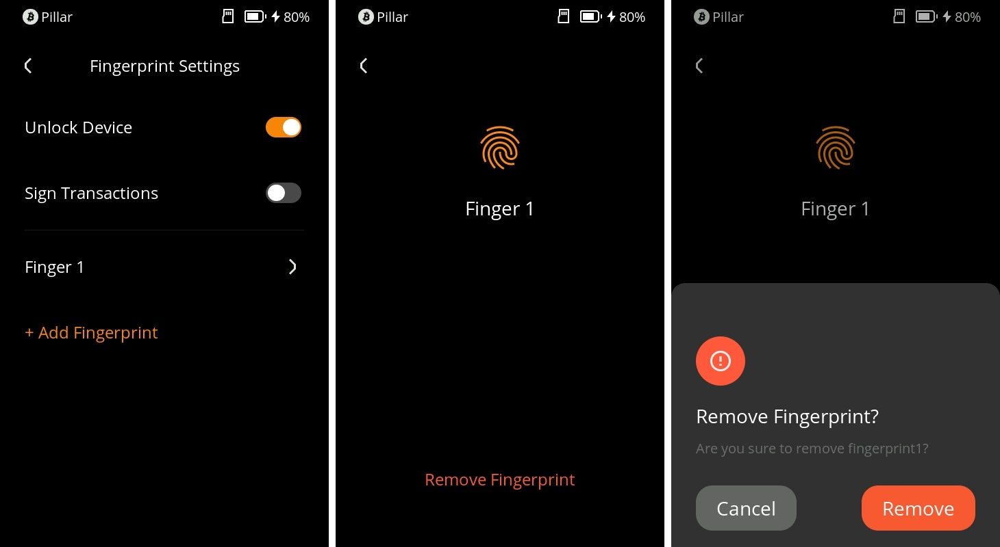

# 指纹设置 {#b4dd97921979429a9832764b31e39713}

在 Keystone 3 Pro 中，您可以一次性添加3个指纹，用于**解锁设备**或**签署交易。**本教程将详细介绍如何设置、应用以及删除指纹解锁。

### **1. 设置指纹** {#836d84a28289494689de98cf7b2e393c}

1. 打开您的 Keystone 3 Pro 设备，在主页右上角点击“...”图标，然后选择“设备设置”，点击“钱包设置”选项。
1. 在钱包设置页面中，选择“指纹和密码”，然后选择“指纹设置”。

  

1. 输入密码以解锁：在设置指纹之前，您需要输入您的密码以确认您的身份。
1. 将您的手指放在设备底部的指纹传感器上，按照屏幕提示录入指纹。录入成功后，您将会收到成功的提示。

  

您总共可以添加3个指纹，您也可以对其使用场景进行限定。

### **2. 使用场景设置** {#1e6450004a634743905fedff10b94ad9}

1. 在成功添加指纹后，您将进入“指纹设置”页面。
1. 在指纹设置页面，您可以看到“指纹适用场景”的选项。这些场景可以是“解锁设备”或“签署交易”。
1. 滑动对应的开关来启用或禁用不同场景。根据您的需求选择启用或禁用相应的场景。

  

### **3. 删除指纹** {#84a7c538e6b44db3b298afcc6a7e9575}

1. 打开您的 Keystone 3 Pro 设备，在主页右上角点击“...”图标，然后选择“设备设置”。
1. 在设备设置页面中，点击“钱包设置”选项，然后选择“指纹和密码”。

  

1. 在指纹和密码页面，选择“指纹设置”。
1. 在指纹设置页面，点击要删除的特定指纹，比如“指纹 1”。
1. 进入指纹详情页面，您将看到“删除指纹”的选项。点击该选项。
1. 确认删除：系统将要求您确认删除操作。确认后，选定的指纹将会被删除。

  

