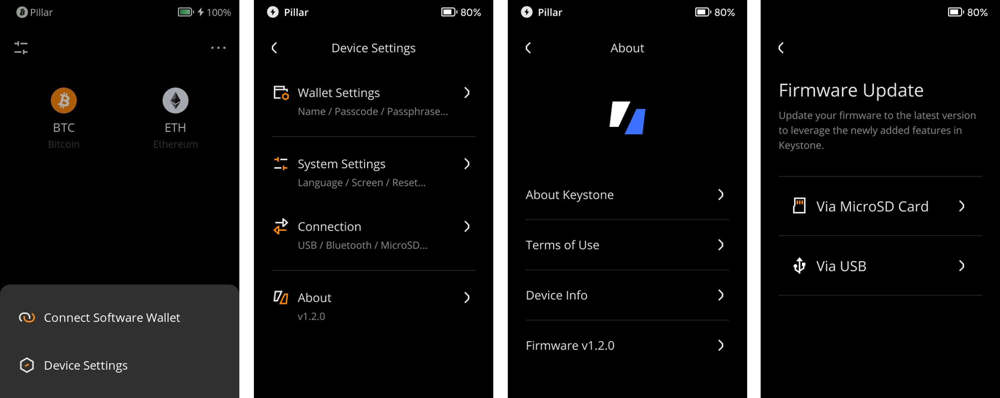

# **固件升级** {#ab3b5af336bc481394df92e1987835d0}

固件升级的主要内容是增加新功能、错误修复以及对新区块链的支持。您可以通过 MicroSD 卡升级。

## 通过MicroSD卡升级  {#e50e1d2a5c6f41e0b58cfccfdfe03b03}

### **准备：** {#1f9543130946437f9a5cba44f7798f88}

1. Keystone 3 Pro
1. MicroSD卡和MicroSD卡读卡器 （推荐使用容量为32GB或64GB的MicroSD卡）
1. 电脑

### **步骤：** {#f945a6f93f7b4f8481c69e5805bc34a5}

1. **检查电量：** 确保Keystone钱包电量至少有20%。
1. **格式化MicroSD卡：** 将MicroSD卡插入电脑并使用FAT32格式进行格式化。
1. **下载固件：** 从Keystone网站下载最新的固件版本，固件名称为“keystone3.bin”，并将该文件粘贴到MicroSD卡中。请确保文件名为“keystone3.bin”，如果出现类似于“keystone3 (1).bin”的文件名，请修改后再安装。
1. **插入MicroSD卡：** 将带有固件的MicroSD卡插入Keystone钱包。
1. **启动升级：**
  1. 在Keystone钱包主页面，点击右上角的 [···] 标志，之后依次点击 [Device Settings] > [About] > [Firmware Update].

    

  2. 在Keystone钱包上，选择“Update”选项，并按照屏幕上的指示、输入密码，开始升级过程。

    

**如何将MicroSD卡格式化到FAT32格式**

1. **Windows用户：**
  - 使用命令提示符。按下**Windows键**，键入“**cmd**”或“**命令提示符**”，进入命令提示符页面。
  - 输入**`format [drive letter]: /FS:FAT32`****。将****`[drive letter]`****替换为您的**Micro**SD卡的盘符（例如****`format E: /FS:FAT32`**）。

    

1. macOS上用户：
  - 插入MicroSD卡，从Spotlight中打开“磁盘工具”。
  - 选择您的卡，点击“抹掉”，选择“FAT32”格式，为卡命名，然后点击“Erase”。

    

完成！您的Keystone钱包固件将会升级。

## 通过USB升级 {#ff1502c2515345de9ab95bdc5dd93d83}

### **准备：** {#f527f70fda2f49ecb385f20dacc5e019}

1. Keystone 3 Pro
1. USB线缆
1. 电脑

### **步骤：** {#6b094442c9a44f749d82d60671d23310}

1. 确保您的版本在 1.0.4 及以上。（如果低于此版本，请先使用 MicroSD 卡升级一次。）
1. **检查电量：** 确保Keystone钱包电量至少有20%。
1. 打开Keystone官网的[固件升级](https://keyst.one/firmware)页面。
1. 在Keystone钱包主页面，点击右上角的 [···] 标志，之后依次点击 [Device Settings] &gt; [About] &gt; [Firmware Update]，选择Via USB，按照图中指示将Keystone 3 Pro与电脑连接。

  

  

1. 在网页上点击升级，按提示进行升级即可。

## **常见问题解答** {#91aaef8b3110488a8244537a52328255}

  
如何在升级过程中防止恶意攻击

为确保设备在升级过程中的安全性，请遵循以下步骤：

- 只从[**官方Keystone网站**](https://keyst.one/)或[**GitHub**](https://github.com/KeystoneHQ)下载固件更新。每个固件都是经过私钥签名的，防止安装未经授权或恶意的固件。
- 请勿从非官方来源或未知方提供的链接下载固件。
- 安装固件时请先对比固件升级页面的校验码与设备上的校验码是否一致。

  

