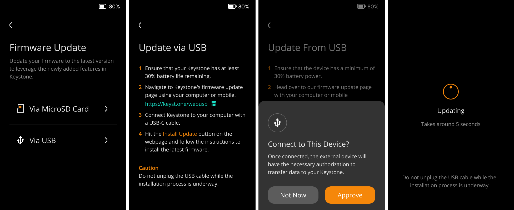
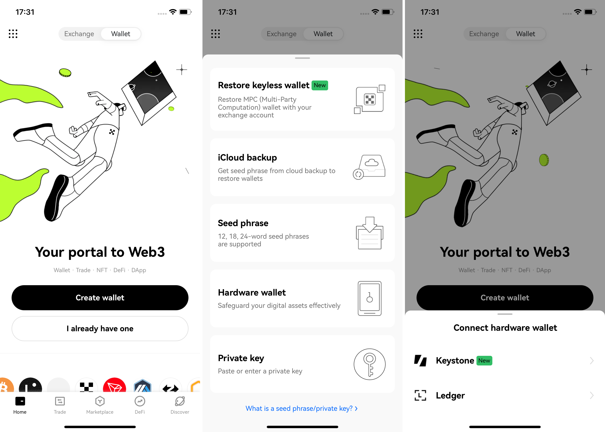

# 新手**指南** {#3122b693d54349f2a5390d8cf4d8ced4}

## **Keystone用户必读指南：在探索之前确保安全** {#0cd47411f1e14766aa0cff68f9d24cf6}

如果您是从软件钱包转向使用硬件钱包，助记词（即种子短语）的重要性绝不容忽视，任何获取到您助记词的人都可以获取到你的资产。让我来为您深入解析，确保您能够充分了解如何保障您的资产。

  
正确保存您的助记词

将您的种子短语安全地储存在别人无法接近的地方。您可以将其写在助记卡，或者保存在助记词板上，然后将其放在安全的地方。推荐使用[Keystone 助记板](https://keyst.one/shop/products/keystone-tablet)，由坚不可摧的不锈钢打造，防火防腐蚀，保护您的财产安全。

  

  
坚持使用离线生成的助记词

Keystone提供了离线生成助记词的功能。当您将Keystone硬件钱包连接到软件钱包时，您的助记词和私钥将始终存储在硬件的安全芯片中，远离任何在线威胁。相比于软件钱包因为其需要在线使用的特性而造成的潜在威胁，将Keystone与软件钱包连接后，物理隔离的设计会使黑客几乎无法通过在线攻击获取您的关键信息。

  

  
Keystone 硬件钱包的使用方法

为了最大程度的安全性，只使用 Keystone 硬件钱包生成助记词。避免将在线生成的助记词导入硬件钱包，因为这可能危及您的安全。相反，您可以将 Keystone 与兼容的第三方软件钱包连接起来，以安全的方式访问体验各种线上功能，如收发货币、质押等。

  

  
在签名前仔细审查交易细节

Keystone解决了盲签问题，确保在您使用Keystone设备对交易进行签名时，您能够清楚了解交易的真实内容，包括发送地址、接收地址、交易金额等。这个功能的重要性不容小觑。由于软件钱包在线操作，存在被黑客攻击的可能性。黑客可能在您交易时将接收地址替换为他们的地址，若您未经仔细核对即进行签名，您的资产将遭受损失，等等。Keystone的功能可以帮助您查看真实的交易信息，从而决定是否签署并广播交易。

  

最重要的是，请始终铭记，助记词是确保您数字资产安全的基石。以极高的谨慎对待，并最大程度地利用Keystone硬件钱包所提供的安全功能。

---

**在开始之前，请确保您拥有以下条件：**

1. 持有Keystone 3 Pro 或 Keystone 3。
1. **电池电量**：确保设备电池电量高于20％。
1. **USB数据线**或**SD卡**：准备一根用于设备验证和固件升级的USB数据线，或一张SD卡。
1. 进入**官方网站**：请使用桌面端网络浏览器访问[**Keystone官方网站**](https://keyst.one/get-started)。

## 新手**设置指南** {#b6331be14a9a4eb180e9b65f4cb0be1e}

对于初次设置的用户，请按照以下详细步骤进行：

### 1. **选择您的语言** {#1a22b0bb1ac3484bb7fd30874f26da87}

### 2. **设备验证（可跳过）** {#bd4faec48a3f41f4a7e25da4c1c63fac}

设备验证的重要性：设备验证是检测运输过程中潜在污染、防止供应链攻击、确保安装固件的安全性的关键步骤。**也就是说，通过此步骤，您可以检查设备是否可以安全使用。**

**通过扫码验证：**

  1. 在[设备验证页面](https://keyst.one/authentication)点击“扫描二维码”。
  2. 使用Keystone相机扫描显示在网站上的二维码，此时会显示验证码。
  3. 将验证码输入到网页上以后即可完成验证。

  

### 3. **固件升级（可跳过）** {#7d4baa19e2ec4fb7a873bf36eced3f0d}

升级固件通常包含对新的区块链的支持、错误修复或新功能。如果当前版本满足您的要求，您可以跳过此步骤。

  
使用SD卡升级

1. 格式化SD卡为FAT32格式
2. 下载最新的固件版本——“keystone3.bin”，并将该文件粘贴到SD卡中。
3. 将SD卡插入设备。
4. 在设备上点击“升级”以开始升级。

  

  
通过USB升级

1. 确保您的版本在 1.0.4 及以上。（如果低于此版本，请先使用 MicroSD 卡升级一次。）
2. **检查电量：** 确保Keystone钱包电量至少有20%。
3. 在电脑上，打开Keystone官网的[固件升级](https://keyst.one/firmware)页面。
4. 通过USB将Keystone 3 Pro与电脑连接。
5. 在网页上点击升级，按提示进行升级即可。

  

### 4. **创建或导入钱包/助记词**： {#98f16ddc49db4336bf5184fda6f98af4}

- 设置密码：选择一个强密码或PIN码来保护您的钱包。

  

- 为您的钱包取个名字（可选）：可选地为您的钱包取一个名字以便于识别，或者跳过此步骤。

:::tip

助记词就是掌控您资产的钥匙。**如何确保它的安全：**

1. **离线生成助记词：**
请始终在与互联网断开连接的设备上创建您的助记词，例如专用的硬件钱包或空气隔离的计算机。这可以降低网络威胁的风险。

1. **安全地书写和保存：**
使用纸和笔书写助记词。不要使用数字设备或打印机。将书写的助记词放在只有您能访问的物理安全位置，如保险箱或锁箱。

1. **不要与他人分享或在线输入：**
永远不要与任何人分享您的助记词，并避免在线输入它。硬件钱包是将助记词保存在离线状态下，来确保其安全。即使将在线生成的助记词导入到您的硬件钱包里也无法提供额外的保护，因此不建议这样做。

**把您的助记词视为您最宝贵的财产，并小心保护它，以保护您的资产安全。**

:::

  
新用户请选择“创建钱包”

1. 如果您是第一次设置钱包，请选择“创建新钱包”。
2. 您的设备将生成一个24个单词的助记词。
3. 将此助记词抄写下来并妥善保存。
4. 按照屏幕上显示的顺序输入这些单词，以确认助记词。

  

  
已经有Keystone助助记词，请选择“导入钱包”

1. 请勿将您在软件钱包或联网情况下生成的助记词导入到Keystone，在线生成助记词的风险不会因为导入到硬件钱包而消失，强烈建议您在Keystone上重新创建一套助记词。
2. 如果您已经拥有另一个BIP39类钱包生成的离线助记词，可以选择“导入钱包”。
3. 按顺序输入您的助记词，进行确认。

  

:::tip

注意：请始终使用离线生成的助记词，以达到最佳安全保护效果。 如果您导入在线生成的助记词（比如通过手机app等生成的助记词），那么即便导入到了硬件钱包里，也无法起到离线保护的效果。

:::

### 5. **选择您需要的软件钱包（可以同时连接多个软件钱包）** {#41baa953f39d45fca710559252c5e324}

  
选择软件钱包

要有效地管理您的数字资产，需要先明确您所要管理和使用的区块链是什么，以及是想要在移动端还是PC端上使用。在下方我们列出了当前Keystone 3 Pro支持的钱包及其端口，您可以进行选择：

- **OKX钱包（移动端 & 扩展程序端）**：适用于BTC和EVM链。我们将逐步支持OKX所支持的更多区块链，为您提供一个更加方便的多链软件钱包。
- **BlueWallet（移动端）**：支持三种类型的BTC——Native Segwit、Nested Segwit 和 Legacy；支持 Coin Control 和 Tor 等。
- **MetaMask（移动端 & 扩展程序端）**：支持EVM生态的以太坊、Avalanche和币安智能链等。
- **Rabby** 或 **BlockWallet**（**扩展程序端）**：支持EVM生态的以太坊、Avalanche和币安智能链等。
- **Safe（移动端 & 扩展程序端）**：EVM生态下的多签钱包。

请访问Keystone官方网站的[**“支持的钱包和资产”**](https://keyst.one/supported-wallets-and-assets)页面，获取兼容的数字资产和软件钱包的详尽列表。

*Keystone 3 Pro当前支持比特币和EVM生态，会逐步支持更多的区块链。

  

  
将Keystone与软件钱包连接/绑定（以OKX移动端为例）

1. **下载应用程序**：从应用商店或官方网站下载OKX移动端软件钱包。
2. **在Keystone设备上：**导航到并选择OKX移动端软件钱包，设备上会出现用于连接OKX移动端的二维码。（您可以同时连接/绑定多个软件钱包）

1. **在OKX移动端上：**
  - 打开OKX Wallet应用，点击顶部，切换到[Wallet]模式。
  - 选择[I already have one]，然后选择[Hardware wallet]，然后选择[Keystone]。

  

  - 点击[Scan to connect]，并仔细按照提供的说明操作。然后点击[Connect now]。

  

  - 授予“OKX”应用访问摄像头的权限，并使用它扫描显示在Keystone硬件钱包上展示的二维码。选择一个账户以解锁。

  

  - 成功绑定您的Keystone钱包与OKX Wallet后，您可以安全地探索其提供的各种功能。

目前支持通过OKX软件钱包管理您的BTC 和 ETH，更多币种正在陆续整合中，敬请期待。

  

恭喜！您的设备现在已经设置完成并准备就绪。请记得保管好您的助记词并不与任何人分享，以确保您的资金安全。

