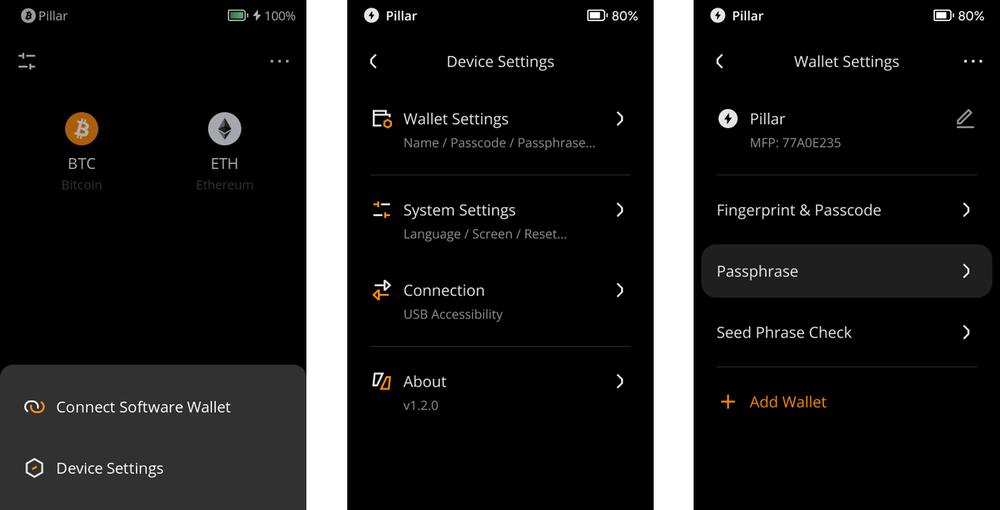
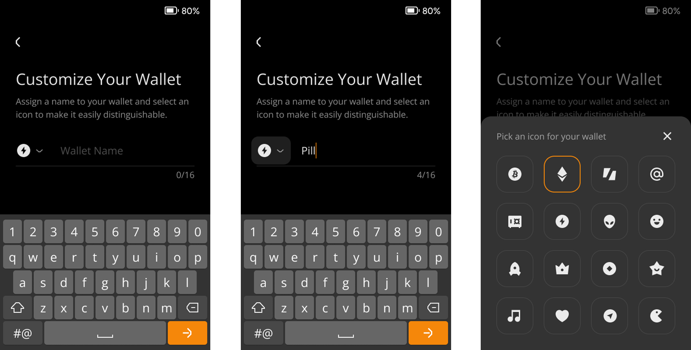

:::tip

要点总结**:**
- 您可以自定义您的钱包名称和图标。

- 由于我们支持同时管理三套助记词，您也可以利用这一功能区分不同的钱包。

- 千万不要在钱包的命名中添加任何私人信息。

:::

## 步骤: {#cacd62a396034db3a627b8bb488c2d30}

1. 点击主界面右上角的 [···] 符号 &gt; [Device Settings] &gt; [Wallet Settings].

  

1. 点击铅笔标志来自定义您的钱包名称和图标。（千万不要在钱包的命名中添加您的私人信息。）

  

