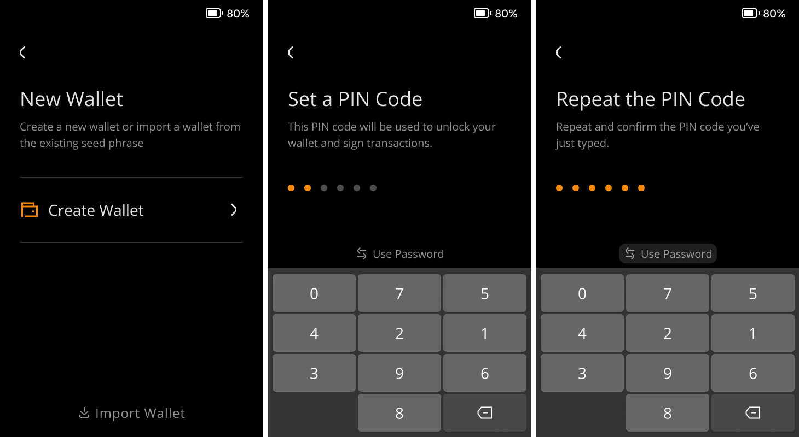

:::tip

要点总结**:**
- 您可以设置纯数字密码（PIN Code）或数字与字母组合而成的密码（Passcode）来管理您的设备。

- 您可以根据此篇教程修改密码。

- 如果您忘记了密码，也可以根据本教程验证助记词重置密码。

:::

## 步骤: {#cf18b6e76d4a4b78a0ec1133d5963719}

1. 在设备的初始设置阶段，您可以选择设置纯数字密码（PIN Code）或数字与字母组合而成的密码（Passcode）来管理您的设备。

  

1. 如果您想修改您的密码:
  1. 点击主界面右上角的 [···] 标志 > [Device Settings] > [Wallet Settings] > [Fingerprint & Passcode]
  2. 选择 [Reset Passcode] ，并输入您的设备密码.
  3. 根据提示设置新的密码，您同样可以选择设置纯数字密码（PIN Code）或数字与字母组合而成的密码（Passcode）。

  

  

1. 如果您忘记密码了，想要重置密码：
  1. 点击主界面右上角的 [···] 标志 > [Device Settings] > [Wallet Settings] > [Fingerprint & Passcode]
  2. 选择 [Reset Passcode] > [Forgot Passcode]
  3. 验证助记词，并根据提示重新设置密码。

  

  

  

