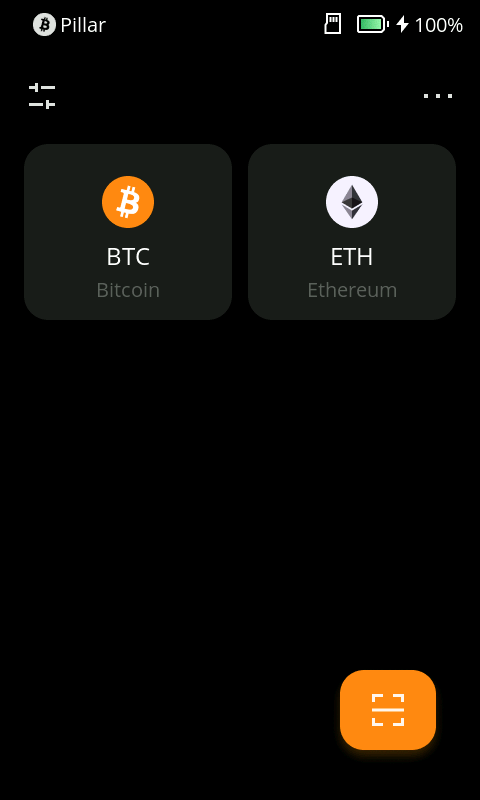
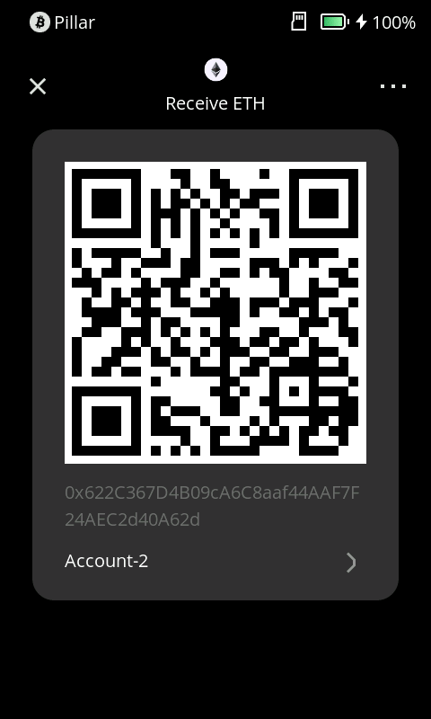

# 接收加密货币 {#d7f71de5540b4367a403bdea1f2ef337}

**1. 选择要接收的币种**

首先，在Keystone硬件钱包界面上，选择你要接收的主要加密货币，比如比特币（BTC）、以太坊（ETH）等。请注意，Keystone通常只显示主要加密货币，而不是代币。

**2. 获取接收地址**

一旦你选择了主币，Keystone会展示一个接收地址。这个地址是唯一的，类似于你的银行账户号码，但以一串字母和数字表示。

在大多数情况下，你可以使用这个主币地址来接收代币，因为代币通常与主币共享相同的地址。

**3. 检查接收地址**

在使用接收地址之前，务必检查两次以确保没有拼写错误或字符缺失。最好的方式是使用Keystone提供的二维码进行扫描，以免出错。

**4. 提供接收地址**

现在你已经有了接收地址，你可以将它提供给需要向你发送资金的人或App。**请确保提供的地址与你想要接收的币种匹配。**

**5. 等待资金到账**

一旦有人向你的接收地址发送了资金，你需要等待矿工确认这笔交易。这个过程可能需要几分钟或更长时间，具体取决于所使用的加密货币网络的速度。

**6. 检查余额**

你可以将Keystone与其他软件钱包配对，当交易成功确认后即可查看你的余额。你的资金现在安全存储在你的硬件钱包中，只有你才能控制它。

## 常见问题解答 {#221349cfb37f426d8987caf9bc8f9250}

  
为什么我的Keystone不能显示余额？

Keystone 是一种离线设备，无法自动更新您的余额。如需查看您的余额、发送资产或访问其他功能，建议将Keystone与兼容的第三方钱包连接。

  

  
当只显示ETH地址时，如何接收我的Arbitrum或Polygon资产？

像Arbitrum和Polygon这样的链是与EVM兼容的，这意味着它们与以太坊（ETH）具有相同的地址格式。您可以使用您的“ETH”地址来接收在Arbitrum和Polygon网络上的代币。

  

