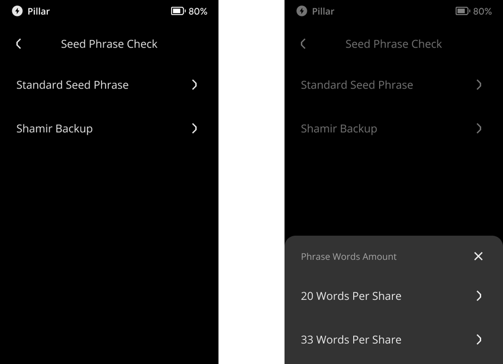

:::tip

要点总结**:**
- 您可以根据此教程，验证设备的助记词的一致性。

- 标准助记词和分片助记词均支持验证。

- 暂不支持通过此功能验证您的密语钱包/隐藏钱包/第15个助记词（Passphrase Wallet）。

:::

## 步骤: {#ee55dac37f704961b50056e263c2f8e8}

1. 点击主界面右上角的 [···] 符号 &gt; [Device Settings] &gt; [Wallet Settings] &gt; [Seed Phrase Check].

  

1. 选择您要验证的助记词类型。

  

1. 输入您备份的助记词并点击 [Confirm Recovery Phrase]。
1. 检查结果。

  

