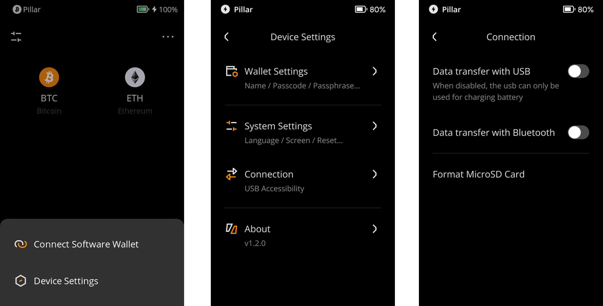

:::tip

要点总结**:**
- Keystone 3 Pro支持通过USB进行安全数据传输。

- 您也可以根据本篇教程关闭USB通信功能，仅使用USB进行充电。

:::

## 步骤: {#fb79529527404f27b8e0fb4c08b8b9ca}

1. 点击主界面右上角的 [···]  &gt; [Device Settings] &gt; [Connection] &gt; [Data transfer with USB].
1. 如果您想关闭USB通信，仅使用USB进行充电的话，可以在此处对USB通信功能关闭。

  

